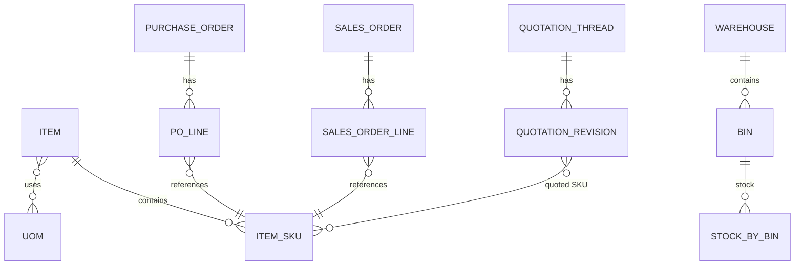

# Flexora ERP — 資料模型總覽（Data Model Overview）

本文件描述 Flexora ERP 的 **資料模型架構、命名規範、欄位慣例、關聯原則、模組級資料模型**，  
是後端 Domain 設計與資料表結構的主要參考。

> **本文件屬於架構級文件（Architecture-Level Document）。**  
> 若要查看模組的欄位清單、DTO、API 行為，請參考 `/docs/specs/<module>/`。

---

# 1. 資料模型設計原則（Core Principles）

Flexora ERP 的資料模型基於以下核心原則：

### 1.1 **Bounded Context（模組邊界）清楚**
每個領域（Product, Inventory, Quotation, Sales, Purchase…）  
都擁有自己的 **Entity / Repository / Domain Logic**。

### 1.2 **弱關聯（Loose Coupling），嚴格防止跨模組侵入**
- 不允許跨模組直接修改對方的 Entity  
- 可透過 ID / Reference / Domain Event（未來）交換訊息

### 1.3 **Code-first（JPA → DB）**
- 使用 Spring Data JPA（Hibernate）管理 Domain Model
- Liquibase 負責 Migration

### 1.4 **Entity != DTO**
- Entity → Domain Model  
- DTO → API Input/Output  
- MapStruct 負責轉換（不允許手寫 converter）

### 1.5 **以「整潔建模（clean modeling）」為優先**
- 不堆積無意義欄位  
- 每個欄位需具有「業務意義」

---

# 2. 欄位命名規範（非常重要）

### 2.1 **Id 類欄位**
| 類型 | 命名 | 說明 |
|------|--------|-------|
| 主鍵 | `id` | Long 或 UUID（JHipster 預設 Long） |
| 外鍵 | `{entity}Id` | 例如 `customerId`, `warehouseId` |

### 2.2 **No / Number 類欄位（流水號 / 業務代碼）**

| 類型 | 命名 | 範例 |
|------|--------|--------|
| 業務代號（可讀） | `{module}No` | `quotationNo`, `salesOrderNo` |
| Serial / 流水號 | `{module}Seq` | `invoiceSeq` |

ERP 中 **所有業務代碼** 都不使用 `code`。  
`code` 僅用於「短代號」，例如 UoM、Currency, Country, ItemType。

### 2.3 **軟刪除欄位**

所有可刪除 Entity 必須包含：

- `deleted`（Boolean）
- `deletedAt`（Instant）
- `deletedBy`（String or Long）

### 2.4 **審計欄位**

所有 Entity 必須繼承：

```

AbstractAuditingEntity

```

內含：

- createdBy
- createdDate
- lastModifiedBy
- lastModifiedDate

---

# 3. 資料關聯（Relationships）

### 3.1 關聯原則

Flexora ERP 採用以下關聯策略：

| 需求 | 解決方式 |
|------|----------|
| 避免跨模組深度關聯 | 優先使用 ID reference |
| 大量關聯 | 使用 `Set<>`（JPA 預設） |
| 需要排序 | 使用 `List<>` 並在 @OrderColumn 標註 |
| 避免 N+1 | Repository + fetch join 或 DTO Query |

### 3.2 常用關聯模式

#### （1）多對一（Most Common）

```

@ManyToOne(fetch = FetchType.LAZY)
private Customer customer;

```

#### （2）一對多（主從）

```

@OneToMany(mappedBy = "header", cascade = CascadeType.ALL, orphanRemoval = true)
private Set<SalesOrderLine> lines = new HashSet<>();

```

#### （3）多對多（非常少用）
避免多對多，ERP 中幾乎不會使用。

---

# 4. 全域資料模型圖（High-Level ERD）

以下為 ERP 各模組的高層級 ER 模型（簡化版）。

> 此為高層架構示意圖，實體詳細欄位請參考 specs。



---

# 5. 模組級資料模型（Module-Level Data Models）

以下為各領域（模組）的資料模型摘要，詳細請見各自 specs。

---

## 5.1 商品管理（Product Management）

**核心實體：**

* `Item`
* `ItemSku`
* `ItemGroup`
* `UoM`
* `Brand`
* `PriceList`
* `ItemPrice`
* ExtAttrs（未來）

**重點：**

* 支援 One Item → Many SKUs
* SKU 是最小銷售 / 庫存單位
* PriceList 為獨立可版本化模組

---

## 5.2 庫存模組（Inventory Management）

**核心實體：**

* `Warehouse`
* `Bin`
* `StockByBin`
* `InventoryTransaction`
* `Reservation`
* `SafetyStockRule`
* `ReplenishmentRequest`（未來）

**重點：**

* 庫存為 **SKU + Bin** 精度
* 所有變動 → `InventoryTransaction`
* 預留量（Reservation）在 SO / Picking 使用

---

## 5.3 報價管理（Quotation）

**核心實體：**

* `QuotationThread`
* `QuotationRevision`
* `QuotationLine`
* `QuotationStatusDef`
* `QuotationWorkflow`（未來）

**重點：**

* Thread = 一個客戶需求
* Revision = 版本（多次來回）
* Workflow = 狀態 + Guard Rules
* 是否有效（ValidUntil）是核心欄位

---

## 5.4 銷售訂單（Sales Order）

**核心實體：**

* `SalesOrder`
* `SalesOrderLine`
* `SalesOrderStatusDef`

**重點：**

* SO 與 Quotation 連動
* 含 Workflow / Guard
* 可觸發庫存預留

---

## 5.5 採購（Purchase）

**核心實體：**

* `PurchaseOrder`
* `PurchaseOrderLine`
* `PurchaseReceipt`（未來）
* `SupplierReturn`（未來）

---

# 6. 狀態（Status）與工作流程（Workflow）模型

所有狀態機均採：

* `{Module}StatusDef` 資料表（狀態主檔）
* Enum 於後端控制
* Guard Rule 在 Service 層檢查
* Workflow Drawer 於前端呈現

範例：

```
QuotationStatusDef
SalesOrderStatusDef
DeliveryNoteStatusDef
```

---

# 7. ExtAttrs（自訂欄位）策略（未來）

ERP 規劃支援通用的 ExtAttr 表：

```
ext_attr_header
ext_attr_value
```

適用於：

* Item
* Customer
* Vendor
* Order / Document

此為企業級 ERP 重要功能，將在後續版本納入。

---

# 8. 命名與資料一致性（Naming & Consistency Rules）

### 8.1 Entity 命名

* 單數命名：`Item`, `SalesOrder`, `Warehouse`

### 8.2 表命名

保持 JHipster 預設（`snake_case`）
例如：

* `sales_order`
* `quotation_revision_line`

### 8.3 欄位命名統一性

| 欄位         | 用途            |
| ---------- | ------------- |
| `status`   | 狀態代碼（String）  |
| `statusId` | 狀態主檔 FK（Long） |
| `no`       | 可讀業務代碼        |
| `seq`      | 自動序號          |

---

# 9. 後續計畫（Roadmap）

未來此文件將補充：

* **各模組 ER 圖完整版**
* **資料表欄位規格**
* **多模組整合場景（e.g., SO → DN → Invoice）**
* **Event-driven（若採用）資料流規格**

---

# 10. 結語

本資料模型文件是 Flexora ERP Domain 設計的根基。
任何資料模型變更（新增欄位、表、關聯）
都必須：

1. 先更新本文件
2. 再更新各模組 `/docs/specs/`
3. 最後更新後端程式碼（Entity/DTO/Mapper）

文件與程式碼必須保持一致。

