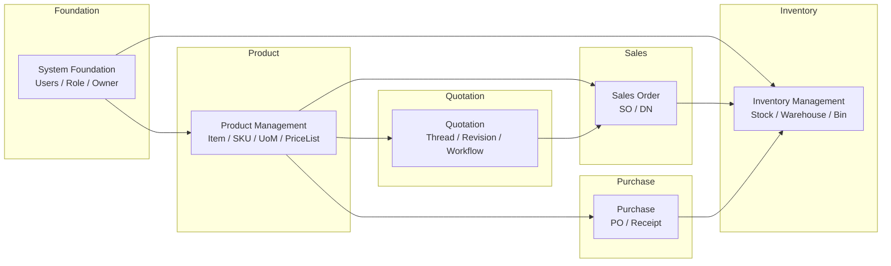

# Flexora ERP — 模組架構與邊界（Modules & Bounded Contexts）

本文件定義 Flexora ERP 的模組（Module / Bounded Context）劃分方式、  
各模組的職責、資料邊界（Data Ownership）、跨模組依賴規則與未來擴充方向。

> 此文件用於快速理解 ERP 的「整體模組藍圖」。  
> 各模組的詳細規格則位於 `/docs/specs/<module>/`。

---

# 1. 模組化原則（Module Design Principles）

Flexora ERP 的模組遵循以下原則：

### 1.1 **清楚的 Bounded Context（上下門界界）**
每個模組擁有：

- 自己的資料模型（Entity / Repository）  
- 自己的業務邏輯（Service）  
- 自己的 API（Resource / Controller）

模組之間不得互相侵入。

---

### 1.2 **弱耦合（Loose Coupling）**
跨模組僅能透過：

- ID reference（建議）  
- 查詢 API（查詢邊界）  
- 事件 / Domain Event（未來）  

不得：

- 直接修改其他模組的資料  
- 使用雙向關聯造成深耦合  

---

### 1.3 **跨模組共享資料有限且明確**
例如 Customer 可在多個模組使用，但其「資料擁有權」在 **CRM/CUSTOMER 模組**。

---

### 1.4 **每個模組都用「workflow + 狀態」支撐流程**
例如：

- 報價 → `QuotationStatusDef`
- 銷售訂單 → `SalesOrderStatusDef`
- 庫存 → `InventoryTransactionType`
- 採購 → `PurchaseOrderStatusDef`

---

# 2. 模組總覽（ERP Modules Overview）

Flexora ERP 的模組依 Roadmap 分為數個階段：  

```

Phase 0   → System Foundation（基礎）
Phase 1   → Product Management & Pricing（商品定價）
Phase 3   → Inventory Management（庫存）
Phase 4   → Quotation Management（報價）
Future    → Sales / Purchase / Finance / Warehouse Ops

```

以下為詳細說明。

---

# 3. Phase 0 — System Foundation（系統基礎模組）

**資料來源位置：** `/docs/specs/phase0-system-foundation/`

包含：

- User / Role / Authority  
- Owner / Department / Team  
- Basic Error Format（BadRequestAlert / ErrorVM）  
- 共用工具（Numbering / Validation / File Storage）  
- 系統參數 / 程式設定  

**邊界：**

- 提供共用元件  
- 不得依賴上層業務模組（反向相依禁止）

---

# 4. Phase 1 — Product & Pricing（商品 / 定價）

**資料來源位置：** `/docs/specs/phase1-product-pricing/`

**核心目的：**

- 管理 Item / SKU / Product Variant  
- 建立可維護的 Price List 機制  
- 提供 Quotation 與 Sales Order 使用 SKU 資料

**實體：**

- Item  
- ItemSku  
- ItemGroup  
- Brand  
- UoM（單位）  
- PriceList  
- ItemPrice  

**邊界：**

- 是 Inventory 與 Quotation 的前置模組  
- 不可依賴後續模組（Sales、Inventory、Quotation）

---

# 5. Phase 3 — Inventory Management（庫存）

**資料來源位置：** `/docs/specs/phase3-inventory/`

**核心目的：**

- Warehouse / Bin 管理  
- 精確到 SKU + BIN 的庫存分布  
- 交易式庫存（InventoryTransaction）  
- 預留量（Reservation）  
- 安全庫存與補貨邏輯（未來）

**實體：**

- Warehouse  
- Bin  
- StockByBin  
- InventoryTransaction  
- Reservation  
- SafetyStockRule  
- ReplenishmentRequest（未來）

**邊界：**

- 提供給 Sales Order / Delivery Note  
- 自身不依賴上層業務模組  

---

# 6. Phase 4 — Quotation Management（報價）

**資料來源位置：** `/docs/specs/phase4-quotation/`

**核心目的：**

- 支援 Thread-like 的報價版本管理  
- 支援多模組（PriceList、SKU）整合  
- 完整 Workflow（Guard + UI Drawer）  

**實體：**

- QuotationThread  
- QuotationRevision  
- QuotationLine  
- QuotationStatusDef  
- QuotationWorkflow（未來）

**邊界：**

- 依賴 Product/Pricing  
- 提供 Sales Order 依賴（SO 可由報價轉單）  

---

# 7. Sales 模組（Sales Order / Delivery）— 未來發展

**資料來源位置（未來）：** `/docs/specs/sales-order/`

**核心目的：**

- 由報價轉成銷售訂單  
- 狀態機管理（Draft → Confirmed → Shipped）  
- 觸發庫存預留與出貨流程  

**實體：**

- SalesOrder  
- SalesOrderLine  
- SalesOrderStatusDef  
- DeliveryNote（未來）

**邊界：**

- 依賴：Quotation、Product、Inventory  
- 提供給：Invoice（未來）  

---

# 8. Purchase 模組（採購）— 未來發展

**資料來源位置（未來）：** `/docs/specs/purchase-order/`

**目的：**

- 與供應商的採購流程管理  
- 收料（Receipt）、退料（Return）  
- 可對接 Inventory

---

# 9. 模組關係圖（Module Relationship Diagram）



---

# 10. 跨模組相依規範（Strict Rules）

| 規範                                                             | 說明                             |
| -------------------------------------------------------------- | ------------------------------ |
| 上層不得依賴下層（Foundation → Product → Inventory → Quotation → Sales） | 避免循環相依                         |
| 不允許跨模組直接存取對方 Repository                                        | 必須透過 Service 或 API             |
| 不允許雙向關聯                                                        | Doctrine-style Lazy Loading 禁止 |
| 可使用 ID reference                                               | 例如 SalesOrderLine.itemSkuId    |
| 模組間只共享必要資料                                                     | 避免 Domain 泥球化                  |

---

# 11. 模組文件索引（快速連結）

| 模組                | 文件位置                                    |
| ----------------- | --------------------------------------- |
| System Foundation | `/docs/specs/phase0-system-foundation/` |
| Product / Pricing | `/docs/specs/phase1-product-pricing/`   |
| Inventory         | `/docs/specs/phase3-inventory/`         |
| Quotation         | `/docs/specs/phase4-quotation/`         |
| Sales (未來)        | `/docs/specs/sales-order/`              |
| Purchase (未來)     | `/docs/specs/purchase-order/`           |

---

# 12. 結語

本模組架構設計將隨 Flexora ERP 的成長持續演進。
每個模組均需要：

1. 獨立的資料模型
2. 獨立的 API
3. 清楚的業務邏輯（Workflow）
4. 清楚的 spec（功能規格）
5. 與其他模組建立 **最少必要依賴**

此文件作為全局導覽（Global Map），
詳細內容請見各模組的 specs。
