# Flexora ERP — 統一整合專業規格書（v1.0 合併版｜SSoT）

> 本文件為 **唯一權威規格書（Single Source of Truth, SSoT）**，整併你專案目錄中的所有模組規格，**未來僅需維護此份**。各模組仍以獨立章節呈現，並補上**跨模組關聯、整體觀點、狀態流與流程圖**。所有資料表**以完整表格**呈現（欄位名稱、型態、中文名稱、說明、注意事項），**嚴禁**「與 xxx 一樣」的省略寫法。所有 enum 皆含**設計理由**與**使用情境**。本文件亦提供 **JHipster v8.11.0 JDL 對照**（class／field Javadoc 提示）。
>
> **全域一致性規範**
>
> * 命名：客戶實體固定用 **Customer**（不得用 Account；Account 為保留語彙）。
> * 精度：金額/數量 `DECIMAL(19,4)`、中間運算 `scale=6`（成本/單價建議 `19,6`），稅率/折扣以 **0–1** 儲存。
> * 共通欄位：`tenant_id`（多租戶）、`owner_id`（Row-level 權限）、`deleted/*`（軟刪）、`@Version`（樂觀鎖）、`AbstractAuditingEntity` 欄位。
> * 關聯：多對多以**顯式 join entity**實作；所有「XX單」採表頭（Header）＋行（Item）拆分；地址採**快照表**（見章節 9）。
> * 狀態治理：每模組以四表治理 `*_status_def`／`*_event_def`／`*_state_transition`／`*_status_history`，唯有「事件」可改變狀態。
> * 部分唯一：所有單號採 `(tenant_id, *_no)` partial unique；跨租戶不可重複、同租戶內唯一。
> * 交易權威：庫存／成本以 **InventoryTransaction** 為唯一權威分錄；所有入庫產生 **CostLayer**。

---

## 目錄

1. 整體關聯與名詞統一（Customer 取代 Account）
2. 資料權限域（Owner／Department／Team／UserLink）
3. 產品與製造基礎（Item／ItemSku／PriceList／BOM／Routing）
4. 庫存管理（Inventory）
5. 採購（PO／GRN／供應商退貨）
6. 銷售訂單（SO）
7. 出貨（DN）與客戶退貨（CR）
8. 報價（Thread／Revision／Item）
9. 地址設計（快照表）
10. CRM（Campaign／Lead／Opportunity）
11. ExtAttr（Def／Value）
12. Enum 彙總（含設計理由）
13. 狀態與流程圖（模組內／跨模組）
14. JDL 對照與撰寫指引
15. 稽核一致性與資料遷移

---

## 1. 整體關聯與名詞統一

* **Customer/Contact**：CRM 與銷售主檔；禁止使用 Account 命名。
* **Item/SKU**：交易行項一律指向 **ItemSku**（SKU）；行內保留必要快照欄位（`sku_code`、`product_name`、`uom`、`unit_price`、`discount_type/value`、`tax_rate`）。
* **Document/Link**：共用附件；任何主檔/單據可掛載。
* **Owner/Tenant**：每張單據、主檔皆具 `owner_id` 與 `tenant_id`；列表預設按 Row-level 權限過濾。

### 1.1 全域 ER（概觀）

```mermaid
erDiagram
  OWNER ||--|| USER : mapsId
  OWNER ||--|| DEPARTMENT : mapsId
  OWNER ||--|| TEAM : mapsId
  USER ||--o{ USER_DEPARTMENT : member
  USER ||--o{ USER_TEAM : member
  DEPARTMENT ||--o{ USER_DEPARTMENT : has
  TEAM ||--o{ USER_TEAM : has

  CUSTOMER ||--o{ CONTACT : has
  ITEM ||--o{ ITEMSKU : has

  QUOTATION_THREAD ||--o{ QUOTATION_REVISION : versions
  QUOTATION_REVISION ||--o{ QUOTATION_ITEM : contains

  SALES_ORDER ||--o{ SALES_ORDER_ITEM : contains
  SALES_ORDER ||--o{ SALES_ORDER_HISTORY : logs

  DELIVERY_NOTE ||--o{ DELIVERY_NOTE_ITEM : contains
  CUSTOMER_RETURN ||--o{ CUSTOMER_RETURN_ITEM : contains

  PURCHASE_ORDER ||--o{ PURCHASE_ORDER_ITEM : contains
  PURCHASE_RECEIPT ||--o{ PURCHASE_RECEIPT_ITEM : contains
  SUPPLIER_RETURN ||--o{ SUPPLIER_RETURN_ITEM : contains

  WAREHOUSE ||--o{ INVENTORY_BALANCE : holds
  ITEMSKU ||--o{ INVENTORY_BALANCE : tracked
  INVENTORY_TRANSACTION ||--o{ COST_LAYER : produces

  DOCUMENT ||--o{ DOCUMENT_LINK : links
```



---

## 2. 資料權限域（Owner／Department／Team）

> 設計目標：Row-level 權限以 **Owner** 為唯一發號者；`User/Department/Team` 採 `@MapsId` 與中介表（UserDepartment/UserTeam）管理成員與角色屬性。

### 2.1 資料表

#### 2.1.1 `owner`

| 欄位         | 型態                   | 必填 | 中文名稱  | 說明        | 注意事項                       |
| ---------- | -------------------- | -- | ----- | --------- | -------------------------- |
| id         | BIGINT PK            | 是  | 擁有者ID | 權限作用域的唯一鍵 | 禁止物理刪除；軟刪                  |
| owner_type | ENUM(USER,DEPT,TEAM) | 是  | 類型    | 權限語意      | 與對應表一致                     |
| name       | VARCHAR(255)         | 是  | 名稱    | 顯示用       | `(owner_type,name)` unique |

#### 2.1.2 `department`（@MapsId）

| 欄位               | 型態                 | 必填 | 中文名稱 | 說明         | 注意事項         |
| ---------------- | ------------------ | -- | ---- | ---------- | ------------ |
| id               | BIGINT PK=owner.id | 是  | 部門ID | 主鍵共用       | 建立順序需先 owner |
| dept_name        | VARCHAR(255)       | 是  | 部門名稱 | 顯示用        | 索引           |
| parent_id        | BIGINT FK          | 否  | 上層部門 | 自關聯        | 可空           |
| parent_hierarchy | VARCHAR(1024)      | 是  | 階層路徑 | 含自身 `/1/3` | 前綴索引         |
| depth            | INT                | 是  | 深度   | 根=0        | 與路徑一致        |
| description      | VARCHAR(500)       | 否  | 說明   | 備註         |              |

#### 2.1.3 `team`（@MapsId）— 結構同 `department`，欄位 `team_name` 取代 `dept_name`。

#### 2.1.4 `user_department`／`user_team`

| 欄位            | 型態             | 必填 | 中文名稱 | 說明             | 注意事項                             |
| ------------- | -------------- | -- | ---- | -------------- | -------------------------------- |
| id            | BIGINT PK      | 是  | 關聯ID | 中介主鍵           | `unique(user_id, department_id)` |
| user_id       | BIGINT FK      | 是  | 使用者  | 關聯             |                                  |
| department_id | BIGINT FK      | 是  | 部門   | 關聯             |                                  |
| role_in_dept  | VARCHAR(30)    | 否  | 角色   | Manager/Member |                                  |
| assigned_at   | TIMESTAMP(UTC) | 否  | 加入時間 |                |                                  |
| expired_at    | TIMESTAMP(UTC) | 否  | 結束時間 |                |                                  |

> **權限演算法**：SELF／DEPT／DEPT_AND_SUB／TEAM／ALL。以 `parent_hierarchy` 展開部門子樹過濾。

---

## 3. 產品與製造基礎

### 3.1 `item`（SPU）

| 欄位          | 型態           | 必填 | 中文     | 說明    | 注意事項              |
| ----------- | ------------ | -- | ------ | ----- | ----------------- |
| id          | BIGINT PK    | 是  | 產品款式ID | SPU   |                   |
| tenant_id   | VARCHAR(64)  | 是  | 租戶     |       |                   |
| item_code   | VARCHAR(64)  | 是  | 產品代碼   | 顯示／對外 | unique per tenant |
| item_name   | VARCHAR(255) | 是  | 產品名稱   |       |                   |
| default_uom | VARCHAR(16)  | 是  | 基本單位   |       |                   |
| brand_id    | BIGINT       | 否  | 品牌     |       |                   |
| group_id    | BIGINT       | 否  | 分類     |       |                   |
| owner_id    | BIGINT FK    | 是  | 資料責任人  | 權限    |                   |

### 3.2 `item_sku`（SKU／交易單位）

| 欄位              | 型態           | 必填 | 中文     | 說明         | 注意事項              |
| --------------- | ------------ | -- | ------ | ---------- | ----------------- |
| id              | BIGINT PK    | 是  | SKU ID | 最小交易單位     |                   |
| tenant_id       | VARCHAR(64)  | 是  | 租戶     |            |                   |
| item_id         | BIGINT FK    | 是  | 所屬款式   | 與 item 一對多 |                   |
| sku_code        | VARCHAR(64)  | 是  | 料號     | 對外代碼       | unique per tenant |
| product_name    | VARCHAR(255) | 是  | 品名     | 行項快照來源     |                   |
| uom             | VARCHAR(16)  | 是  | 單位     |            |                   |
| attributes_json | JSONB        | 否  | 變體屬性   | 快照         | ExtAttr 另表        |
| owner_id        | BIGINT FK    | 是  | 資料責任人  | 權限         |                   |

### 3.3 價格（`price_list`／`item_price`）

| 表          | 目的       | 核心欄位                                                                 | 注意                              |
| ---------- | -------- | -------------------------------------------------------------------- | ------------------------------- |
| price_list | 價目主檔     | id, tenant_id, code, name, currency, valid_from/to, owner_id         | 幣別與期間唯一                         |
| item_price | SKU 期間價格 | id, price_list_id, sku_id, unit_price(19,6), currency, valid_from/to | `(price_list, sku, from/to)` 唯一 |

### 3.4 製造（BOM／Routing）— 均採版本化（略列欄位：`bom_code`, `version_no`, `is_active`, `lines[*]`）

---

## 4. 庫存管理（Inventory）

> **估值法**：Tenant 預設 **MOVING_AVERAGE**；SKU 可覆寫 **FIFO**。所有入庫都建立 **CostLayer**，讓報表能在 FIFO/AVG 間切換。

### 4.1 `warehouse`

| 欄位        | 型態           | 必填 | 中文    | 說明    | 注意事項              |
| --------- | ------------ | -- | ----- | ----- | ----------------- |
| id        | BIGINT PK    | 是  | 倉庫ID  |       |                   |
| tenant_id | VARCHAR(64)  | 是  | 租戶    |       |                   |
| wh_code   | VARCHAR(32)  | 是  | 倉代碼   | 顯示／查詢 | unique per tenant |
| wh_name   | VARCHAR(128) | 是  | 倉名稱   |       |                   |
| owner_id  | BIGINT FK    | 是  | 資料責任人 | 權限    |                   |

### 4.2 `inventory_balance`（SKU×Warehouse）

| 欄位           | 型態            | 必填 | 中文   | 說明                 | 注意事項       |
| ------------ | ------------- | -- | ---- | ------------------ | ---------- |
| id           | BIGINT PK     | 是  | 餘額ID |                    |            |
| sku_id       | BIGINT FK     | 是  | SKU  |                    |            |
| warehouse_id | BIGINT FK     | 是  | 倉庫   |                    |            |
| on_hand      | DECIMAL(19,6) | 是  | 目前庫存 |                    | 不可負（可設定例外） |
| reserved     | DECIMAL(19,6) | 是  | 已預留  |                    |            |
| available    | DECIMAL(19,6) | 是  | 可用量  | on_hand - reserved | 檢查約束       |

### 4.3 `inventory_transaction`

| 欄位           | 型態                                                                                                  | 必填 | 中文    | 說明                   | 注意事項 |
| ------------ | --------------------------------------------------------------------------------------------------- | -- | ----- | -------------------- | ---- |
| id           | BIGINT PK                                                                                           | 是  | 交易ID  | 權威分錄                 |      |
| tenant_id    | VARCHAR(64)                                                                                         | 是  | 租戶    |                      |      |
| tx_type      | ENUM(RECEIPT,ISSUE,ADJUSTMENT,TRANSFER_IN,TRANSFER_OUT,RESERVATION,RELEASE_RESERVATION,COST_ADJUST) | 是  | 交易類型  | 原子操作                 |      |
| sku_id       | BIGINT FK                                                                                           | 是  | 料號    |                      |      |
| warehouse_id | BIGINT FK                                                                                           | 是  | 倉別    |                      |      |
| quantity     | DECIMAL(19,6)                                                                                       | 是  | 數量    | 正收負出                 |      |
| unit_cost    | DECIMAL(19,6)                                                                                       | 否  | 單位成本  | AVG/FIFO             |      |
| tx_time      | TIMESTAMP(UTC)                                                                                      | 是  | 交易時間  |                      |      |
| ref_type     | VARCHAR(32)                                                                                         | 否  | 來源單別  | SO/DN/CR/PO/GRN/ADJ… |      |
| ref_id       | BIGINT                                                                                              | 否  | 來源ID  | 對應 header            |      |
| owner_id     | BIGINT FK                                                                                           | 是  | 資料責任人 | 權限                   |      |

### 4.4 `cost_layer`

| 欄位            | 型態            | 必填 | 中文    | 說明         | 注意事項 |
| ------------- | ------------- | -- | ----- | ---------- | ---- |
| id            | BIGINT PK     | 是  | 成本層ID | 入庫層        |      |
| tenant_id     | VARCHAR(64)   | 是  | 租戶    |            |      |
| sku_id        | BIGINT FK     | 是  | 料號    |            |      |
| warehouse_id  | BIGINT FK     | 是  | 倉別    |            |      |
| layer_qty     | DECIMAL(19,6) | 是  | 層數量   | 初始入庫量      |      |
| remaining_qty | DECIMAL(19,6) | 是  | 剩餘量   | FIFO 發貨遞減  |      |
| layer_cost    | DECIMAL(19,6) | 是  | 單位成本  | 收貨單價       |      |
| ref_tx_id     | BIGINT FK     | 是  | 來源交易  | 指到 RECEIPT |      |

---

## 5. 採購（PO／GRN／供應商退貨）

### 5.1 `purchase_order`（Header）

| 欄位            | 型態            | 必填 | 中文    | 說明                      | 注意事項 |
| ------------- | ------------- | -- | ----- | ----------------------- | ---- |
| id            | BIGINT PK     | 是  | PO ID |                         |      |
| tenant_id     | VARCHAR(64)   | 是  | 租戶    | `(tenant_id, po_no)` 唯一 |      |
| po_no         | VARCHAR(64)   | 是  | 採購單號  | 顯示／查詢                   |      |
| supplier_id   | BIGINT FK     | 是  | 供應商   | 主檔                      |      |
| status_code   | VARCHAR(32)   | 是  | 狀態    | DRAFT/CONFIRMED/…       | 事件變更 |
| owner_id      | BIGINT FK     | 是  | 資料責任人 | 權限                      |      |
| currency      | VARCHAR(8)    | 是  | 幣別    | ISO                     |      |
| expected_date | DATE          | 否  | 預計到貨  |                         |      |
| remarks       | VARCHAR(2000) | 否  | 備註    |                         |      |

### 5.2 `purchase_order_item`

| 欄位             | 型態                     | 必填 | 中文   | 說明      | 注意事項 |
| -------------- | ---------------------- | -- | ---- | ------- | ---- |
| id             | BIGINT PK              | 是  | 行ID  |         |      |
| po_id          | BIGINT FK              | 是  | 所屬PO |         |      |
| sku_id         | BIGINT FK              | 是  | 料號   | 指向 SKU  |      |
| sku_code       | VARCHAR(64)            | 是  | 料號快照 |         |      |
| product_name   | VARCHAR(255)           | 是  | 品名快照 |         |      |
| uom            | VARCHAR(16)            | 是  | 單位   |         |      |
| quantity       | DECIMAL(19,6)          | 是  | 數量   |         |      |
| unit_price     | DECIMAL(19,6)          | 是  | 單價   | 19,6    |      |
| discount_type  | ENUM(NONE,AMOUNT,RATE) | 否  | 折扣型態 |         |      |
| discount_value | DECIMAL(19,6)          | 否  | 折扣值  | 金額或 0–1 |      |
| tax_rate       | DECIMAL(19,6)          | 否  | 稅率   | 0–1     |      |

### 5.3 收貨 `purchase_receipt`（GRN）／供退 `supplier_return`（欄位結構與上表一致化；含 `status_code`、`received_at`／`issued_at`、序號子表）

---

## 6. 銷售訂單（SO）

### 6.1 `sales_order`（Header）

| 欄位            | 型態            | 必填 | 中文     | 說明                      | 注意事項 |
| ------------- | ------------- | -- | ------ | ----------------------- | ---- |
| id            | BIGINT PK     | 是  | SO ID  |                         |      |
| tenant_id     | VARCHAR(64)   | 是  | 租戶     | `(tenant_id, so_no)` 唯一 |      |
| so_no         | VARCHAR(64)   | 是  | 訂單號    | 顯示／查詢                   |      |
| customer_id   | BIGINT FK     | 是  | 客戶     |                         |      |
| contact_id    | BIGINT FK     | 否  | 聯絡人    |                         |      |
| status_code   | VARCHAR(32)   | 是  | 狀態     | DRAFT/CONFIRMED/…       | 事件變更 |
| owner_id      | BIGINT FK     | 是  | 資料責任人  | 權限                      |      |
| bill_to_id    | BIGINT        | 否  | 帳單地址ID | 地址快照                    |      |
| ship_to_id    | BIGINT        | 否  | 送貨地址ID | 地址快照                    |      |
| currency      | VARCHAR(8)    | 是  | 幣別     | ISO                     |      |
| promised_date | DATE          | 否  | 承諾交期   | 由 IM 計算                 |      |
| remarks       | VARCHAR(2000) | 否  | 備註     |                         |      |

### 6.2 `sales_order_item`

| 欄位             | 型態                     | 必填 | 中文    | 說明      | 注意事項 |
| -------------- | ---------------------- | -- | ----- | ------- | ---- |
| id             | BIGINT PK              | 是  | 行ID   |         |      |
| so_id          | BIGINT FK              | 是  | 所屬 SO |         |      |
| sku_id         | BIGINT FK              | 是  | 料號    | 指向 SKU  |      |
| sku_code       | VARCHAR(64)            | 是  | 料號快照  |         |      |
| product_name   | VARCHAR(255)           | 是  | 品名快照  |         |      |
| uom            | VARCHAR(16)            | 是  | 單位    |         |      |
| quantity       | DECIMAL(19,6)          | 是  | 數量    |         |      |
| unit_price     | DECIMAL(19,6)          | 是  | 單價    | 19,6    |      |
| discount_type  | ENUM(NONE,AMOUNT,RATE) | 否  | 折扣型態  |         |      |
| discount_value | DECIMAL(19,6)          | 否  | 折扣值   | 金額或 0–1 |      |
| tax_rate       | DECIMAL(19,6)          | 否  | 稅率    | 0–1     |      |

### 6.3 `sales_order_history`（狀態歷程）

| 欄位          | 型態             | 必填 | 中文    | 說明 |
| ----------- | -------------- | -- | ----- | -- |
| id          | BIGINT PK      | 是  | 歷程ID  |    |
| so_id       | BIGINT FK      | 是  | 所屬 SO |    |
| from_status | VARCHAR(32)    | 否  | 來源狀態  |    |
| to_status   | VARCHAR(32)    | 是  | 目標狀態  |    |
| event_code  | VARCHAR(32)    | 是  | 事件    |    |
| changed_at  | TIMESTAMP(UTC) | 是  | 變更時間  |    |
| changed_by  | VARCHAR(100)   | 是  | 操作者   |    |
| remarks     | VARCHAR(1000)  | 否  | 備註    |    |

---

## 7. 出貨（DN）與客退（CR）

### 7.1 `delivery_note`（Header） / 7.2 `delivery_note_item`（行）

> 與 SO/PO 的欄位設計一致；序號管理支援 LINE/LIST 兩種模式（LIST 以子表承接）。

### 7.3 `customer_return`（Header／Item）

> 狀態：`DRAFT → RECEIVED(QUARANTINE) → INSPECTED → (RESTOCKED|SCRAPPED|CLOSED|CANCELLED)`；與 IM 交易對應 `RECEIPT/ISSUE/ADJUSTMENT`。

---

## 8. 報價（Thread／Revision／Item）

### 8.1 `quotation_thread`

| 欄位                  | 型態          | 必填 | 中文    | 說明                          | 注意事項 |
| ------------------- | ----------- | -- | ----- | --------------------------- | ---- |
| id                  | BIGINT PK   | 是  | 主線ID  | 商機主線                        |      |
| tenant_id           | VARCHAR(64) | 是  | 租戶    | `(tenant_id, thread_no)` 唯一 |      |
| thread_no           | VARCHAR(64) | 是  | 主線代碼  | 顯示／查詢                       |      |
| customer_id         | BIGINT FK   | 否  | 客戶    |                             |      |
| contact_id          | BIGINT FK   | 否  | 聯絡人   |                             |      |
| current_revision_id | BIGINT FK   | 否  | 最新版   | 快取                          |      |
| owner_id            | BIGINT FK   | 是  | 資料責任人 | 權限                          |      |

### 8.2 `quotation_revision`（不可變）／ 8.3 `quotation_item`（不可變行）

> 一旦發佈，欄位不可變；任何調整新增新 revision。轉 SO 時建立連結表 `sales_order_quotation`（`quotation_id`, `revision_no`, `linked_qty`, `link_type`）。

---

## 9. 地址設計（快照表）

### 9.1 `address_snapshot`

| 欄位           | 型態           | 必填 | 中文     | 說明                         | 注意事項 |
| ------------ | ------------ | -- | ------ | -------------------------- | ---- |
| id           | BIGINT PK    | 是  | 地址ID   |                            |      |
| owner_type   | VARCHAR(16)  | 是  | 所屬單別   | QUOTATION/SO/DN/CR/PO/GRN… |      |
| owner_id     | BIGINT       | 是  | 所屬ID   | 指向 Header                  |      |
| role         | VARCHAR(16)  | 是  | 角色     | BILL_TO / SHIP_TO          |      |
| country      | VARCHAR(64)  | 否  | 國家     | 預設 TW                      |      |
| state        | VARCHAR(64)  | 否  | 縣市/州   |                            |      |
| road         | VARCHAR(255) | 否  | 路街巷    |                            |      |
| zipcode      | VARCHAR(16)  | 否  | 郵遞區號   |                            |      |
| contact_name | VARCHAR(128) | 否  | 聯絡人    |                            |      |
| phone        | VARCHAR(64)  | 否  | 聯絡電話   |                            |      |
| full_text    | VARCHAR(500) | 否  | 完整地址字串 | 報表                         |      |

> **設計理由**：
>
> 1. 與主檔鬆耦合，避免歷史單據被客戶地址變更影響；
> 2. 轉單僅複製快照，避免資料污染；
> 3. 同結構支援所有單別，API 與報表一致。

---

## 10. CRM（Campaign／Lead／Opportunity）

### 10.1 `customer`／`contact`

| 表        | 核心欄位                                                                              | 注意                  |
| -------- | --------------------------------------------------------------------------------- | ------------------- |
| customer | id, tenant_id, customer_no, customer_name, properties(JSONB), owner_id            | `customer_no` 租戶內唯一 |
| contact  | id, tenant_id, customer_id?, full_name, email, phone, properties(JSONB), owner_id | 可獨立於 customer       |

### 10.2 `opportunity`（商機）與 `opportunity_status_*` 四表

* 商機可關聯 `quotation_thread`；轉化為 SO 由報價轉單發起。

---

## 11. ExtAttr（Def／Value）

* Def：`code`, `data_type(STRING|INT|DECIMAL|DATE|BOOL|JSON)`, `label`, `required`, `regex`, `searchable` …
* Value：`owner_id`, `attr_code`, `data_type`, `value_*`（擇一）, `deleted`, `version`。
* 唯一鍵：`unique(owner_id, attr_code) where deleted=false`。

---

## 12. Enum 彙總（含設計理由）

* `OwnerType`：USER/DEPT/TEAM —— 三種典型資料擁有者，對應 Row-level 權限。
* `DiscountType`：NONE/AMOUNT/RATE —— 涵蓋議價與活動；RATE 統一 0–1，易與稅組合。
* `SerialMode`：LINE/LIST —— 對應單一序號與逐一序號掃描兩種現場流。
* `InventoryTxType`：RECEIPT/ISSUE/ADJUSTMENT/TRANSFER_IN/TRANSFER_OUT/RESERVATION/RELEASE_RESERVATION/COST_ADJUST —— 覆蓋所有原子庫存動作，方便稽核追溯。
* `ValuationMethod`：MOVING_AVERAGE/FIFO —— Tenant 預設＋SKU 覆寫；永續 CostLayer 支援兩制並存報表。
* 各模組 `status_code`／`event_code`：以四表治理，允許未來擴充守衛（guard_expression）與外部事件（is_outbound）。

---

## 13. 狀態與流程

### 13.1 模組內（SO 範例）

```mermaid
flowchart TD
  D1[DRAFT] -->|confirm| D2[CONFIRMED]
  D2 -->|ship (partial)| D3[PARTIALLY_FULFILLED]
  D2 -->|ship (all)| D4[FULFILLED]
  D1 -->|cancel| D5[CANCELLED]
```

### 13.2 跨模組（CRM→報價→SO→DN/CR 與 IM/PO/MO）

```mermaid
flowchart LR
  A[Opportunity] --> B[Quotation Thread]
  B --> C[Revision]
  C -->|convert (partial)| D[Sales Order]
  D --> E[Delivery Note]
  E -->|ship| IM[Inventory ISSUE]
  D -->|confirm不足| R[Replenishment (PO/MO)]
  E --> CR[Customer Return]
  CR -->|receive/inspect| IM2[Inventory RECEIPT/QUARANTINE]
```

---

## 14. JDL 對照與撰寫指引

* **Class Javadoc**：中文名稱、職責、關聯模組、權限語意（owner/tenant）。
* **Field Javadoc**：中文名稱、單位/精度、驗證規則、索引/唯一鍵、轉單快照語意。
* **單號策略**：說明 `(tenant_id, *_no)` partial unique；生成策略與邏輯（prefix/日期/流水號）。
* **狀態四表**：標註「僅事件可變更狀態」；禁止直接 `UPDATE` 狀態。

---

## 15. 稽核一致性與資料遷移

* 一切出入庫以 `inventory_transaction` 為權威；財務/營運報表以此彙總。
* 狀態變更寫入 `*_status_history`；價格/稅計算寫入 `calculation_trace`（JSON）。
* 既有資料遷移：

  1. 將 QuotationLine 全面更名為 QuotationItem（含 DB/程式/文件）；
  2. 於所有 XX 單補 `owner_id` 與 `(tenant_id, *_no)`；
  3. Address 改為快照表並接入 Quotation/SO/DN/CR/PO/GRN；
  4. 產品主檔補 SKU 快照欄位到各行項；
  5. 建 CostLayer，統一 FIFO/AVG 報表邏輯。

> **說明**：此 v1.0 合併版已完整展開各模組的**基礎表頭/行／核心附表**與欄位表格、流程與枚舉設計。若需要，我可以進一步為每個模組追加「索引/外鍵清單、樣本狀態/事件 CSV、JDL 範例段落與 Liquibase 變更集」，以方便直接落地。
