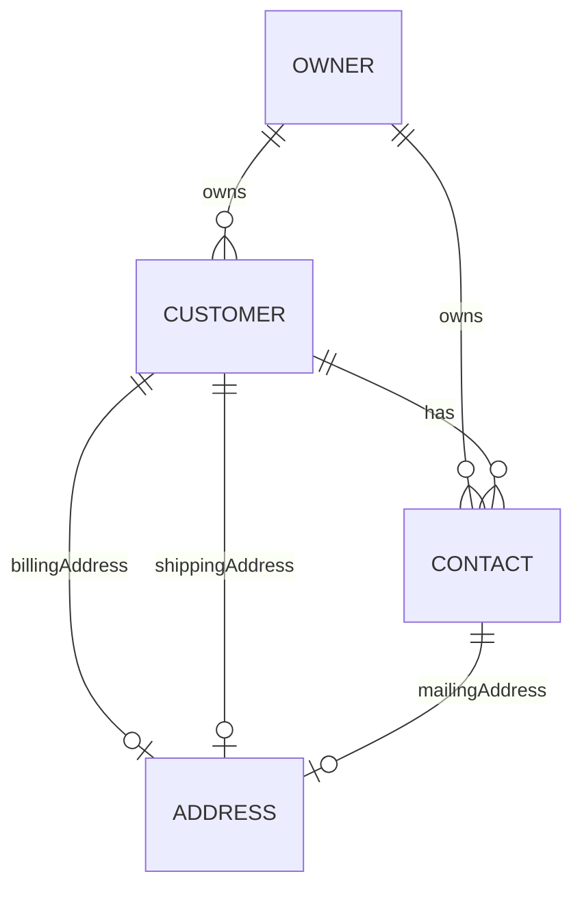

# Flexora ERP — Phase 2：CRM 基礎（Customer & Contact）規格 v1.0

> 更新：2025-10-29（Asia/Taipei）  
> 基底：JHipster v8.11.x，Spring Boot 3.x，PostgreSQL  
> 原則：Owner 可見性（@Filter: v_owner_visible）、軟刪除、審計欄位、Materialized Path（若有階層）、JSONB/VO、Partial Unique（WHERE deleted=false）

## 目錄

1. 模組範疇與用例
2. 資料模型（ER 圖 / 資料表）
3. 共同規範（審計、軟刪、Owner、搜尋/分頁/排序）
4. 商規與驗證（唯一鍵、部分唯一、關聯/刪除規則）
5. API 規格（OpenAPI 路徑摘要）
6. JSONB Address 設計（VO 與轉換）
7. ExtAttrDef 設計（Customer/Contact 擴充屬性定義）
8. 測試計畫（單元/整合/資料）
9. 後續工作與相依

---

## 1) 模組範疇與用例

- 客戶主檔（Customer）：建立/維護客戶、對應多個聯絡人、**以 Address 實體關聯**（billing/shipping）
- 聯絡人（Contact）：隸屬某客戶，可標示主要聯絡人，**以 Address 實體關聯**（mailing）
- 地址（Address）：通用地址主檔（避免在 Customer/Contact 以 JSONB 內嵌造成 N:1 複雜）
- ExtAttrDef：為 Customer/Contact 定義動態欄位（字串、數值、布林、下拉、日期…），後續 Phase 可加 value 表

---

## 2) 資料模型（ER / Tables）



### 2.0 ADDRESS（主檔）

| 欄位        | 型態          | 必填 | 說明                                   |
| ----------- | ------------- | ---- | -------------------------------------- |
| id          | BIGINT PK     | Y    |                                        |
| type        | ENUM          | Y    | `BILLING`/`SHIPPING`/`MAILING`/`OTHER` |
| street_1    | VARCHAR(500)  | Y    | 門牌/路名                              |
| street_2    | VARCHAR(500)  |      | 樓層/巷弄                              |
| city        | VARCHAR(120)  |      | 城市                                   |
| state       | VARCHAR(120)  |      | 行政區/縣市                            |
| postal_code | VARCHAR(30)   |      | 郵遞區號                               |
| country     | VARCHAR(10)   |      | ISO 2/3                                |
| latitude    | NUMERIC(21,6) |      | 緯度                                   |
| longitude   | NUMERIC(21,6) |      | 經度                                   |
| description | VARCHAR(1000) |      | 地址備註                               |
| deleted…等  |               |      | 一律含 `deleted/at/by`、`version`      |

> **索引建議**：`idx_address_country_state_city_postal`（country,state,city,postal_code）

### 2.1 CUSTOMER

| 欄位                | 型態         | 必填 | 預設  | 說明                                              |
| ------------------- | ------------ | ---- | ----- | ------------------------------------------------- |
| id                  | BIGINT PK    | Y    |       |                                                   |
| customer_no         | VARCHAR(50)  | Y    |       | **對外代碼**（同一 Owner 下唯一；partial unique） |
| customer_name       | VARCHAR(120) | Y    |       | 客戶名稱                                          |
| short_name          | VARCHAR(60)  |      |       | 簡稱                                              |
| tax_id              | VARCHAR(20)  |      |       | 統一編號／Tax ID（可部分唯一）                    |
| phone               | VARCHAR(40)  |      |       |                                                   |
| email               | VARCHAR(120) |      |       |                                                   |
| billing_address_id  | BIGINT FK    |      |       | 對應 `Address`                                    |
| shipping_address_id | BIGINT FK    |      |       | 對應 `Address`                                    |
| tags                | VARCHAR(255) |      |       | 逗號分隔或 JSONB（先字串）                        |
| enabled             | BOOLEAN      | Y    | true  |                                                   |
| deleted             | BOOLEAN      | Y    | false |                                                   |
| deleted_at          | TIMESTAMP    |      |       |                                                   |
| deleted_by          | VARCHAR(100) |      |       |                                                   |
| version             | BIGINT       |      |       |                                                   |
| owner_id            | BIGINT FK    | Y    |       |                                                   |

**Partial Unique**

- `(owner_id, lower(customer_no)) WHERE deleted=false`
- （選配）`(owner_id, tax_id) WHERE deleted=false AND tax_id IS NOT NULL`

### 2.2 CONTACT

| 欄位                | 型態                  | 必填             | 說明                                           |
| ------------------- | --------------------- | ---------------- | ---------------------------------------------- |
| id                  | BIGINT PK             | Y                |                                                |
| customer_id         | BIGINT FK -> CUSTOMER | Y                | 隸屬客戶                                       |
| contact_no          | VARCHAR(50)           |                  | 對外代碼（同 Owner+Customer 下唯一；可空）     |
| full_name           | VARCHAR(100)          | Y                | 姓名                                           |
| job_title           | VARCHAR(80)           |                  | 職稱                                           |
| phone               | VARCHAR(40)           |                  |                                                |
| mobile              | VARCHAR(40)           |                  |                                                |
| email               | VARCHAR(120)          |                  |                                                |
| is_primary          | BOOLEAN               | Y(default false) | 主要聯絡人（同一客戶下建議僅一位；以商規控制） |
| mailing_address_id  | BIGINT FK             |                  | 對應 `Address`                                 |
| enabled/deleted/... |                       |                  | 同上                                           |

**Partial Unique**

- `(customer_id, lower(contact_no)) WHERE deleted=false AND contact_no IS NOT NULL`

### 2.3 EXT ATTR DEF（Customer/Contact 共用一張或各自一張）

採 **共用表**，以 `target_type` 區分：`CUSTOMER` / `CONTACT`

| 欄位        | 型態         | 必填 | 說明                                                 |
| ----------- | ------------ | ---- | ---------------------------------------------------- |
| id          | BIGINT PK    | Y    |                                                      |
| owner_id    | BIGINT FK    | Y    |                                                      |
| target_type | VARCHAR(24)  | Y    | `CUSTOMER`/`CONTACT`                                 |
| attr_code   | VARCHAR(50)  | Y    | 欄位代碼（同 Owner+TargetType 唯一；partial unique） |
| attr_name   | VARCHAR(100) | Y    | 顯示名稱                                             |
| value_type  | VARCHAR(20)  | Y    | `STRING/NUMBER/BOOLEAN/DATE/ENUM`                    |
| options     | JSONB        |      | ENUM 選項、數值範圍、格式規則                        |
| required    | BOOLEAN      | Y    |                                                      |
| enabled/…   |              |      | 同上                                                 |

**Partial Unique**

- `(owner_id, target_type, lower(attr_code)) WHERE deleted=false`

> 註：本階段僅定義「欄位定義表」。實際值表（ExtAttrValue）可於 Phase 2.5/3 擴充。

---

## 3) 共同規範

- **Owner 可見性**：所有查詢套用 `@Filter(name="ownerFilter")`（v_owner_visible）
- **軟刪除**：`deleted=false` 為有效；所有唯一性採 **Partial Unique Index**
- **審計**：createdBy/createdDate/lastModifiedBy/lastModifiedDate（沿用現有基底）
- **搜尋/分頁/排序**：維持 JHipster `Criteria + QueryService` 模式

---

## 4) 商規與驗證

- **唯一鍵（程式 + DB）**

  - Customer：`customer_no` 在 `(owner, deleted=false)` 下唯一
  - Contact：`contact_no` 在 `(customer, deleted=false)` 下唯一（若有）
  - ExtAttrDef：`(owner, target_type, attr_code)` 在 `deleted=false` 下唯一

- **主聯絡人**：同一客戶僅允許一位 `is_primary=true`（Service 層以 UPDATE 將其他設為 false）
- **刪除規則**：刪除 Customer 時，如存在未刪除的 Contact → **禁止刪除**（需先處理關聯）
- **Email/Phone**：基本格式檢查；Email 唯一性不強制（不同客戶可能同信箱）

---

## 5) API 規格（摘要）

- `POST /api/addresses`、`GET /api/addresses`、`...`
- `POST /api/customers`（payload 可帶 `billingAddress`/`shippingAddress` 物件或僅傳 `...AddressId`）
- `POST /api/contacts`（payload 可帶 `mailingAddress` 物件或僅傳 `mailingAddressId`）
- `GET /api/customers`、`GET /api/customers/{id}`、`PUT/PATCH/DELETE`
- `GET /api/contacts`、`...`
- `GET /api/ext-attr-defs/customer`、`POST /api/ext-attr-defs/customer`（同 contact）
- **建立/更新策略**

  - 若 body 內含 `billingAddress`（帶 `id`）→ 視為指向既有 Address；未帶 `id` → 先建 Address 再關聯。
  - 同理適用於 `shippingAddress`、`mailingAddress`。
  - 僅傳 `...AddressId` 時直接關聯既有 Address。

- **驗證錯誤模型**：維持 JHipster ProblemDetail
- **部分唯一檢查**：違反回 `400 BadRequestAlertException`（message: `error.unique`）

> 完整 OpenAPI 於實作後由 Springdoc 輸出；此處僅列摘要與商規。

---

## 6) Address JSON（API 用）設計（以 Address 實體為基礎）

**用於 API 輸入/輸出（inline 物件）**。欄位對應 `Address` 實體；當 **建立新地址** 時可不含 `id`。

```json
{
  "id": 123,
  "type": "BILLING",
  "street1": "忠孝西路一段 1 號",
  "street2": "10 樓",
  "city": "中正區",
  "state": "台北市",
  "postalCode": "100",
  "country": "TW",
  "latitude": 25.04776,
  "longitude": 121.51706,
  "description": "公司總部收件處"
}
```

**驗證與行為**

- `type`、`street1` 必填；`latitude/longitude` 若有，後端檢核為數值且 scale ≤ 6。
- 以 **Address Upsert** 流程處理：有 `id` → 驗證存在再更新；無 `id` → 建立後回傳新 `id`。
- 客戶/聯絡人關聯更新時：

  - 若同一請求同時帶入 `...AddressId` 與 `...Address`，以 **物件優先**（並忽略 Id），避免矛盾。
  - 取消關聯可傳 `null` 的 `...AddressId`（或在 PATCH 中移除欄位）。

---

## 7) ExtAttrDef 設計

- `value_type` 控制資料格式；若為 `ENUM`，`options.allowedValues=["A","B","C"]`
- 後續可新增 ExtAttrValue（entityId, attrCode, value）與快取

---

## 8) 測試計畫

- **單元**

  - AddressService：建立/更新/刪除（軟刪）、型別與座標檢核。
  - CustomerService/ContactService：帶入 inline Address 之 upsert 關聯、`...AddressId` 與物件互斥規則。

- **整合**

  - `POST /api/customers`：同時新建 `billingAddress` + 指定 `shippingAddressId`。
  - `PATCH /api/contacts/{id}`：替換 `mailingAddress`（物件）並驗證落地。

- **CSV/種子**

  - `address.csv`、`customer.csv`、`contact.csv`：涵蓋 BILLING/SHIPPING/MAILING，含一筆具座標的地址。

---

## 9) 後續工作

- Phase 2.5：ExtAttrValue、客戶備註/附件（整合 Document 模組）
