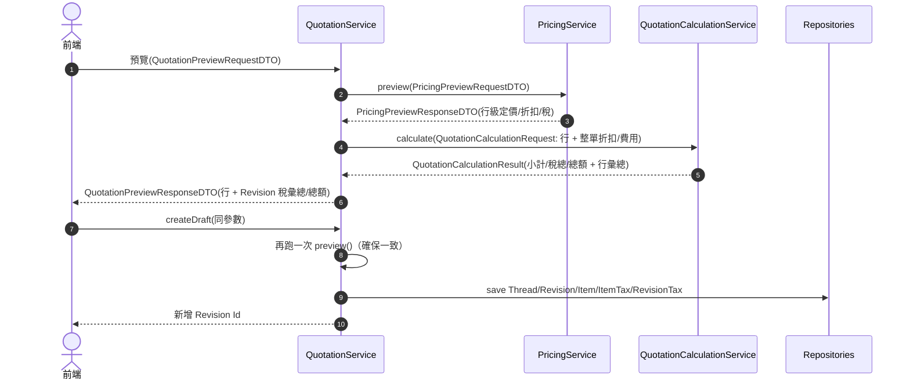

# Phase 4 — 報價（Quotation）開發規格

> 依據 `docs/flexora-quotation-management-spec.md`、`docs/Flexora ERP 規格書(整合).md` 及既有程式結構整理。所有欄位/流程仍須遵循《Flexora ERP 開發規範 – 資料結構與版本管理》。

---

## 1. 目標與範圍

1. 以 **Thread + Revision** 模型管理報價，Revision/Item/Tax 為不可變快照，Thread 僅保存商機層資訊與最新版本指標。
2. 支援 **狀態機**（`quotation_status_def` 四表）＋事件端點，涵蓋 `send/approve/reject/cancel/expire`。
3. 行項資料 **對 ItemSku**；價格/稅率需快照當下值。折扣支援 `NONE/AMOUNT/RATE`。
4. 提供 **ExtAttr**、**地址快照**、**附檔關聯**與 **JaVers** 追蹤。
5. 核准版本可 **轉 SalesOrder**，必須記錄 `SalesOrderQuotationLink`（thread + revision）。
6. 產出對應 API、事件、驗收測試與開發任務清單。

---

## 2. 資料模型摘要

| 實體                                                                         | 角色與重點欄位                                                                                                                                                                       |
| ---------------------------------------------------------------------------- | ------------------------------------------------------------------------------------------------------------------------------------------------------------------------------------ |
| `quotation_thread`                                                           | `thread_no`（partial unique）；`customer_id` / `contact_id`；`owner_id`；`current_revision_id`（快取最新 Revision）                                                                  |
| `quotation_revision`                                                         | `revision_no`（線內序號）、`quotation_date`、`valid_until`、`price_list_id`、`currency`、`payment_term`、`shipping_term`、`subtotal/discount/tax/total`、`source`（CRM、複製、手動） |
| `quotation_item`                                                             | `sku_id`、`uom_id`、`quantity`、`unit_price`、`discount_type/value`、`line_amount`、`tax_inclusive`                                                                                  |
| `quotation_revision_address`                                                 | `type=BILL_TO/SHIP_TO`、`fullName`、`phone`、`addressJson`（VO）                                                                                                                     |
| `quotation_revision_tax` / `quotation_item_tax`                              | `tax_code_id`、`rate`、`base_amount`、`tax_amount`、`sequence`                                                                                                                       |
| `quotation_status_def` / `event_def` / `state_transition` / `status_history` | 定義狀態、事件、轉換守衛與歷史紀錄                                                                                                                                                   |
| `quotation_revision_ext_attr_def/value`                                      | ExtAttr 定義與值，遵循通用規則（partial unique by owner + attr_code）                                                                                                                |
| `sales_order_quotation_link`                                                 | SO 與 Quotation Thread/Revision 關聯、轉單數量與備註                                                                                                                                 |

> **對齊 Flexora v2.0**：完整欄位/型態/索引仍以《flexora-quotation-management-spec.md》章節 3.x 為權威；本文件僅擷取開發要點。所有時間欄位採 UTC Instant，金額 `DECIMAL(19,4)`、中間運算 `scale=6`，並沿用 partial unique（`WHERE deleted=false`）與四表狀態治理。

---

## 3. 流程與狀態

### 3.1 狀態

| 代碼          | 說明   | 終結 | 守衛/備註                                |
| ------------- | ------ | ---- | ---------------------------------------- |
| `DRAFT`       | 草稿   | 否   | 建立中/可編輯                            |
| `IN_APPROVAL` | 審批中 | 否   | `SUBMIT_FOR_APPROVAL` 後進入、待審批結果 |
| `APPROVED`    | 已核准 | 否   | 內部審批完成，可寄送或轉訂單             |
| `SENT`        | 已寄出 | 否   | 需至少 1 行項，觸發 `SEND`               |
| `WON`         | 成交   | 是   | 客戶接受（`CUSTOMER_ACCEPT`）            |
| `LOST`        | 失單   | 是   | 客戶拒絕或判定失單（`LOST` 事件）        |
| `REJECTED`    | 已退回 | 否   | 審批退回等待調整                         |
| `EXPIRED`     | 已逾期 | 是   | 有效期限逾期由排程觸發                   |
| `CANCELLED`   | 作廢   | 是   | 管理員或流程取消                         |

### 3.2 事件端點

| 事件      | 路由                                          | 輸入重點                           | 守衛                          |
| --------- | --------------------------------------------- | ---------------------------------- | ----------------------------- |
| `send`    | `POST /api/quotations/{threadId}/events/send` | `revisionId`、`channel(email/pdf)` | Revision 必須最新且有至少一行 |
| `approve` | `/events/approve`                             | `revisionId`、`customerAck`        | 僅 `SENT` 可轉；逾期需先延展  |
| `reject`  | `/events/reject`                              | `reason`                           | 僅 `SENT`/`APPROVED` 可轉     |
| `cancel`  | `/events/cancel`                              | `reason`                           | 非終結狀態                    |
| `expire`  | 排程 API 或 `/events/expire`                  | 系統自動                           | ValidUntil <= now 並非終結    |

> 事件 API 回傳 `QuotationThreadDTO`（含 `currentRevision` 與最新狀態）；所有守衛失敗回 `409`（`quotation.status.guard`）。

#### 3.2.1 事件請求欄位

| 欄位         | 型態     | 說明                                                                          |
| ------------ | -------- | ----------------------------------------------------------------------------- |
| `revisionId` | `Long`   | 目標 Revision 主鍵，僅允許等於 `thread.currentRevision.id`                    |
| `channel`    | `String` | 觸發來源（EMAIL / PORTAL / API...），`send` 事件必填                          |
| `reason`     | `String` | `reject/cancel` 等終結事件需提供原因                                          |
| `note`       | `String` | 補充說明，寫入 `quotation_status_history.note`                                |
| `reference`  | `String` | 外部參考（emailId / workflowId）                                              |
| `payload`    | `JSON`   | 自由格式 payload，會序列化為字串寫入 `quotation_status_history.event_payload` |

#### 3.2.2 事件定義（來自 `quotation_event_def.csv`）

| 事件代碼              | 名稱     | 說明                              |
| --------------------- | -------- | --------------------------------- |
| `SUBMIT_FOR_APPROVAL` | 提交審批 | 草稿送審，進入 `IN_APPROVAL`      |
| `APPROVE`             | 審批通過 | Flow 結束、轉 `APPROVED`          |
| `REJECT`              | 審批退回 | 轉入 `REJECTED`，等待調整         |
| `SEND`                | 寄送報價 | 寄給客戶並轉 `SENT`               |
| `EXPORT_PDF`          | 匯出 PDF | 不變更狀態，僅記錄歷史            |
| `CUSTOMER_ACCEPT`     | 客戶接受 | 由 Portal/Webhook 觸發，轉 `WON`  |
| `LOST`                | 標記失單 | 客戶拒絕或業務標記失單，轉 `LOST` |
| `CANCEL`              | 作廢     | 內部取消報價，轉 `CANCELLED`      |
| `EXPIRE`              | 逾期     | 排程觸發，轉 `EXPIRED`            |
| `MANUAL_NOTE`         | 人工註記 | 不變更狀態，僅記錄備註            |

#### 3.2.3 狀態轉換（`quotation_state_transition.csv`）

| From          | 事件                  | To            | 說明           |
| ------------- | --------------------- | ------------- | -------------- |
| `DRAFT`       | `SUBMIT_FOR_APPROVAL` | `IN_APPROVAL` | 草稿提交審批   |
| `IN_APPROVAL` | `APPROVE`             | `APPROVED`    | 審批通過       |
| `IN_APPROVAL` | `REJECT`              | `REJECTED`    | 審批退回       |
| `REJECTED`    | `SUBMIT_FOR_APPROVAL` | `IN_APPROVAL` | 調整後再送審   |
| `APPROVED`    | `SEND`                | `SENT`        | 寄送報價       |
| `DRAFT`       | `CANCEL`              | `CANCELLED`   | 草稿作廢       |
| `IN_APPROVAL` | `CANCEL`              | `CANCELLED`   | 审批中作廢     |
| `APPROVED`    | `CANCEL`              | `CANCELLED`   | 核准後作廢     |
| `SENT`        | `CUSTOMER_ACCEPT`     | `WON`         | 客戶接受、成交 |
| `SENT`        | `LOST`                | `LOST`        | 客戶拒絕或失單 |
| `SENT`        | `EXPIRE`              | `EXPIRED`     | 逾期自動終結   |

---

## 4. API 設計總覽

| 類別          | 路由                                                                                               | 說明                                                                    |
| ------------- | -------------------------------------------------------------------------------------------------- | ----------------------------------------------------------------------- |
| Thread CRUD   | `GET/POST/PUT/PATCH/DELETE /api/quotation-threads` + `/{id}:soft-delete`/`:{restore}` + `/_exists` | 基於 JHipster Resource；新增 threadNo 自動編號、重複檢查、軟刪除/還原   |
| Revision CRUD | `POST /api/quotations/{threadId}/revisions`（新增版本）、`GET /api/quotation-revisions/{id}` 等    | 建版時複製上一版本資料並重算 totals                                     |
| Items API     | `POST/PUT/DELETE /api/quotation-items`                                                             | 僅針對最新 Revision；發行後不可修改                                     |
| 稅務/地址     | `POST /api/quotation-revision-taxes`、`POST /api/quotation-revision-addresses`                     | 需同步更新 Revision totals                                              |
| ExtAttr       | `POST /api/quotation-revision-ext-attr-defs` + `/values`                                           | 與其它模組一致                                                          |
| 狀態/事件     | `POST /api/quotations/{id}/events/{eventCode}`                                                     | 由 `QuotationWorkflowService` 驗證轉換                                  |
| Workflow 選項 | `GET /api/quotations/{threadId}/events/options`                                                    | 依據最新 Revision 狀態列出可執行事件、目標狀態與條件提示                |
| 查詢          | `GET /api/quotations?status.equals=...&customerId.equals=...`                                      | Criteria 查詢；支援 `lastRevisionOnly`                                  |
| 轉 SO         | `POST /api/quotations/{threadId}/revisions/{revisionId}:to-sales-order`                            | 驗證 Revision `APPROVED`、未轉單；建立 SO + `SalesOrderQuotationLink`   |
| Link 清單     | `GET /api/quotations/{threadId}/links[?revisionId=]`                                               | 取得已建立的 `SalesOrderQuotationLink` 列表，含 `salesOrderId/linkType` |
| 附件          | `POST /api/documents` + `POST /api/document-links`                                                 | 可附檔於 Thread/Revision                                                |

> threadNo 採 `NumberingService.next("QUOTATION", "threadNo")` 統一產生；若前端未提供編號，後端會自動帶入並透過 `/api/quotation-threads/_exists` 提供即時重複檢查。軟刪除／還原（`POST /{id}:soft-delete`、`POST /{id}:restore?newThreadNo=`）僅切換 `deleted` 狀態，不會硬刪記錄。

> 所有寫入端點建議加上 `@IdempotentEndpoint`（thread create、revision create、event），方便客戶端重試。

### 4.1 預覽／草稿輸入欄位（新增）

| 欄位            | 型態               | 說明                                                              |
| --------------- | ------------------ | ----------------------------------------------------------------- |
| `discountType`  | `NONE/AMOUNT/RATE` | 整單折扣型態，對應 `quotation_revision.discount_type`             |
| `discountValue` | `BigDecimal(21,6)` | 整單折扣值，`AMOUNT=金額`、`RATE=0–1`                             |
| `shippingFee`   | `BigDecimal(21,4)` | 運費快照，預設 0，傳入後會落地於 `QuotationRevision.shipping_fee` |
| `handlingFee`   | `BigDecimal(21,4)` | 其他手續費/調整金額，預設 0                                       |
| `properties`    | `JSON 物件字串`    | 客製化欄位值（ExtAttr 以外），需為合法 JSON 物件，空值視為 `{}`   |

> **Quick Create Flow**：前端 Quick Create Drawer 需先呼叫 `POST /api/quotations/preview`（帶行項、付款條件、地址與 `properties.extAttrs`）確認金額，再用相同 payload 呼叫 `POST /api/quotations` 建立 Thread/Revision。ExtAttr 值會寫入 `properties.extAttrs`，後續 def 異動不影響既有 JSON 快照。

> `/api/quotations/preview` 會依此欄位重新計算 totals，`POST /api/quotations` 亦會帶入同樣設定以確保資料落地一致。

> **驗證**：`properties` 一律被正規化為 `{}` 或合法 JSON 物件，若傳入非 JSON 字串或 JSON 陣列，後端會回傳 400（errorKey=`invalidJson`）。

> **Quotation Hub 查詢 / 篩選**
>
> - List / Pipeline 均沿用 `GET /api/quotation-threads`，新加入以下 Criteria 參數：
>   - `currentRevisionStatusCode.equals` / `.in`：依最新修訂狀態過濾。
>   - `currentRevisionValidUntil.lessThan|greaterThanOrEqual`：支援「已過期 / 即將到期」查詢。
>   - `search.contains`：同時搜尋 threadNo/subject/customerName/contactName（不區分大小寫）。
>   - `ownerId.equals`：依 Owner 進行 server-side 篩選（前端「我的報價」會先根據登入者查詢對應 OwnerId 後再呼叫）。
> - 分頁參數仍沿用 `page`/`size`/`sort`，Pipeline 模式以同條件一次抓取上限 500 筆資料並依狀態分欄；如需完整清單可再搭配 CSV Export。
> - 目前 Owner 仍以 ID 節點過濾；未來若要支援 Team/Department，可改用 `ownerType.equals` 與多值 `ownerId.in`。

> **Line Item 傳遞**
>
> - Drawer 會依 SKU 預設帶入 `items[].uomId` 與 `taxCode`，確保 Pricing 端能依 UoM 換算。
> - Quick create / 業務覆寫單價為需求項，短期先暫存於 `properties.extAttrs.manualUnitPrices`（格式：`[{ lineIndex, skuId, unitPrice }]`），後端照常依 Pricing 結果落地。
> - 中期需擴充 `QuotationPreviewRequestDTO` / `QuotationPreviewItemDTO` / `QuotationLine` / `quotation_item`，加入 `unitPriceOverride`（或 `pricingMode`）欄位，preview 與 create 皆能帶入自訂含稅/未稅單價。
> - Entity 層新增欄位後，同步調整 `QuotationService.saveRevisionSnapshot()`、`QuotationCustomizationService` 與 `QuotationItemMapper`，確保 override 價格可被 JaVers/歷史記錄追蹤。

### 4.2 轉 SalesOrder 請求欄位

| 欄位                  | 型態                  | 說明                                                                                           |
| --------------------- | --------------------- | ---------------------------------------------------------------------------------------------- |
| `reservationStrategy` | `ReservationStrategy` | 給即將建立的 SO 使用的預留策略（預設 `AUTO`）                                                  |
| `shipComplete`        | `Boolean`             | 是否要求整單備齊才出貨（預設 `false`）                                                         |
| `linkType`            | `String`              | 建立 `SalesOrderQuotationLink` 時的連結型態（預設 `FULL`）                                     |
| `note`                | `String`              | 轉單備註，寫入 `SalesOrderQuotationLink.note`                                                  |
| `items[]`             | `LineSelection`       | 選填。指定行項(`quotationItemId`)與此次轉出的 `quantity`。空陣列時代表「轉出所有剩餘可轉量」。 |

`LineSelection.quantity` 必須小於等於「報價行原始數量 – 已轉單數量」。服務會根據 `SalesOrderItem.originQuotationItemId` 自動計算剩餘量，避免出現超轉。<br/>
前端/Resource 層亦會驗證 `items[]` 不得包含空白元素、重複 `quotationItemId`，且 `quantity` 需大於 0。
完成同一報價版本最後一批轉單時（所有行項剩餘量歸零），系統會自動：

1. 將 `linkType` 預設為 `FULL`（除非使用者覆寫）；若仍有剩餘量則為 `PARTIAL`。
2. 將運費/手續費/整單折扣快照帶入該批所建立的 SO；之前的部分轉單則不重複帶入，避免金額被多次計算。

> API 路徑：`POST /api/quotations/{threadId}/revisions/{revisionId}:to-sales-order`。Revision 狀態需為 `APPROVED`，僅可轉出尚未轉單的剩餘數量（超出時回 `400`）。
>
> 轉單成功後系統會自動觸發 SalesOrder workflow `SUBMIT` + `CONFIRM`（若對應轉換存在），確保新訂單立即進入可配貨狀態。如需覆蓋，仍可透過 `/api/sales-orders/{id}/events/{eventCode}` 進行手動事件。

### 4.3 Sales Order 狀態機

#### 4.3.1 狀態

| 代碼                | 說明     | 終結 | 備註            |
| ------------------- | -------- | ---- | --------------- |
| `DRAFT`             | 草稿     | 否   | 建立中          |
| `CONFIRMED`         | 已確認   | 否   | 可進行預留/出貨 |
| `PARTIAL_FULFILLED` | 部分履約 | 否   | 部分出貨完成    |
| `FULFILLED`         | 已完結   | 是   | 全部出貨完成    |
| `CANCELLED`         | 已取消   | 是   | 釋放預留、終結  |

#### 4.3.2 事件

| 事件代碼       | 名稱     | 說明                       |
| -------------- | -------- | -------------------------- |
| `SUBMIT`       | 提交     | 送出草稿供審批或確認       |
| `CONFIRM`      | 確認     | 轉入 `CONFIRMED`、啟動預留 |
| `PARTIAL_SHIP` | 部分出貨 | 更新為 `PARTIAL_FULFILLED` |
| `SHIP`         | 完整出貨 | 轉入 `FULFILLED`           |
| `CANCEL`       | 取消     | 釋放預留、轉入 `CANCELLED` |

#### 4.3.3 轉換

| From                | 事件           | To                  | 守衛/備註                                               |
| ------------------- | -------------- | ------------------- | ------------------------------------------------------- |
| `DRAFT`             | `SUBMIT`       | `DRAFT`             | `order.isValid() && order.hasItems()`（僅紀錄提交事件） |
| `DRAFT`             | `CONFIRM`      | `CONFIRMED`         | `order.isValid() && order.hasItems()`                   |
| `DRAFT`             | `CANCEL`       | `CANCELLED`         | 無                                                      |
| `CONFIRMED`         | `PARTIAL_SHIP` | `PARTIAL_FULFILLED` | 部分出貨完成                                            |
| `PARTIAL_FULFILLED` | `SHIP`         | `FULFILLED`         | 剩餘出貨完成                                            |
| `CONFIRMED`         | `SHIP`         | `FULFILLED`         | 一次性全出貨                                            |
| `CONFIRMED`         | `CANCEL`       | `CANCELLED`         | `order.canCancel()`，需釋放預留                         |

### 4.4 轉單連結清冊 API

| 路由                                   | 說明                                                                                      |
| -------------------------------------- | ----------------------------------------------------------------------------------------- |
| `GET /api/quotations/{threadId}/links` | 取得指定 Thread 的 `SalesOrderQuotationLink` 清單，可透過 `revisionId` query 篩選單一版本 |

### 4.5 Workflow 事件選項 API

- 路由：`GET /api/quotations/{threadId}/events/options`
- 行為：
  1. 以 `threadId` 載入最新 Revision 與其狀態（若缺少最新版本或狀態 → 400）。
  2. 查詢 `quotation_state_transition` 中符合 `fromStatus` 的啟用轉換，依 `sequence` 排序。
  3. 回傳 `QuotationWorkflowOptionDTO` 陣列供前端 Workflow Drawer / Pipeline 參考。

| 欄位                 | 說明                                              |
| -------------------- | ------------------------------------------------- |
| `eventCode/name`     | 事件代碼 / 顯示名稱（沿用 `quotation_event_def`） |
| `toStatusCode/name`  | 目標狀態代碼 / 顯示名稱                           |
| `requiresLineItems`  | 是否需至少一筆行項                                |
| `requiresChannel`    | 是否需指定 `channel`（SEND 類）                   |
| `requiresReason`     | 是否需提供 `reason`（REJECT / CANCEL / LOST 等）  |
| `requiresValidUntil` | 是否需檢查 `validUntil` 尚未逾期                  |

> 前端應以此 API 作為唯一資料來源，避免硬編事件清單；當狀態機新增事件時亦能即時反映 Guard 要求。

> **TODO（後端）**：`BadRequestAlertException`/`ProblemDetailWithCause` 目前在 `detail` 欄位塞入另一個 ProblemDetail 字串，導致前端只能顯示包裹後的訊息。請於 `QuotationWorkflowService`、`SalesOrderWorkflowService` 等流程中調整為「直接將 title（或實際錯誤訊息）寫入 detail/message」，並沿用相同策略至 SalesOrder Workflow，讓 UI 可以直接顯示「報價已逾期」等可讀內容。

回傳欄位沿用 `SalesOrderQuotationLinkDTO`（含 `salesOrderId/linkType/linkedQuantity/note/linkedAt`）。供前端顯示部分轉單記錄、跳轉到對應的 SalesOrder。

> 銷售訂單事件端點：`POST /api/sales-orders/{id}/events/{eventCode}`，輸入 `SalesOrderEventRequestDTO`（包含 channel/reason/note），服務端會依 enum metadata + state_transition 檢查守衛並寫入 `sales_order_status_history`。

---

### 4.5 ExtAttr／附件／地址 API（QTN-6）

| 路由                                                               | 說明                                                                                        |
| ------------------------------------------------------------------ | ------------------------------------------------------------------------------------------- |
| `POST /api/quotations/{threadId}/revisions/{revisionId}/addresses` | 更新帳單（billing）與送貨（shipping）地址 JSON 快照，僅覆寫 payload 中提供的欄位            |
| `POST /api/quotations/{threadId}/revisions/{revisionId}/ext-attrs` | 批次寫入 `properties.extAttrs`，依 `QuotationRevisionExtAttrDef.dataType` 驗證/轉換值       |
| `POST /api/quotations/{threadId}/documents`                        | 建立 `DocumentLink`，可掛在 Thread（預設）或指定 Revision；支援 `relationType/primary/note` |

#### 4.5.1 輸入規範

1. **地址 API**：payload 為 `QuotationAddressUpdateDTO`，欄位型別直接採用 `AddressSnapshot` VO。前端傳遞物件即可，由後端 AttributeConverter 轉為 JSONB；若 billing/shipping 全為 null 會直接忽略。
2. **ExtAttr API**：前端以欄位代碼 + JSON 值傳入。後端會：
   - 讀取 `QuotationRevisionExtAttrDef` 並依型別轉換 (`STRING/INT/DECIMAL/DATE/BOOL/JSON`)；
   - 將結果寫入 `properties.extAttrs.<code>`，不存在時自動建立 `extAttrs` 節點；
   - Def 調整（label/regex/required）不會 retroactive 修改既有 Revision 的 JSON；若 def 被刪除，既有資料仍保留，僅前端不再顯示該欄位；
   - 若代碼不存在或值格式錯誤回 400，errorKey `extAttrNotFound` / `extAttrValueInvalid`。
3. **附件 API**：要求 `documentId`，可選 `revisionId`；若帶入 revisionId，會使用 `LinkOwnerType.QUOTATION_REVISION`，否則掛在 Thread。`relationType` 缺省為 `OTHER`，`primary` 預設 false。
4. **AddressSnapshot 結構**：`com.asynctide.flexora.domain.vo.AddressSnapshot` 為所有表單地址統一 VO，欄位包含
   `recipientName/recipientTitle/recipientPhone/recipientEmail/companyName/taxId/country/state/city/district/postalCode/line1/line2/line3/landmark/fullAddress/note`。系統在 Entity 儲存時會以 AttributeConverter 轉成 JSONB，並於 Service 端深拷貝避免共享引用。

#### 4.5.2 請求範例

**地址快照**

```json
POST /api/quotations/100/revisions/200/addresses
{
  "billingAddress": {
    "recipientName": "王大同",
    "companyName": "花見股份有限公司",
    "country": "TW",
    "state": "新北市",
    "city": "板橋區",
    "postalCode": "220",
    "line1": "文化路一段100號10樓",
    "note": "統編 12345678"
  },
  "shippingAddress": {
    "recipientName": "江小美",
    "recipientPhone": "+886-2-12345678#308",
    "country": "TW",
    "state": "高雄市",
    "city": "前鎮區",
    "line1": "成功二路123號",
    "fullAddress": "806 高雄市前鎮區成功二路123號"
  }
}
```

**ExtAttr 批次更新**

```json
POST /api/quotations/100/revisions/200/ext-attrs
{
  "attributes": [
    { "code": "CUSTOMER_PO", "value": "PO-2025-001" },
    { "code": "SHIP_VIA", "value": "DHL" },
    { "code": "REQUIRE_DEPOSIT", "value": true }
  ]
}
```

**附件連結**

```json
POST /api/quotations/100/documents
{
  "documentId": 9876,
  "relationType": "QUOTE_PDF",
  "primary": true,
  "revisionId": 200,
  "note": "自動從 PDF 產生"
}
```

#### 4.5.3 UI 驗證建議

- ExtAttr 表單需根據 def metadata 動態渲染：`requiredAttr`、`regex`、`dataType` 決定輸入元件與檢核。
- 附件上傳流程建議先呼叫 Document Service 取得 `documentId`，再打本 API 建立 link；同附件可重複連結但需提示使用者。
- 地址編輯建議帶入 CRM 既有地址作為預設，避免使用者輸入無效 JSON。

#### 4.5.4 寫入位置

- `QuotationRevision.billingAddress` / `shippingAddress`：字串欄位，存整段 JSON。
- `QuotationRevision.properties`：新增/維護 `extAttrs` 子節點；可透過 `QuotationCustomizationService` 解析與序列化。
- `document_link`：使用既有 `Document` + `DocumentLink` 表，`link_owner_type` 僅允許 `QUOTATION_THREAD`、`QUOTATION_REVISION`。

> 對應服務：`com.asynctide.flexora.service.quotation.QuotationCustomizationService`。API 層與服務層皆加入繁體中文 JavaDoc，並透過 `QuotationCustomizationResourceIT` 驗證 happy path。

---

## 5. 整合

1. **定價（Pricing）**：Revision 建版時優先使用 `PriceList` + `ItemPrice` 快照；若無則 fallback 至手動輸入。需記錄 `priceListId` 與 `pricingTraceNo`。
2. **CRM**：Thread 可連結 `Opportunity`/`Campaign`；狀態改變時可發 `quotation.status.changed` 事件（後續擴充）。
3. **Sales Order**：核准 Revision 轉單後，不允許修改；`SalesOrderQuotationLink` 回寫 `linkedQuantity`、`note`。
4. **JaVers**：Thread 及 Revision 皆納入 `@JaversSpringDataAuditable`，便於比對版本。
5. **排程**：每日 00:05 由排程服務呼叫 `POST /api/quotations/events/expire`（或直接呼叫 Service）對過期資料執行 expire 事件。

---

## 6. 測試與驗收

### 6.1 單元/服務

| 項目                               | 重點                                                      |
| ---------------------------------- | --------------------------------------------------------- |
| `QuotationWorkflowServiceTest`     | send/approve/reject/cancel/expire 守衛 + 狀態歷史寫入     |
| `QuotationCalculatorTest`          | 單頭/行項折扣、稅計算（含稅/未稅、序列）、圓整規則        |
| `QuotationRevisionFactoryTest`     | 新版本建立：複製快照、increment `revisionNo`、重算 totals |
| `QuotationToSalesOrderMapperTest`  | 轉單 mapping（行項、稅、地址）                            |
| `QuotationToSalesOrderServiceIT`   | 多次 / 部分轉單、Link 型態、剩餘量守衛                    |
| `QuotationCustomizationResourceIT` | 地址更新、ExtAttr 更新、附件連結 API happy path           |

### 6.2 Integration / MockMvc

1. **Thread + Revision Happy Path**：`POST /threads` → `POST /revisions` → `POST /items` → `POST /events/send` → `approve` → `:to-sales-order` → 驗證 SO 與 Link。
2. **守衛測試**：未寄送即批准、逾期仍批准、取消已終結等，應得 409。
3. **稅/折扣**：測單頭折扣 + 行項折扣 + 稅金序列，驗證 totals。
4. **ExtAttr / 附件 / 地址**：`QuotationCustomizationResourceIT` 驗證 API，並透過 JaVers / status history 確認寫入；`GET /audit/quotation-thread/{id}` 應含變更紀錄。

### 6.3 驗收清單

1. 報價可成功建立多版本，僅最新版本可編輯，舊版本唯讀。
2. 事件端點遵循狀態機，歷史與守衛正確；排程逾期自動 expire。
3. 核准版本轉單後，SO 與 QuotationLink 建立，且 Thread 被鎖定（只允許 clone 建新 Thread）。
4. 稅/折扣/總額與文件一致（與 Pricing 期望值無差）。
5. ExtAttr、附件、地址快照、JaVers 皆可用。

---

## 7. 開發任務（建議拆單）

| 編號  | 任務                                                                   | 說明                                                   | 依賴                    | 目前狀態                                                   |
| ----- | ---------------------------------------------------------------------- | ------------------------------------------------------ | ----------------------- | ---------------------------------------------------------- |
| QTN-1 | Thread / Revision / Item 實體 + Repository                             | 套用通用欄位、partial unique、關聯設定                 | －                      | ✅ 完成                                                    |
| QTN-2 | Revision Calculator Service                                            | 行項/稅計算、折扣、rounding、總額回寫                  | QTN-1                   | ✅ 完成                                                    |
| QTN-3 | QuotationThreadResource + QuotationRevisionResource（CRUD + Criteria） | 包含新增版本流程、只允許最新版本修改                   | QTN-2                   | ✅ 完成                                                    |
| QTN-4 | QuotationWorkflowService + events API                                  | 狀態守衛、歷史紀錄、事件 endpoint、排程 adaptor        | QTN-3                   | ✅ 完成                                                    |
| QTN-5 | SalesOrder 轉單整合                                                    | `:to-sales-order`、`SalesOrderQuotationLink`、多筆連結 | QTN-4、Sales Order 模組 | ✅ 完成（含自動 SUBMIT/CONFIRM + Link 列表 API）           |
| QTN-6 | ExtAttr / 附件 / 地址快照                                              | 套用共用 ExtAttrDef/Value、DocumentLink                | QTN-3                   | ✅ 完成（Customization Service + 新 API + 測試）           |
| QTN-7 | E2E 測試與 Postman                                                     | Happy path + 守衛 + 轉單 + expire                      | 全                      | ⏳ 尚未開始（TODO：待 Phase 4 所有模組完成後統一補齊 E2E） |

> 跨模組項目（CRM 事件、PDF/Email 寄送）可列入 Phase 4.1 後續工作，避免卡住主流程。

> **TODO（E2E）**：目前暫停撰寫 E2E / Postman 套件，待 Phase 4 所有模組開發完成後再統一補齊，避免情境頻繁變動導致腳本大幅重寫。

---

## 8. 待後續排期（跨模組）

1. **CRM 整合**：`quotation.status.changed` 事件推播至 Campaign/Opportunity。
2. **PDF 與寄送**：`send` 事件產生 PDF、透過 Document Service 與 Mail Service 發送。
3. **報價複製/模板**：允許從其它 Thread 複製或使用模板；需加 REST 端點與 UI。
4. **串接 Pricing Trace**：將計價過程 trace_no 寫回 Revision，供日後查詢。

---

## 9. 前端 UI 執行指引

1. **保留 JHipster 既有畫面**：既有 CRUD、Entity List 與 Admin UI 仍必須可用；新 ERP 介面（pipeline、drawer 等）以額外 route/component 形式堆疊，不得移除或破壞原功能，除非產品另有核准。
2. **優先沿用既有套件**：React 18 + Redux Toolkit + Bootstrap 5 + JHipster DataTable/表單為預設。若需替換第三方元件（例如 UI Library、Uploader），需先評估與現有樣式、安全策略的衝突並取得共識；Materia（Bootswatch）主題需維持，色票請使用 `var(--bs-*)`。
3. **欄位顯示策略**：UI 需支援「核心欄位 + 詳細區」佈局。畫面與後端 DTO 保持一致，但可將較少使用的欄位收納在 Advanced accordion 或 Tab；新增欄位只需於詳細區補上即可。
4. **Pipeline & Quick Actions**：Pipeline 直接使用 `quotation_status_def` 狀態；顏色依 Materia theme mapping，未來可讀取 `metadata.color`覆寫。列表 Toolbar 預設提供新增/送出/批准/轉單/匯出/軟刪，Phase 4.1 功能（匯入 Excel、共用連結、複製 Thread）先以 disabled 菜單預留。
5. **權限與 DataScope**：列表查詢依後端 Criteria（owner/data scope）決定資料；詳情/Workflow 按鈕需依 API 回傳的 `canEdit`、`canTriggerEvent` 或 owner 是否匹配顯示。Pipeline 拖拉若被拒絕需即時提示並回復原欄位。
6. **共用元件策略**：ExtAttr、Attachment、Address Snapshot 等子元件應放在 `app/shared/components` 或 `app/modules/quotation/shared`，後續 Sales Order 亦可重用。
7. **文檔同步**：每次新增/調整 UI 行為需更新 `docs/ui/quotation-ui-wireframe.md`、React 實作檢查清單（`docs/ui/react-ui-checklist.md`）以及 `docs/ui/README.md` 中的結構描述，確保與後端 API 規格一致。
8. **守衛一致性**：前端 Workflow 表單需沿用後端事件守衛（line item/ channel/ reason 檢核），避免 UI 與 Service 條件不一致。

### 8.1 CRM 整合

- 事件：`quotation.status.changed`；欄位含 `threadId/revisionId/revisionNo/eventCode/fromStatus/toStatus/ownerId/customerId/grandTotal/currency/occurredAt`。
- 發送點：`QuotationWorkflowService` 成功觸發事件後，由 ApplicationEvent/Message Bridge 派送至 CRM。
- 訂閱：Campaign/Opportunity 模組根據 owner/customer 對應商機，自動更新 pipeline、損益與提醒。
- 文件：需補 `docs/domain/CRM Events.md` 說明事件欄位與重試策略。

### 8.2 PDF 與郵件寄送

- `send` 事件流程：產生 PDF（Report Service 或外部渲染）→ 上傳 `Document` → 呼叫 Mail Service 寄送（含附件/連結）。
- 需支援多語模板、簽核摘要與自訂寄送對象（customer contact、抄送內部人員）。
- 後端需保存寄送紀錄（log table or DocumentLink note）並允許重新寄送。

### 8.3 報價複製與模板

- 需求：可從既有 Thread 或預設模板複製行項、條件、ExtAttr。
- API 草案：`POST /api/quotations/{threadId}:clone`、`POST /api/quotations/templates/{templateCode}:apply`。
- 注意：複製時需重新編號 threadNo、reset workflow 狀態、保留引用的 priceList/owner/customer。

### 8.4 Pricing Trace 串接

- 於 preview/draft 時將 Pricing 回傳的 `traceNo` 寫到 Revision（已有欄位）。
- 提供 `GET /api/quotations/{threadId}/revisions/{revNo}/pricing-trace` 對應 Pricing Trace API，利於客服調查。
- 需明確權限與稽核紀錄（trace 可能含敏感定價參數，需 owner/data-scope 控制）。

---

## 9. 功能/實體/端點對映

| 功能     | 實體                                                                                            | 端點                                                    | 測試重點               |
| -------- | ----------------------------------------------------------------------------------------------- | ------------------------------------------------------- | ---------------------- | ------ | ----- | ----------------------- |
| 報價主檔 | `QuotationThread`, `QuotationRevision`                                                          | `/api/quotations`                                       | CRUD／版本控管         |
| 報價行項 | `QuotationItem`, `QuotationRevisionTax`, `QuotationItemTax`                                     | `/api/quotations/{id}/items` 等                         | 稅計算／捨入正確       |
| 狀態管理 | `QuotationStatusDef`, `QuotationEventDef`, `QuotationStateTransition`, `QuotationStatusHistory` | `/api/quotations/{id}/events/{send                      | approve                | reject | ...}` | 守衛、歷史、排程 expire |
| 轉訂單   | `SalesOrderQuotationLink`                                                                       | `/api/quotations/{id}/revisions/{revId}:to-sales-order` | SO 生成、部分/合併轉單 |

> 表格對應 `docs/api/MODULES.md` Phase 4 條目，可作為任務與驗收的交叉檢查清單。

---

# 10. 定價與報價服務分工與協作（Pricing / Quotation）

> 本章詳細補充三個核心服務之關係與邏輯邊界：  
> `com.asynctide.flexora.service.PricingService`、  
> `com.asynctide.flexora.service.quotation.QuotationCalculationService`、  
> `com.asynctide.flexora.service.quotation.QuotationService`。

## 10.1 一句話定位

- **PricingService**：根據價目表、規則、UoM 換算與稅碼，計算**行級**的單價、折扣後未稅、行稅與顯示用含稅/未稅單價。
- **QuotationCalculationService**：在「行級未稅與稅率」確定後，計算**整單**：分攤整單折扣、計算各行稅與總額、加總運/手續費、得出稅總與含稅總。
- **QuotationService**：**應用層協調者**，把前端請求轉成 Pricing 輸入，取得行級結果後交給 Calculation 做整單；提供**預覽**（不落地）與**草稿建立**（落地）兩條流程。

## 10.2 呼叫時序



## 10.3 輸入/輸出契約與精度

| 服務                        | 主要輸入                                                                                      | 主要輸出                                                                                                                                       | 精度策略                                                       |
| --------------------------- | --------------------------------------------------------------------------------------------- | ---------------------------------------------------------------------------------------------------------------------------------------------- | -------------------------------------------------------------- |
| PricingService              | PriceList/ItemPrice、PriceRule、UoM 換算、稅碼、請求行（含 `uomId/qty`）                      | `PricingPreviewResponseDTO`（行級 `unitPriceExcl/unitPriceIncl/taxRate/netAmount/taxAmount/discountAmount/pricedQuantity/pricedUomId` + 彙總） | 中間 6 位，金額對外以 4 位；字串輸出（`MoneyUtils`）           |
| QuotationCalculationService | `QuotationItemDTO`（quantity、unitPrice、taxRate；多由 Pricing 行轉換）、整單折扣/運費/手續費 | `QuotationCalculationResult`（小計、整單折扣金額、稅總、含稅總、行匯總；並**回寫**行 `lineTaxAmount/lineTotal`）                               | 中間 6 位、金額 4 位、`HALF_UP`                                |
| QuotationService            | 前端預覽/草稿 DTO                                                                             | 預覽 DTO（含 Revision 稅彙總）或落地資料                                                                                                       | 以 Calculation 結果為準寫庫；行單價 6 位、金額 4 位、稅率 6 位 |

> **規範**：所有金額入庫以 `DECIMAL(19,4)`；運算中間值 6 位，捨入規則 `HALF_UP`，與 Pricing/Calculation 服務一致。

## 10.4 資料映射要點（避免不一致）

- **Pricing → Calculation 橋接**（在 `QuotationService#buildCalculationItem`）：

  - `quantity` 使用 **pricedQuantity**（已做 UoM 換算），不是原始下單量。
  - `unitPrice` 以 `netAmount / pricedQuantity` 回推（6 位）。
  - `taxRate` 直接採用 Pricing 行輸出（6 位）。
  - 行內折扣已併入 `netAmount`，因此傳給計算服務的每行 `discountType=NONE`、`discountValue=0`。

- **計算後覆寫行**（`applyCalculationResultToLines`）：

  - 以 Calculation 的 `lineTaxAmount/lineTotal` 覆寫預覽行，確保**行顯示**與**Revision 總額**一致。

- **入庫**（`createDraft`）：

  - `subtotal/discount/tax/shipping/handling/grandTotal` 以 4 位寫庫；行 `unitPrice` 6 位，`taxRate` 6 位。

## 10.5 邊界條款與守衛

- **價表選擇**（PricingService）：

  - 價表需啟用、未刪除、幣別一致、效期涵蓋下單日；否則丟 `IllegalStateException`。

- **UoM 換算**：

  - 以 `UomConversionService.getConversionFactor(reqUom, priceUom)` 回傳 factor；換算後數量 `pricedQty` 用於命中階梯價。

- **整單折扣分攤**（QuotationCalculationService）：

  - 依行 `netBeforeHeader` 占比分攤；最後一行吃掉餘額，避免因四捨五入造成總額不平。
  - 稅基＝行折扣後且**已分攤整單折扣**的未稅；再乘行 `taxRate` 得稅。

- **負值保護**：

  - 行 `netAfterHeader` 若 < 0 視為 0；折抵不致使行負數。

- **折扣上限**（PricingService）：

  - 整單率與群組率合併後上限 100%。

## 10.6 常見問題與解法

1. **行合計與總計不等**：必須以 `QuotationCalculationService` 為單一真相，計算後回寫各行淨額/稅額/總額。
2. **雙重四捨五入**：中間值維持 6 位，對外金額 4 位；僅在輸出/入庫處捨入。
3. **稅率來源不一致**：一律以 Pricing 行輸出的 `taxRate` 帶入 Calculation；若行請求/價表都無稅碼，視為 0 稅。

## 10.6.1 計算服務的實作細節（建議記錄於 Spec）

為了讓開發者能快速對照程式碼，本節補充 `QuotationCalculationService` 的實作重點與已採用的常數/方法名稱（可作為測試/Code Review 檢查點）：

- 精度與捨入：

  - INTERNAL_SCALE = 6（內部中間運算使用 6 位小數）
  - MONEY_SCALE = 4（輸出/入庫/顯示金額使用 4 位小數）
  - ROUNDING = RoundingMode.HALF_UP

- 主要方法與行為：

  - calculate(QuotationCalculationRequest)：主入口，傳入行列表、整單折扣型態/值、運費/手續費，回傳 QuotationCalculationResult。

### Workflow 型別與啟動檢查（新增）

- 報價工作流程內的狀態/事件由 `QuotationStatusCode`、`QuotationEventCode` enum 定義，服務層統一以 enum 取得 code，避免寫錯大小寫或前後綴。
- 新增 `QuotationWorkflowDictionaryValidator` 於啟動時檢查 enum 中的代碼是否存在於 `quotation_status_def`、`quotation_event_def` 資料表；若缺漏直接 fail-fast，提醒維運補齊 seed。
- 若於 H2 或無 Testcontainers 的 fallback 環境啟動，可設定 `flexora.workflow.dictionary-validation.enabled=false` 暫時關閉檢查；正式環境請保持預設 `true`。
- SalesOrder 模組亦比照辦理（`SalesOrderStatusCode`/`SalesOrderEventCode` + `flexora.sales-order.workflow.dictionary-validation.enabled`），以確保轉單後自動事件可穩定執行。

  - buildLineBase(QuotationItemDTO)：計算每行的 rawAmount、lineDiscountAmount、netBeforeHeader（負數保護會將負值歸 0）。
  - resolveHeaderDiscount(subtotal, discountType, discountValue)：計算整單折扣總額（AMOUNT / RATE / NONE）。
  - allocateHeaderDiscount(lines, subtotal, totalDiscount)：依行 netBeforeHeader 比例分攤整單折扣，並將剩餘誤差交由最後一行承擔。
  - calculateTax(taxBase, taxRate)：當稅率為 null 或稅基 <= 0 時回傳 0；否則 taxBase \* taxRate 並以 MONEY_SCALE 捨入。

- 防呆與一致性：
  - 行 `netAfterHeader` 若為負數則視為 0（避免折抵使行為負）。
  - 在分攤與計稅後，會以 Calculation 的結果回寫行上的 `lineTaxAmount` 與 `lineTotal`，並以這些回寫值作為寫庫（QuotationRevision）之最終來源。

將上述實作細節列入 Spec 有助於測試與 Code Review，確保 Calculation 的行為不因個別開發者實作差異而產生不一致的金額。

## 10.6.2 PricingService 的實作細節與 DTO 範例

為了讓開發者能直接對照程式與測試，以下列出 `PricingService` 的責任切分、建議方法名稱、輸入/輸出 DTO 範例、以及常見守則（可作為 Code Review 與測試檢查點）：

職責摘要：

- 根據 PriceList、ItemPrice、UoM 換算、客戶/階梯價格與促銷規則，決定每一行的 `pricedQuantity`、`unitPriceExcl`、`unitPriceIncl`、`taxRate` 與 `discountAmount`。
- 對 preview/calc 路徑提供無副作用的快照（不寫庫），並回傳 traceNo 以便稽核。

建議方法（Service API）：

- `PricingPreviewResponseDTO preview(PricingPreviewRequestDTO request)`
- `BigDecimal getEffectivePrice(Long priceListId, Long skuId, Long uomId, BigDecimal quantity)`
- `PriceList getApplicablePriceList(Long customerId, Currency currency, LocalDate asOf)`

DTO 範例（簡化，用於 Spec；實作可多一層 builder/mapper）：

```java
PricingPreviewRequestDTO {
  Long priceListId; // 可為 null 表示 fallback
  Long customerId;
  List<PricingPreviewLine> lines;
}

PricingPreviewLine {
  Long skuId;
  Long reqUomId;
  BigDecimal reqQuantity;
}

PricingPreviewResponseDTO {
  String traceNo; // 計價快照 id
  List<PricingPreviewLineResult> lines;
  BigDecimal subtotalExcl;
  BigDecimal subtotalTax;
}

PricingPreviewLineResult {
  Long skuId;
  BigDecimal pricedQuantity; // 已換算成 price UoM
  Long pricedUomId;
  BigDecimal unitPriceExcl; // 單位未稅（6 位）
  BigDecimal unitPriceIncl; // 含稅單價（6 位）
  BigDecimal taxRate; // 6 位
  BigDecimal discountAmount; // 行折抵（4 位寫庫）
  BigDecimal netAmount; // 行未稅淨額（4 位寫庫）
}

```

守則與檢查點：

- 中間運算採 INTERNAL_SCALE=6，輸出寫庫採 MONEY_SCALE=4、ROUNDING=HALF_UP。
- 若沒有 priceList 或價格規則，應允許使用前端傳入的 unitPrice（fallback），但要在 Revision 中記錄 pricingTraceNo=null 並註明來源為 manual。
- 價表命中需檢查生效日、幣別、狀態（啟用/停用）；不符合時應回傳錯誤或 fallback 行為由上層決定。
- Pricing preview 請務必回傳 `traceNo`（UUID 或短 id），並建議在 createDraft 時把該 traceNo 寫入 `QuotationRevision.properties`，方便稽核。

測試要點：

- UoM 換算正確：不同 reqUom 與 priceUom 的換算因子命中階梯價。
- 階梯價/客戶等級/特殊價格覆蓋邏輯（優先順序）正確。

## 10.6.3 QuotationService 的 mapping、事務邊界與伪代碼

QuotationService 為應用層協調者，負責把前端/API 呼叫轉成 Pricing 與 Calculation 的輸入，並在落地（createDraft）時以單一事務寫入 Thread/Revision/Items/Taxes。以下為具體建議以便開發實作與測試。

事務邊界：

- `preview()`：非事務，不寫庫；呼叫 PricingService.preview() 與 QuotationCalculationService.calculate()，回傳 Preview DTO（含 traceNo）。
- `createDraft()`：在單一 @Transactional 方法中執行：
  1. 再執行一次 preview 流程以確保結果一致（防止 TOCTOU）。
  2. 建立 `QuotationThread`（若為新 thread）與 `QuotationRevision`（含 Revision properties 寫入 pricingTraceNo），並寫入 Items、ItemTaxes、RevisionTaxes 等快照資料。
  3. 回傳剛建立的 Revision Id/Thread DTO。

伪代碼：

```java
@Transactional
public QuotationRevisionDTO createDraft(QuotationCreateRequest req) {
  // 1. 取得行級定價
  PricingPreviewResponseDTO pricing = pricingService.preview(buildPricingRequest(req));

  // 2. 建立計算輸入（使用 pricing 行結果）
  QuotationCalculationRequest calcReq = buildCalcRequestFromPricing(req, pricing);
  QuotationCalculationResult calcRes = calculationService.calculate(calcReq);

  // 3. 在同一事務內落地
  QuotationThread thread = threadRepository.findOrCreate(req.getThreadNo(), req.getCustomer());
  QuotationRevision rev = quotationRevisionFactory.createFromRequest(req, calcRes, pricing.getTraceNo());
  revisionRepository.save(rev);
  itemRepository.saveAll(rev.getItems());
  taxRepository.saveAll(rev.getTaxes());

  // 4. 回傳 DTO
  return mapper.toDto(rev);
}

```

Mapping 要點（重要）：

- `buildCalcRequestFromPricing` 必須使用 `pricedQuantity` 與 `unitPriceExcl`（6 位）作為每行的 quantity/unitPrice，並帶入 `taxRate` 與行折抵（若已由 Pricing 含入 netAmount，則傳 discountType=NONE，discountValue=0）。
- 在落地時，所有金額欄位（subtotal、tax、grandTotal、shipping、handling）以 4 位寫入 DB；行級 `unitPrice` 保留 6 位以利再計算/稽核。
- 事務內若發生價格不一致（例：preview 回來的 price trace 與當下計算結果不一致），應回滾並回傳 409 或 409-like error 提示前端重試。

Idempotency 與重試：

- 建議 `createDraft`、`createRevision`、`events` 等寫入端點標記 `@IdempotentEndpoint`（或透過 IdempotencyGuard），對於重入請求要能安全地回傳相同結果或提示衝突。

測試要點：

- preview() vs createDraft() 的行為一致性測試（相同 input 先後呼叫，結果應一致或合理變更並提示）。
- 事務回滾情形測試：在落地時若 DB unique constraint 衝突或 pricing trace 不一致，系統需回滾且回傳適當錯誤。

## 10.7 API/服務互動清單（與本章關聯）

- `POST /api/quotations/preview` → `QuotationService.preview()` → `PricingService.preview()` → `QuotationCalculationService.calculate()`
- `POST /api/quotations`（建立草稿） → `QuotationService.createDraft()`（內部先跑 `preview()` 再落地 Thread/Revision/Items/Taxes）

## 10.8 驗收案例（建議測資）

- **不同 UoM 階梯價**：請求 UoM≠價表 UoM，確認 `pricedQuantity` 命中正確階梯；`unitPriceExcl/Incl` 顯示正確。
- **整單折扣分攤**：`RATE=0.1` 與 `AMOUNT` 兩型態，驗證分攤後行稅與總額。
- **多稅碼聚合**：不同稅碼的行項，Revision 稅彙總應依稅碼合併，序號升冪。
- **臨界值**：整單折扣接近小計、行 `netAfterHeader` 接近 0、不足 0 時歸 0。

## 10.9 擴充建議

- **抽象整單計算**：若 SO/DN 等模組也要整單折扣分攤，可將 `QuotationCalculationService` 上提為 `OrderCalculationService`，以策略模式處理稅序列。
- **Traceability**：`PricingPreviewResponseDTO.traceNo` 建議寫回 `QuotationRevision.properties`，方便稽核。

---

# 11. 變更紀錄（本次新增）

- 新增章節 **10. 定價與報價服務分工與協作**，詳述 `PricingService`、`QuotationCalculationService`、`QuotationService` 的職責邊界、時序、精度規範、邊界條款、驗收案例與擴充建議。
- 對應程式參考：

  - `com.asynctide.flexora.service.PricingService`
  - `com.asynctide.flexora.service.quotation.QuotationCalculationService`
  - `com.asynctide.flexora.service.quotation.QuotationService`

---

> 若有任何新增欄位或 API，請同步更新 `docs/api/final/API 清單（含用途說明）.md` 與本檔，並維持測試清單與任務表一致。若與事件發布、訂閱，也需更新`doc/domian/Inventory Domain Events.md`
