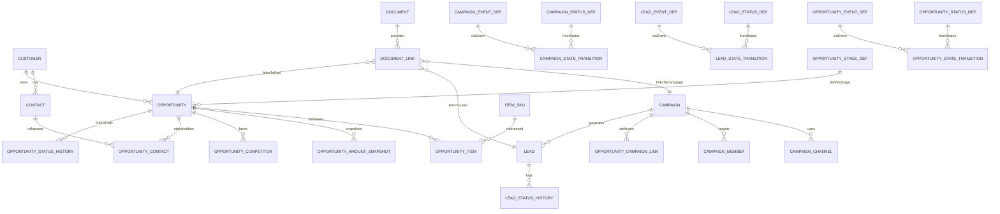

# Flexora CRM 三大模組整合規格書 v1.0

> 更新：2025-09-26（Asia/Taipei）
> 系統原則：百分比一律 0–1；金額 `DECIMAL(19,4)`（中間運算 s=6、稅 s=4、顯示可 round 2）；多對多用 join entity；狀態流採 `status_def / event_def / state_transition / status_history`；ExtAttr 採定義表＋值表；所有 `*_no` 與 `(tenant_id, *_no)` 部分唯一。

---

## 0) 角色與對應

- **Campaign**：行銷活動與花費/成效來源。
- **Lead**：尚未轉為正式帳號/聯絡人的線索。
- **Opportunity**：商機（可含估價行項），承接 Lead 與 Campaign 歸因。
- **Customer / Contact**：客戶主檔/聯絡人（請參閱 報價單模組說明）。

---

## 1) 全域通用（供三模組共用）

### 1.1 `customer`

| 欄位              |         型別 | 必填 | 說明             |
| ----------------- | -----------: | :--: | ---------------- |
| id                |    BIGINT PK |  是  | 主鍵             |
| customer_no       |  VARCHAR(64) |  是  | 客戶代碼（唯一） |
| customer_name     | VARCHAR(255) |  是  | 客戶名稱         |
| properties        |        JSONB |  否  | metadata         |
| deleted / version |              |  是  | 軟刪/鎖          |

**注意事項**：`(tenant_id, customer_no)` partial unique；更多欄位由客戶主檔模組擴充。

### 1.2 `contact`（最小化主檔）

| 欄位              |         型別 | 必填 | 說明     |
| ----------------- | -----------: | :--: | -------- |
| id                |    BIGINT PK |  是  | 主鍵     |
| customer_id       |    BIGINT FK |  否  | 所屬客戶 |
| full_name         | VARCHAR(255) |  是  | 姓名     |
| email             | VARCHAR(255) |  否  | 電子郵件 |
| phone             |  VARCHAR(64) |  否  | 電話     |
| properties        |        JSONB |  否  | metadata |
| deleted / version |              |  是  | 軟刪/鎖  |

**注意事項**：可為獨立個人（`customer_id` 為空）。

### 1.3 `item_sku`（最小化）

| 欄位         |         型別 | 必填 | 說明 |
| ------------ | -----------: | :--: | ---- |
| id           |    BIGINT PK |  是  | 主鍵 |
| sku_code     |  VARCHAR(64) |  是  | 料號 |
| product_name | VARCHAR(255) |  是  | 品名 |

---

## 2) 行銷活動（Campaign）

### 2.1 `campaign`（Header）

| 欄位              |          型別 | 必填 |  預設 | 說明             |
| ----------------- | ------------: | :--: | ----: | ---------------- |
| id                |     BIGINT PK |  是  |       | 主鍵             |
| campaign_no       |   VARCHAR(64) |  是  |       | 活動代碼（唯一） |
| tenant_id         |   VARCHAR(64) |  是  |       | 租戶             |
| name              |  VARCHAR(255) |  是  |       | 活動名稱         |
| description       |          TEXT |  否  |       | 描述             |
| type_code         |   VARCHAR(64) |  否  |       | 活動類型         |
| status_code       |   VARCHAR(64) |  是  | DRAFT | 狀態             |
| start_date        |          DATE |  否  |       | 開始日           |
| end_date          |          DATE |  否  |       | 結束日           |
| budget_amount     | DECIMAL(19,4) |  否  |     0 | 預算             |
| actual_cost       | DECIMAL(19,4) |  否  |     0 | 實際成本         |
| expected_revenue  | DECIMAL(19,4) |  否  |     0 | 預期營收         |
| actual_revenue    | DECIMAL(19,4) |  否  |     0 | 實際營收         |
| owner_id          |     BIGINT FK |  否  |       | 負責人           |
| properties        |         JSONB |  否  |       | metadata         |
| deleted / version |               |  是  |       | 軟刪/鎖          |

**注意事項**：`(tenant_id, campaign_no)` partial unique；金額快照用於 ROI 分析。

### 2.2 `campaign_channel`（投放渠道）

| 欄位         |          型別 | 必填 | 說明                                                  |
| ------------ | ------------: | :--: | ----------------------------------------------------- |
| id           |     BIGINT PK |  是  | 主鍵                                                  |
| campaign_id  |     BIGINT FK |  是  | 所屬活動                                              |
| channel_type |   VARCHAR(32) |  是  | EMAIL/SMS/PUSH/WEBINAR/TRADE_SHOW/SOCIAL_AD/SEARCH_AD |
| plan_cost    | DECIMAL(19,4) |  否  | 計畫成本                                              |
| actual_cost  | DECIMAL(19,4) |  否  | 實際成本                                              |
| kpi_json     |         JSONB |  否  | 曝光/點擊/CTR/轉換等                                  |
| properties   |         JSONB |  否  | metadata                                              |

**注意事項**：`channel_type` 枚舉見「2.6-Enum」。

### 2.3 `campaign_member`（受眾/名單）

| 欄位        |        型別 | 必填 | 說明                                                     |
| ----------- | ----------: | :--: | -------------------------------------------------------- |
| id          |   BIGINT PK |  是  | 主鍵                                                     |
| campaign_id |   BIGINT FK |  是  | 活動                                                     |
| entity_type | VARCHAR(16) |  是  | Lead/Contact                                             |
| entity_id   |      BIGINT |  是  | 實體 ID                                                  |
| status_code | VARCHAR(32) |  否  | TARGETED/SENT/BOUNCED/RESPONDED/UNSUBSCRIBED/NO_RESPONSE |
| metadata    |       JSONB |  否  | 追蹤資訊                                                 |

**注意事項**：允許同一實體多次參與不同活動。

### 2.4 狀態/事件/轉換/歷史

- `campaign_status_def` / `campaign_event_def` / `campaign_state_transition` / `campaign_status_history`（欄位結構沿用狀態模組通用結構）

**2.4.1 `campaign_status_def`（建議值）**

| code      | name   | is_default | is_closed |
| --------- | ------ | :--------: | :-------: |
| DRAFT     | 草稿   |     ✓      |           |
| PLANNED   | 已規劃 |            |           |
| ACTIVE    | 進行中 |            |           |
| COMPLETED | 已完成 |            |     ✓     |
| CANCELLED | 已取消 |            |     ✓     |

**2.4.2 `campaign_event_def`（建議值）**

| code     | name |
| -------- | ---- |
| plan     | 規劃 |
| launch   | 上線 |
| complete | 完成 |
| cancel   | 取消 |

**2.4.3 `campaign_state_transition`（常見）**

| from                   | event    | to        |
| ---------------------- | -------- | --------- |
| DRAFT                  | plan     | PLANNED   |
| PLANNED                | launch   | ACTIVE    |
| ACTIVE                 | complete | COMPLETED |
| (DRAFT/PLANNED/ACTIVE) | cancel   | CANCELLED |

### 2.5 ExtAttr（Campaign）

- `campaign_ext_attr_def` / `campaign_ext_attr_value`（與你既有 ExtAttr 模式一致）

### 2.6 Enum（Campaign）

| 類型               | 值                                                       | 說明     |
| ------------------ | -------------------------------------------------------- | -------- |
| type_code          | EMAIL/EVENT/ADS/SOCIAL/REFERRAL/OTHER                    | 活動型別 |
| channel_type       | EMAIL/SMS/PUSH/WEBINAR/TRADE_SHOW/SOCIAL_AD/SEARCH_AD    | 渠道     |
| member.status_code | TARGETED/SENT/BOUNCED/RESPONDED/UNSUBSCRIBED/NO_RESPONSE | 受眾狀態 |

**索引建議**：`(tenant_id, campaign_no)` unique、`status_code`、`start_date`、`end_date`。

---

## 3) 潛在客戶（Lead）

### 3.1 `lead`

| 欄位              |         型別 | 必填 | 預設 | 說明            |
| ----------------- | -----------: | :--: | ---: | --------------- |
| id                |    BIGINT PK |  是  |      | 主鍵            |
| tenant_id         |  VARCHAR(64) |  是  |      | 租戶            |
| lead_no           |  VARCHAR(64) |  是  |      | 編號（唯一）    |
| first_name        | VARCHAR(128) |  否  |      | 名              |
| last_name         | VARCHAR(128) |  否  |      | 姓              |
| company_name      | VARCHAR(255) |  否  |      | 公司名          |
| email             | VARCHAR(255) |  否  |      | 電子郵件        |
| phone             |  VARCHAR(64) |  否  |      | 電話            |
| status_code       |  VARCHAR(64) |  是  |  NEW | 狀態            |
| source_code       |  VARCHAR(64) |  否  |      | 來源            |
| campaign_id       |    BIGINT FK |  否  |      | 來源活動        |
| owner_id          |    BIGINT FK |  否  |      | 業務            |
| score             | DECIMAL(9,4) |  否  |    0 | 線索分數（0–1） |
| properties        |        JSONB |  否  |      | metadata        |
| deleted / version |              |  是  |      | 軟刪/鎖         |

**注意事項**：`(tenant_id, lead_no)` partial unique；`score` 用 0–1 表示。

### 3.2 `lead_assignment`（分派）

| 欄位        |        型別 | 必填 | 說明     |
| ----------- | ----------: | :--: | -------- |
| id          |   BIGINT PK |  是  | 主鍵     |
| lead_id     |   BIGINT FK |  是  | 線索     |
| assignee_id |   BIGINT FK |  是  | 被分派人 |
| assigned_at |   TIMESTAMP |  是  | 分派時間 |
| rule_key    | VARCHAR(64) |  否  | 分派規則 |
| properties  |       JSONB |  否  | metadata |

### 3.3 狀態/事件/轉換/歷史

**3.3.1 `lead_status_def`（建議值）**

| code         | name   | is_default | is_closed |
| ------------ | ------ | :--------: | :-------: |
| NEW          | 新增   |     ✓      |           |
| ASSIGNED     | 已分派 |            |           |
| QUALIFIED    | 合格   |            |           |
| CONVERTED    | 已轉換 |            |     ✓     |
| DISQUALIFIED | 取消   |            |     ✓     |

**3.3.2 `lead_event_def`（建議值）**

| code       | name |
| ---------- | ---- |
| assign     | 分派 |
| qualify    | 合格 |
| convert    | 轉換 |
| disqualify | 取消 |

**3.3.3 `lead_state_transition`（常見）**

| from                     | event      | to           |
| ------------------------ | ---------- | ------------ |
| NEW                      | assign     | ASSIGNED     |
| (NEW/ASSIGNED)           | qualify    | QUALIFIED    |
| QUALIFIED                | convert    | CONVERTED    |
| (NEW/ASSIGNED/QUALIFIED) | disqualify | DISQUALIFIED |

**3.3.4 `lead_status_history`**

| 欄位       |         型別 | 必填 | 說明     |
| ---------- | -----------: | :--: | -------- |
| id         |    BIGINT PK |  是  | 主鍵     |
| lead_id    |    BIGINT FK |  是  | 線索     |
| from_code  |  VARCHAR(64) |  否  | 前狀態   |
| to_code    |  VARCHAR(64) |  是  | 後狀態   |
| event_code |  VARCHAR(64) |  否  | 事件     |
| changed_by | VARCHAR(128) |  是  | 操作者   |
| changed_at |    TIMESTAMP |  是  | 時間     |
| payload    |        JSONB |  否  | 請求快照 |
| reason     | VARCHAR(255) |  否  | 理由     |

### 3.4 ExtAttr（Lead）

- `lead_ext_attr_def / lead_ext_attr_value`（同樣式）

### 3.5 Enum（Lead）

| 類型        | 值                                                        | 說明 |
| ----------- | --------------------------------------------------------- | ---- |
| status_code | NEW/ASSIGNED/QUALIFIED/CONVERTED/DISQUALIFIED             | 狀態 |
| source_code | WEB/CAMPAIGN/REFERRAL/MANUAL/EVENT/PARTNER/PURCHASED_LIST | 來源 |

**索引建議**：`(tenant_id, lead_no)` unique、`status_code`、`campaign_id`、`email`。

---

## 4) 銷售機會（Opportunity）

### 4.1 `opportunity`（Header）

| 欄位                |          型別 | 必填 |        預設 | 說明                           |
| ------------------- | ------------: | :--: | ----------: | ------------------------------ |
| id                  |     BIGINT PK |  是  |             | 主鍵                           |
| tenant_id           |   VARCHAR(64) |  是  |             | 租戶                           |
| opportunity_no      |   VARCHAR(64) |  是  |             | 商機代碼（唯一）               |
| name                |  VARCHAR(255) |  是  |             | 商機名稱                       |
| customer_id         |     BIGINT FK |  否  |             | 所屬客戶                       |
| owner_id            |     BIGINT FK |  否  |             | 業務                           |
| status_code         |   VARCHAR(64) |  是  |        OPEN | 狀態                           |
| stage_code          |   VARCHAR(64) |  是  | PROSPECTING | 銷售階段                       |
| probability         |  DECIMAL(7,6) |  否  |           0 | 成交機率（0–1）                |
| expected_close_date |          DATE |  否  |             | 預計結案日                     |
| amount              | DECIMAL(19,4) |  否  |           0 | 目前總額（未稅）               |
| expected_amount     | DECIMAL(19,4) |  否  |           0 | 權重金額（amount×probability） |
| currency_code       |   VARCHAR(16) |  是  |             | 幣別                           |
| exchange_rate       | DECIMAL(19,8) |  否  |             | 匯率快照                       |
| loss_reason_code    |   VARCHAR(64) |  否  |             | 失單原因                       |
| properties          |         JSONB |  否  |             | metadata                       |
| deleted / version   |               |  是  |             | 軟刪/鎖                        |

**注意事項**：`amount/expected_amount` 由行項＋折扣重算；`probability` 也可由 `stage_code` 推導。

### 4.2 `opportunity_item`（估價行）

| 欄位                 |          型別 | 必填 | 預設 | 說明             |
| -------------------- | ------------: | :--: | ---: | ---------------- |
| id                   |     BIGINT PK |  是  |      | 主鍵             |
| opportunity_id       |     BIGINT FK |  是  |      | 所屬商機         |
| sku_id               |     BIGINT FK |  否  |      | 參考 SKU         |
| sku_code             |   VARCHAR(64) |  否  |      | SKU 快照         |
| product_name         |  VARCHAR(255) |  是  |      | 名稱快照         |
| description_snapshot |          TEXT |  否  |      | 描述             |
| uom_id               |     BIGINT FK |  否  |      | 單位             |
| quantity             | DECIMAL(19,6) |  是  |    0 | 數量             |
| unit_price           | DECIMAL(19,6) |  是  |    0 | 單價（未稅）     |
| discount_type        |   VARCHAR(16) |  是  | NONE | NONE/AMOUNT/RATE |
| discount_value       | DECIMAL(19,6) |  否  |    0 | 折扣值           |
| line_net_amount      | DECIMAL(19,4) |  是  |    0 | 行淨額           |
| properties           |         JSONB |  否  |      | metadata         |

**注意事項**：行淨額計算：`qty×unit_price` → 套用行折扣（RATE=0–1）。

### 4.3 `opportunity_amount_snapshot`

| 欄位            |          型別 | 必填 | 說明     |
| --------------- | ------------: | :--: | -------- |
| id              |     BIGINT PK |  是  | 主鍵     |
| opportunity_id  |     BIGINT FK |  是  | 商機     |
| snapshot_at     |     TIMESTAMP |  是  | 時間     |
| amount          | DECIMAL(19,4) |  是  | 目前總額 |
| expected_amount | DECIMAL(19,4) |  是  | 權重金額 |
| probability     |  DECIMAL(7,6) |  是  | 成交機率 |
| stage_code      |   VARCHAR(64) |  是  | 階段     |

### 4.4 `opportunity_competitor`

| 欄位           |         型別 | 必填 | 說明      |
| -------------- | -----------: | :--: | --------- |
| id             |    BIGINT PK |  是  | 主鍵      |
| opportunity_id |    BIGINT FK |  是  | 商機      |
| name           | VARCHAR(255) |  是  | 競品/對手 |
| strength       |         TEXT |  否  | 優勢      |
| weakness       |         TEXT |  否  | 劣勢      |
| properties     |        JSONB |  否  | metadata  |

### 4.5 `opportunity_contact`（影響人）

| 欄位             |         型別 | 必填 | 說明                                           |
| ---------------- | -----------: | :--: | ---------------------------------------------- |
| id               |    BIGINT PK |  是  | 主鍵                                           |
| opportunity_id   |    BIGINT FK |  是  | 商機                                           |
| contact_id       |    BIGINT FK |  是  | 聯絡人                                         |
| role_code        |  VARCHAR(64) |  否  | DECISION_MAKER/INFLUENCER/END_USER/PROCUREMENT |
| influence_weight | DECIMAL(7,6) |  否  | 影響權重（0–1）                                |

### 4.6 `opportunity_campaign_link`（歸因）

| 欄位              |         型別 | 必填 | 說明                          |
| ----------------- | -----------: | :--: | ----------------------------- |
| id                |    BIGINT PK |  是  | 主鍵                          |
| opportunity_id    |    BIGINT FK |  是  | 商機                          |
| campaign_id       |    BIGINT FK |  是  | 活動                          |
| attribution_model |  VARCHAR(32) |  否  | FIRST/ LAST/ LINEAR/ U_SHAPED |
| weight            | DECIMAL(7,6) |  否  | 權重（0–1）                   |

### 4.7 狀態/事件/階段/轉換/歷史

**4.7.1 `opportunity_status_def`（建議值）**

| code      | name   | is_default | is_closed |
| --------- | ------ | :--------: | :-------: |
| OPEN      | 進行中 |     ✓      |           |
| WON       | 成交   |            |     ✓     |
| LOST      | 失單   |            |     ✓     |
| ON_HOLD   | 暫停   |            |           |
| CANCELLED | 取消   |            |     ✓     |

**4.7.2 `opportunity_stage_def`（範例）**

| code          | name     | default_probability |
| ------------- | -------- | ------------------: |
| PROSPECTING   | 開發中   |                 0.1 |
| QUALIFICATION | 資格評估 |                 0.2 |
| PROPOSAL      | 提案     |                 0.5 |
| NEGOTIATION   | 議價     |                 0.7 |
| CLOSED_WON    | 成交     |                 1.0 |
| CLOSED_LOST   | 失單     |                 0.0 |

**4.7.3 `opportunity_event_def`（建議值）**

| code       | name     |
| ---------- | -------- |
| move.stage | 階段移動 |
| win        | 成交     |
| lose       | 失單     |
| hold       | 暫停     |
| reopen     | 重開     |
| cancel     | 取消     |

**4.7.4 `opportunity_state_transition`（常見）**

| from           | event  | to        |
| -------------- | ------ | --------- |
| OPEN           | win    | WON       |
| OPEN           | lose   | LOST      |
| OPEN           | hold   | ON_HOLD   |
| ON_HOLD        | reopen | OPEN      |
| (OPEN/ON_HOLD) | cancel | CANCELLED |

**4.7.5 `opportunity_status_history`**

| 欄位             |         型別 | 必填 | 說明     |
| ---------------- | -----------: | :--: | -------- |
| id               |    BIGINT PK |  是  | 主鍵     |
| opportunity_id   |    BIGINT FK |  是  | 商機     |
| from_status_code |  VARCHAR(64) |  否  | 前狀態   |
| to_status_code   |  VARCHAR(64) |  是  | 後狀態   |
| event_code       |  VARCHAR(64) |  否  | 事件     |
| stage_code       |  VARCHAR(64) |  否  | 階段     |
| changed_by       | VARCHAR(128) |  是  | 操作者   |
| changed_at       |    TIMESTAMP |  是  | 時間     |
| payload          |        JSONB |  否  | 請求快照 |
| reason           | VARCHAR(255) |  否  | 理由     |

### 4.8 ExtAttr（Opportunity）

- `opportunity_ext_attr_def / opportunity_ext_attr_value`

### 4.9 Enum（Opportunity）

| 類型               | 值                                                                    | 說明     |
| ------------------ | --------------------------------------------------------------------- | -------- |
| status_code        | OPEN/WON/LOST/ON_HOLD/CANCELLED                                       | 狀態     |
| stage_code         | PROSPECTING/QUALIFICATION/PROPOSAL/NEGOTIATION/CLOSED_WON/CLOSED_LOST | 階段     |
| contact.role_code  | DECISION_MAKER/INFLUENCER/END_USER/PROCUREMENT                        | 角色     |
| attribution_model  | FIRST/LAST/LINEAR/U_SHAPED                                            | 歸因模型 |
| item.discount_type | NONE/AMOUNT/RATE                                                      | 折扣型別 |

**索引建議**：`(tenant_id, opportunity_no)` unique、`status_code`、`stage_code`、`customer_id`、`expected_close_date`。

---

## 5) 轉換與整合規則

### 5.1 Campaign → Lead

- `campaign_member` 可批量建立 `lead`；保留 `campaign_id` 來源鏈結。
- KPI/成本可透過 `campaign_channel.kpi_json / actual_cost` 匯總至活動層。

### 5.2 Lead → Customer + Contact + Opportunity

- 事件 `convert`：

  1. 建立/關聯 `customer`（去重規則：公司名、網域、電話）；
  2. 建立/關聯 `contact`（email/電話）；
  3. 以線索關鍵資料建立 `opportunity`（帶入 `campaign_id` 與 `source_code`）；
  4. `lead.status_code → CONVERTED` 並寫入 `lead_status_history`。

### 5.3 Opportunity × Campaign 歸因

- `opportunity_campaign_link` 支援多模型（first/last/linear/U-shaped），用 `weight` 記錄權重；報表可據此分攤營收/毛利。

### 5.4 金額計算（Opportunity）

- 行項：`line_net = qty×price → discount`。
- 總額：`amount = Σ line_net`；`expected_amount = amount × probability`。
- 變更 `stage_code` 時可自動帶入 `default_probability`（可覆寫）。

---

## 6) 權限/審批/併發

- **權限**：Campaign/Lead/Opp 皆有 owner；跨部門可授權。
- **審批**：大額折扣（OpportunityItem）或贈與需審批。
- **併發**：狀態轉換與行項修改使用樂觀鎖 `version`；API 支援 `Idempotency-Key`。

---

## 7) API（摘要）

- `POST /api/campaigns` / `.../{id}/launch|complete|cancel`
- `POST /api/leads` / `.../{id}/assign|qualify|convert|disqualify`
- `POST /api/opportunities` / `.../{id}/move-stage|win|lose|hold|reopen|cancel`

---

## 8) 索引與測試要點

- **索引**：各模組 `(_no)` 唯一、`status_code`、關聯鍵（`campaign_id/customer_id`）、日期欄位。
- **測試**：

  - 轉換流程（Campaign→Lead→Opportunity）鏈結完整。
  - 機率與 `expected_amount` 正確更新。
  - 歸因模型權重合計=1。
  - 狀態機與歷史紀錄一致；冪等與樂觀鎖重試正確。

---

## 9) ER 圖（Mermaid）

---

## 10) UML Class 圖（Mermaid）

```mermaid
classDiagram
  class Campaign {
    +Long id
    +String campaignNo
    +String name
    +String typeCode
    +String statusCode
    +LocalDate startDate
    +LocalDate endDate
    +BigDecimal budgetAmount
    +BigDecimal actualCost
    +BigDecimal expectedRevenue
    +BigDecimal actualRevenue
  }
  class CampaignChannel { +Long id +Long campaignId +String channelType +BigDecimal planCost +BigDecimal actualCost +Map kpiJson }
  class CampaignMember { +Long id +Long campaignId +String entityType +Long entityId +String statusCode }

  class Lead {
    +Long id
    +String leadNo
    +String statusCode
    +String sourceCode
    +Long campaignId
    +BigDecimal score
  }
  class LeadAssignment { +Long id +Long leadId +Long assigneeId +Instant assignedAt +String ruleKey }
  class LeadStatusHistory { +Long id +Long leadId +String fromCode +String toCode +String eventCode +Instant changedAt }

  class Opportunity {
    +Long id
    +String opportunityNo
    +String statusCode
    +String stageCode
    +BigDecimal probability
    +BigDecimal amount
    +BigDecimal expectedAmount
    +LocalDate expectedCloseDate
  }
  class OpportunityItem { +Long id +Long opportunityId +String productName +BigDecimal quantity +BigDecimal unitPrice +String discountType +BigDecimal discountValue +BigDecimal lineNetAmount }
  class OpportunityAmountSnapshot { +Long id +Long opportunityId +Instant snapshotAt +BigDecimal amount +BigDecimal expectedAmount +BigDecimal probability +String stageCode }
  class OpportunityCompetitor { +Long id +Long opportunityId +String name }
  class OpportunityContact { +Long id +Long opportunityId +Long contactId +String roleCode +BigDecimal influenceWeight }
  class OpportunityCampaignLink { +Long id +Long opportunityId +Long campaignId +String attributionModel +BigDecimal weight }
  class OpportunityStatusHistory { +Long id +Long opportunityId +String fromStatusCode +String toStatusCode +String eventCode +String stageCode +Instant changedAt }

  class Customer { +Long id +String customerNo +String customerName }
  class Contact { +Long id +Long customerId +String fullName +String email }

  Campaign "1" o-- "0..*" CampaignChannel
  Campaign "1" o-- "0..*" CampaignMember
  Campaign "1" o-- "0..*" OpportunityCampaignLink

  Campaign "1" o-- "0..*" Lead
  Customer "1" o-- "0..*" Contact
  Customer "1" o-- "0..*" Opportunity
  Opportunity "1" o-- "0..*" OpportunityItem
  Opportunity "1" o-- "0..*" OpportunityAmountSnapshot
  Opportunity "1" o-- "0..*" OpportunityCompetitor
  Opportunity "1" o-- "0..*" OpportunityContact
  Lead "1" o-- "0..*" LeadStatusHistory
  Opportunity "1" o-- "0..*" OpportunityStatusHistory
```

---

## 11) 附件（共用）

- `document` / `document_link`：沿用通用附件模組（此處不重複展開）。`entity_type` 可為 `Campaign/Lead/Opportunity`。

---

需要我把這份 **CRM 三大模組整合規格書** 輸出成兩個可下載檔（Markdown 與 PDF）嗎？我可以直接生成並附上下載連結。
