# Flexora 出貨（Delivery Note）& 客戶退貨（Customer Return）完整規格書 v2.0
> 更新：2025-10-01（Asia/Taipei）  
> 依《Flexora ERP 開發規範 – 資料結構與版本管理（含 JaVers）》重寫：  
> - **不使用 `tenant_id`**；唯一鍵採 **partial unique（WHERE deleted=false）**。  
> - 時間：一律以 **UTC `TIMESTAMP`** 儲存（API 以 ISO 8601）。  
> - 共通審計／軟刪／樂觀鎖欄位（以下統稱 **通用欄位**）：  
>   - `created_by VARCHAR(128)`, `created_at TIMESTAMP`,  
>     `last_modified_by VARCHAR(128)`, `last_modified_at TIMESTAMP`,  
>     `deleted BOOLEAN DEFAULT false`, `deleted_at TIMESTAMP`, `deleted_by VARCHAR(128)`,  
>     `version BIGINT`。  
> - 精度：金額 `DECIMAL(19,4)`；數量/單價/折扣運算 `DECIMAL(19,6)`；稅率 `DECIMAL(7,6)`（0–1）。  
> - 流程：**DB-Driven 狀態機**（`*_status_def` / `*_event_def` / `*_state_transition` / `*_status_history`）。  
> - 既有資料表以「**請參照既有模組**」標註：`customer`、`sales_order`/`sales_order_item`、`item_sku`、`uom`、`warehouse`/`bin`、`price_list`、`tax_code`/`tax_rate_line`、`user/owner`、`reservation`、`inventory_transaction` 等。

---

## 目錄
1. 流程總覽與整合
2. Enum 值定義（集中）
3. 出貨（Delivery Note, DN）資料表（**完整表格**）
4. 客戶退貨（Customer Return, CRN）資料表（**完整表格**）
5. 稅計算規格（演算法／順序／捨入）
6. 與其他模組整合（IM/庫存、SO/銷售、稅/定價、事件外發）
7. ER 圖（Mermaid）
8. Class 圖（Mermaid）
9. 鍵值、索引與約束建議
10. 測試案例與驗收清單

---

## 1) 流程總覽與整合
- **出貨 DN**：`DRAFT → CONFIRMED → (PARTIALLY_)SHIPPED / CANCELLED`。`ship` 時：  
  IM 產生 `ISSUE`、釋放 Reservation、依稅規計算稅額、回寫 SO 出貨量、留存歷史。  
- **客退 CRN**：`DRAFT → RECEIVED → INSPECTED → (RESTOCKED | SCRAPPED) | CLOSED / CANCELLED`。`receive` 時：  
  IM 產生 `RECEIPT` 入 **QUARANTINE**；後續依 IQC 決定 `RESTOCK` 或 `SCRAP`，並回寫 SO 退貨量。  
- **稅務**：與銷售一致，共用 `tax_code` / `tax_rate_line` 主檔；DN/CRN 均有**行稅表**與**單頭稅表**。  
- **定價**：可由價目表帶入；DN/CRN 以**當次快照**（單價、稅別、稅率）為準。

---

## 2) Enum 值定義（集中）
> 以 `VARCHAR` 儲存；如需後台維護可改 lookup 表。

### 2.1 折扣型態 `discount_type`
| 代碼 | 說明 | 規則 |
|---|---|---|
| `NONE` | 無折扣 | 直接取價 |
| `AMOUNT` | 固定金額 | 固定金額扣減 |
| `RATE` | 比例折扣 | 0–1；先折扣再課稅 |

### 2.2 序號模式 `serial_mode`
| 代碼 | 說明 | 規則 |
|---|---|---|
| `LINE` | 行內單一序號 | 使用 `serial_no` 欄位 |
| `LIST` | 多序號 | 明細序號改存 `*_item_serial`；**筆數=quantity** |

### 2.3 DN 狀態 `delivery_note.status_code`
| 代碼 | 說明 | 終結 |
|---|---|---|
| `DRAFT` | 草稿 | 否 |
| `CONFIRMED` | 已確認 | 否 |
| `PARTIALLY_SHIPPED` | 部分出貨 | 否 |
| `SHIPPED` | 全數出貨完成 | 是 |
| `CANCELLED` | 作廢 | 是 |

### 2.4 DN 事件 `delivery_note_event_def.code`
| 代碼 | 說明 | 典型條件 |
|---|---|---|
| `confirm` | 確認 | 權限+基本檢核 |
| `ship` | 出貨過帳 | 庫存足額、序號/批號合法、預留釋放成功、稅計算成功 |
| `cancel` | 取消 | DRAFT/CONFIRMED |

### 2.5 CRN 狀態 `customer_return_status_def.code`
| 代碼 | 說明 | 終結 |
|---|---|---|
| `DRAFT` | 草稿 | 否 |
| `RECEIVED` | 已收回（入 QUARANTINE） | 否 |
| `INSPECTED` | 檢驗完成 | 否 |
| `RESTOCKED` | 回補可用庫 | 是 |
| `SCRAPPED` | 報廢結案 | 是 |
| `CANCELLED` | 作廢 | 是 |
| `CLOSED` | 結案（退款/折讓完成） | 是 |

### 2.6 CRN 事件 `customer_return_event_def.code`
| 代碼 | 說明 | 典型條件 |
|---|---|---|
| `receive` | 收回入庫（QUARANTINE） | 建立 IM `RECEIPT` |
| `inspect.pass` | 檢驗通過 | IQC=PASS |
| `inspect.fail` | 檢驗不通過 | IQC=FAIL |
| `restock` | 轉可用 | 庫存轉移完成 |
| `scrap` | 報廢 | 產生報廢交易 |
| `cancel` | 取消 | 未終結 |
| `close` | 結案 | 金流/折讓完成 |

---

## 3) 出貨（Delivery Note, DN）資料表（**完整表格**）
> 下列各表皆隱含 **通用欄位**。

### 3.1 `delivery_note`（Header）
| 欄位代碼 | 型態 | 預設值 | 欄位名稱 | 必填 | 說明 | 注意事項 |
|---|---:|---:|---|:--:|---|---|
| id | BIGINT PK |  | 主鍵 | Y | | |
| dn_no | VARCHAR(64) |  | 出貨單號 | Y | 唯一單號 | **partial unique**（WHERE deleted=false） |
| customer_id | BIGINT FK |  | 客戶 | Y | 請參照既有 `customer` | |
| currency_code | VARCHAR(16) |  | 幣別 | Y | ISO 4217 | |
| exchange_rate | DECIMAL(19,8) | NULL | 匯率快照 | N | 對本位幣 | 多幣別必填 |
| status_code | VARCHAR(64) | DRAFT | 狀態碼 | Y | 由狀態機控制 | |
| delivery_date | DATE | NULL | 出貨日 | N | 會計期間/報表 | |
| ship_from_warehouse_id | BIGINT FK | NULL | 預設出貨倉 | N | 可由行覆寫 | |
| shipping_address | JSONB | {} | 寄送地址快照 | N | | |
| bill_to_address | JSONB | {} | 帳單地址快照 | N | | |
| reference | VARCHAR(128) | NULL | 外部參考 | N | 物流單/對外系統 | |
| subtotal | DECIMAL(19,4) | 0 | 未稅小計 | Y | 彙總行淨額 | |
| discount_type | VARCHAR(16) | 'NONE' | 折扣型態 | Y | NONE/AMOUNT/RATE | |
| discount_value | DECIMAL(19,6) | 0 | 折扣值 | N | RATE=0–1 | |
| discount_total | DECIMAL(19,4) | 0 | 整單折扣金額 | N | 按占比分攤 | |
| shipping_fee | DECIMAL(19,4) | 0 | 運費 | N | | |
| handling_fee | DECIMAL(19,4) | 0 | 手續費 | N | | |
| tax_total | DECIMAL(19,4) | 0 | 稅總額 | Y | 由 DN 稅表彙總 | |
| grand_total | DECIMAL(19,4) | 0 | 應收總額 | Y | subtotal - discount_total + fees + tax | |
| promise_date | DATE | NULL | 交期快照 | N | 來源 SO | |
| price_list_id | BIGINT FK | NULL | 價目表快照 | N | 請參照既有 `price_list` | |
| origin_type | VARCHAR(32) | NULL | 來源型態 | N | SO / API / Manual | |
| properties | JSONB | {} | 其他屬性 | N | 客製旗標、列印模板碼… | |

**注意**：`SHIPPED` 後不可直接改變倉別/倉位/批號/序號/數量；需以 **客退 CRN** 或 **IM 調整**處理。

### 3.2 `delivery_note_item`（Line）
| 欄位代碼 | 型態 | 預設值 | 欄位名稱 | 必填 | 說明 | 注意事項 |
|---|---:|---:|---|:--:|---|---|
| id | BIGINT PK |  | 主鍵 | Y | | |
| delivery_note_id | BIGINT FK |  | 所屬 DN | Y | FK→`delivery_note` | |
| sales_order_id | BIGINT FK | NULL | 來源 SO | N | 請參照既有 | 合併/分拆追蹤 |
| sales_order_item_id | BIGINT FK | NULL | 來源 SO 行 | N | 請參照既有 | 回寫出貨量 |
| sku_id | BIGINT FK |  | SKU | Y | 請參照既有 `item_sku` | |
| sku_code | VARCHAR(64) |  | SKU 快照 | Y | | |
| product_name | VARCHAR(255) |  | 品名快照 | Y | | |
| description_snapshot | TEXT | NULL | 描述快照 | N | | |
| uom_id | BIGINT FK | NULL | 單位 | N | 請參照既有 `uom` | |
| warehouse_id | BIGINT FK | NULL | 出貨倉 | N | 預設承接 Header | |
| bin_id | BIGINT FK | NULL | 倉位 | N | 請參照既有 `bin` | |
| lot_no | VARCHAR(100) | NULL | 批號 | N | lotTracked 必填 | |
| serial_mode | VARCHAR(8) | 'LINE' | 序號模式 | N | LINE / LIST | |
| serial_no | VARCHAR(200) | NULL | 單一序號 | N | `serial_mode=LINE` | |
| quantity | DECIMAL(19,6) | 0 | 出貨量 | Y | | `LIST` 需有等筆序號 |
| unit_price | DECIMAL(19,6) | 0 | 未稅單價快照 | Y | | |
| discount_type | VARCHAR(16) | 'NONE' | 折扣型態 | Y | | |
| discount_value | DECIMAL(19,6) | 0 | 折扣值 | N | | |
| tax_code | VARCHAR(64) | NULL | 稅別代碼快照 | N | 文字快照 | |
| tax_rate | DECIMAL(7,6) | NULL | 稅率快照 | N | 0–1 | |
| line_tax_amount | DECIMAL(19,4) | 0 | 行稅額 | N | s=4 | |
| line_total | DECIMAL(19,4) | 0 | 行總額（含稅） | Y | s=4 | |
| reserved_release_qty | DECIMAL(19,6) | 0 | 本次釋放量 | N | 預留釋放稽核 | |
| shipped_qty | DECIMAL(19,6) | 0 | 行內累計出貨量 | N | | |
| properties | JSONB | {} | 其他屬性 | N | | |

### 3.3 `delivery_note_item_serial`（序號明細）
| 欄位代碼 | 型態 | 預設值 | 欄位名稱 | 必填 | 說明 |
|---|---:|---:|---|:--:|---|
| id | BIGINT PK |  | 主鍵 | Y | |
| delivery_note_item_id | BIGINT FK |  | DN 行 | Y | |
| serial_no | VARCHAR(100) |  | 序號 | Y | |
| properties | JSONB | {} | 其他 | N | |

**注意**：同一 DN 行序號不得重複；跨 DN 序號唯一由 IM 控制。

### 3.4 `delivery_note_package`（包裹/追蹤）
| 欄位代碼 | 型態 | 預設值 | 欄位名稱 | 必填 | 說明 |
|---|---:|---:|---|:--:|---|
| id | BIGINT PK |  | 主鍵 | Y | |
| delivery_note_id | BIGINT FK |  | 所屬 DN | Y | |
| package_no | VARCHAR(64) |  | 箱號 | Y | |
| weight | DECIMAL(19,6) | NULL | 重量 | N | |
| dimensions | JSONB | NULL | 尺寸 | N | {l,w,h,unit} |
| carrier | VARCHAR(64) | NULL | 承運商 | N | |
| tracking_no | VARCHAR(128) | NULL | 追蹤碼 | N | |
| properties | JSONB | {} | 其他 | N | |

### 3.5 狀態機（DN）
#### 3.5.1 `delivery_note_status_def`
| 欄位代碼 | 型態 | 預設值 | 欄位名稱 | 必填 | 說明 |
|---|---:|---:|---|:--:|---|
| id | BIGINT PK |  | 主鍵 | Y | |
| code | VARCHAR(64) |  | 狀態代碼 | Y | 例：DRAFT/CONFIRMED/... |
| name | VARCHAR(128) |  | 狀態名稱 | Y | |
| is_default | BOOLEAN | false | 是否預設 | Y | |
| is_closed | BOOLEAN | false | 是否終結 | Y | |
| sequence | INT | 1 | 顯示順序 | N | |
| metadata | JSONB | {} | 其他 | N | 顏色/權限 |

#### 3.5.2 `delivery_note_event_def`
| 欄位代碼 | 型態 | 預設值 | 欄位名稱 | 必填 | 說明 |
|---|---:|---:|---|:--:|---|
| id | BIGINT PK |  | 主鍵 | Y | |
| code | VARCHAR(64) |  | 事件代碼 | Y | confirm/ship/cancel |
| name | VARCHAR(128) |  | 事件名稱 | Y | |
| payload_schema | TEXT | NULL | 載荷 Schema | N | JSON Schema |
| is_outbound | BOOLEAN | false | 是否外發 | Y | |
| metadata | JSONB | {} | 其他 | N | |

#### 3.5.3 `delivery_note_state_transition`
| 欄位代碼 | 型態 | 預設值 | 欄位名稱 | 必填 | 說明 |
|---|---:|---:|---|:--:|---|
| id | BIGINT PK |  | 主鍵 | Y | |
| from_status_id | BIGINT FK |  | 來源狀態 | Y | |
| event_id | BIGINT FK |  | 事件 | Y | |
| to_status_id | BIGINT FK |  | 目標狀態 | Y | |
| guard_expression | VARCHAR(2000) | NULL | Guard | N | SpEL/EL |
| sequence | INT | 1 | 優先序 | N | |
| metadata | JSONB | {} | 其他 | N | |

#### 3.5.4 `delivery_note_status_history`
| 欄位代碼 | 型態 | 預設值 | 欄位名稱 | 必填 | 說明 |
|---|---:|---:|---|:--:|---|
| id | BIGINT PK |  | 主鍵 | Y | |
| delivery_note_id | BIGINT FK |  | DN | Y | |
| event_code | VARCHAR(64) | NULL | 事件代碼快照 | N | |
| from_status_code | VARCHAR(64) |  | 前狀態 | Y | |
| to_status_code | VARCHAR(64) |  | 後狀態 | Y | |
| changed_by | VARCHAR(128) |  | 操作者 | Y | |
| changed_at | TIMESTAMP | now | 變更時間 | Y | UTC |
| payload | JSONB | NULL | 事件載荷 | N | |
| reason | VARCHAR(255) | NULL | 原因 | N | |
| reference | VARCHAR(255) | NULL | 外部參考 | N | |
| calculation_trace_id | BIGINT | NULL | 計算追蹤 | N | |

### 3.6 ExtAttr（DN）
- `delivery_note_ext_attr_def` / `delivery_note_ext_attr_value`（結構與採購模組一致）。  
- 唯一鍵：`(delivery_note_id, ext_attr_def_id) WHERE deleted=false`。

### 3.7 DN 稅表
#### 3.7.1 `delivery_note_item_tax`
| 欄位代碼 | 型態 | 預設值 | 欄位名稱 | 必填 | 說明 |
|---|---:|---:|---|:--:|---|
| id | BIGINT PK |  | 主鍵 | Y | |
| delivery_note_item_id | BIGINT FK |  | DN 行 | Y | |
| tax_code_id | BIGINT FK |  | 稅別 | Y | FK→`tax_code` |
| component_code | VARCHAR(64) |  | 稅組成 | Y | |
| tax_rate | DECIMAL(7,6) | 0 | 稅率 | Y | 0–1 |
| tax_base_amount | DECIMAL(19,4) | 0 | 稅基 | Y | |
| tax_amount | DECIMAL(19,4) | 0 | 稅額 | Y | |
| seq | INT | 1 | 順序 | N | |
| metadata | JSONB | {} | 其他 | N | 捨入/最小額 |

#### 3.7.2 `delivery_note_tax`
| 欄位代碼 | 型態 | 預設值 | 欄位名稱 | 必填 | 說明 |
|---|---:|---:|---|:--:|---|
| id | BIGINT PK |  | 主鍵 | Y | |
| delivery_note_id | BIGINT FK |  | DN | Y | |
| tax_code_id | BIGINT FK |  | 稅別 | Y | |
| tax_component_code | VARCHAR(64) |  | 稅組成 | Y | |
| tax_rate | DECIMAL(7,6) | 0 | 稅率 | Y | |
| tax_base_amount | DECIMAL(19,4) | 0 | 彙總稅基 | Y | |
| tax_amount | DECIMAL(19,4) | 0 | 彙總稅額 | Y | |
| seq | INT | 1 | 順序 | N | |
| metadata | JSONB | {} | 其他 | N | |

### 3.8 DN 與 SO/預留關聯（稽核）
- `delivery_note_sales_order`：多對多（DN × SO），含 `link_type`、`linked_quantity`、`notes`。  
- `delivery_note_reservation_release`：DN 行 × Reservation 釋放紀錄（釋放量、時間、策略）。

---

## 4) 客戶退貨（Customer Return, CRN）資料表（**完整表格**）
> 下列各表皆隱含 **通用欄位**。

### 4.1 `customer_return_note`（Header）
| 欄位代碼 | 型態 | 預設值 | 欄位名稱 | 必填 | 說明 | 注意事項 |
|---|---:|---:|---|:--:|---|---|
| id | BIGINT PK |  | 主鍵 | Y | | |
| rma_no | VARCHAR(64) |  | 客退單號 | Y | 唯一單號 | **partial unique** |
| customer_id | BIGINT FK |  | 客戶 | Y | 請參照既有 `customer` | |
| currency_code | VARCHAR(16) |  | 幣別 | Y | ISO 4217 | |
| exchange_rate | DECIMAL(19,8) | NULL | 匯率快照 | N | | 多幣別必填 |
| status_code | VARCHAR(64) | DRAFT | 狀態碼 | Y | 由狀態機控制 | |
| received_date | DATE | NULL | 客退收貨日 | N | | |
| receive_to_warehouse_id | BIGINT FK | NULL | 收回倉 | N | 預設 **QUARANTINE** | |
| shipping_address | JSONB | {} | 客戶寄回地址快照 | N | | |
| bill_to_address | JSONB | {} | 帳單地址快照 | N | | |
| original_document_ref | JSONB | NULL | 原出貨/發票參考 | N | {type,no,date,id} | |
| return_reason_code | VARCHAR(64) | NULL | 退貨原因碼 | N | 字典維護 | |
| condition_code | VARCHAR(64) | NULL | 物品狀況碼 | N | New/Used/Defective… | |
| refund_policy_snapshot | JSONB | NULL | 退款/折舊政策 | N | | |
| subtotal | DECIMAL(19,4) | 0 | 未稅小計 | Y | | |
| discount_type | VARCHAR(16) | 'NONE' | 折扣型態 | Y | | |
| discount_value | DECIMAL(19,6) | 0 | 折扣值 | N | | |
| discount_total | DECIMAL(19,4) | 0 | 整單折扣金額 | N | | |
| handling_fee | DECIMAL(19,4) | 0 | 手續/處理費 | N | 可正可零 | |
| tax_total | DECIMAL(19,4) | 0 | 稅總額 | Y | | |
| grand_total | DECIMAL(19,4) | 0 | 退款/折讓金額 | Y | 方向交由會計判定 | |
| properties | JSONB | {} | 其他屬性 | N | | |

### 4.2 `customer_return_item`（Line）
| 欄位代碼 | 型態 | 預設值 | 欄位名稱 | 必填 | 說明 | 注意事項 |
|---|---:|---:|---|:--:|---|---|
| id | BIGINT PK |  | 主鍵 | Y | | |
| customer_return_note_id | BIGINT FK |  | 所屬 CRN | Y | | |
| original_delivery_note_id | BIGINT FK | NULL | 原出貨單 | N | 建議填 | |
| original_delivery_note_item_id | BIGINT FK | NULL | 原出貨行 | N | 成本/序號回溯 | |
| sales_order_id | BIGINT FK | NULL | 對應 SO | N | | |
| sales_order_item_id | BIGINT FK | NULL | 對應 SO 行 | N | | |
| sku_id | BIGINT FK |  | SKU | Y | | |
| sku_code | VARCHAR(64) |  | SKU 快照 | Y | | |
| product_name | VARCHAR(255) |  | 品名快照 | Y | | |
| description_snapshot | TEXT | NULL | 描述快照 | N | | |
| uom_id | BIGINT FK | NULL | 單位 | N | | |
| warehouse_id | BIGINT FK | NULL | 收回倉 | N | 預設 QUARANTINE | |
| bin_id | BIGINT FK | NULL | 倉位 | N | | |
| lot_no | VARCHAR(100) | NULL | 批號 | N | lotTracked 必填 | |
| serial_mode | VARCHAR(8) | 'LINE' | 序號模式 | N | | |
| serial_no | VARCHAR(200) | NULL | 單一序號 | N | `serial_mode=LINE` | |
| quantity | DECIMAL(19,6) | 0 | 退回量 | Y | | |
| unit_price | DECIMAL(19,6) | 0 | 單價快照 | Y | 通常取原 DN 價 | |
| discount_type | VARCHAR(16) | 'NONE' | 折扣型態 | Y | | |
| discount_value | DECIMAL(19,6) | 0 | 折扣值 | N | | |
| tax_code | VARCHAR(64) | NULL | 稅別代碼快照 | N | | |
| tax_rate | DECIMAL(7,6) | NULL | 稅率快照 | N | 0–1 | |
| line_tax_amount | DECIMAL(19,4) | 0 | 行稅額 | N | s=4 | |
| line_total | DECIMAL(19,4) | 0 | 行總額（含稅） | Y | s=4 | |
| inspection_result | VARCHAR(32) | NULL | 檢驗結果 | N | PASS/FAIL/REPAIR | |
| disposition | VARCHAR(32) | NULL | 處置 | N | RESTOCK/REFURBISH/SCRAP | |
| properties | JSONB | {} | 其他屬性 | N | | |

### 4.3 `customer_return_item_serial`（序號）
| 欄位代碼 | 型態 | 預設值 | 欄位名稱 | 必填 | 說明 |
|---|---:|---:|---|:--:|---|
| id | BIGINT PK |  | 主鍵 | Y | |
| customer_return_item_id | BIGINT FK |  | CRN 行 | Y | |
| serial_no | VARCHAR(100) |  | 序號 | Y | **須存在於原 DN** |
| properties | JSONB | {} | 其他 | N | |

### 4.4 狀態機（CRN）
- `customer_return_status_def` / `customer_return_event_def` / `customer_return_state_transition` / `customer_return_status_history`（結構與 DN 等同，表名改前綴）。

### 4.5 ExtAttr（CRN）與稅表
- `customer_return_ext_attr_def` / `customer_return_ext_attr_value`（同 DN 結構）。  
- 稅表：`customer_return_item_tax`、`customer_return_tax`（結構對應 DN 稅表）。

### 4.6 CRN 與 DN 關聯
- `customer_return_delivery_link`：連結 CRN ↔ DN（`ORIGIN` / `REFERENCE`），便於追溯。

---

## 5) 稅計算規格（演算法／順序／捨入）
**行級**：  
1. `raw = quantity * unit_price`（s=6）  
2. 行折扣：  
   - `NONE`：`net = raw`  
   - `AMOUNT`：`net = raw - discount_value`（不得 < 0）  
   - `RATE`（0–1）：`net = raw * (1 - rate)`  
3. 複合稅：依 `*_item_tax.seq` 與 `tax_rate_line.apply_on`（請參照既有模組）逐一計算：`tax_i = round(base_i * rate_i, 4)`；`base_i` 可能為 `net` 或「含前項稅」。  
4. 行總額：`line_total = round(net + Σ tax_i, 4)`。  

**單頭**：  
1. 小計：`subtotal = Σ 行(net)`  
2. Header 折扣：  
   - `RATE`：各行 `net *= (1 - header_rate)`（按占比分攤後重算行稅）  
   - `AMOUNT`：依各行 `net` 比例分攤，餘數補最後一行  
3. 稅彙總：`*_tax` 表依稅組成聚合 `tax_base_amount` 與 `tax_amount`。  
4. 應收/退款：`grand_total = subtotal - discount_total + shipping_fee + handling_fee + tax_total`。  

**捨入**：中間運算 s=6；稅與總額 s=4（`HALF_UP`）。每次計算需保存 **calculation trace**（輸入、輸出與捨入點）。

---

## 6) 與其他模組整合
- **IM/庫存**：
  - DN：對每個明細建立 `ISSUE`（精確到 `sku/warehouse/bin/lot/serial`）；釋放 Reservation（記錄於 `delivery_note_reservation_release`）。  
  - CRN：`receive` 時建立 `RECEIPT` 入 **QUARANTINE**；`restock` 轉可用、`scrap` 產生報廢交易；序號/批號完整追溯。  
- **SO/銷售**：
  - DN：回寫 `sales_order_item.shipped_qty += quantity`。  
  - CRN：回寫 `sales_order_item.returned_qty += quantity`（**獨立欄位**）。  
- **稅/定價**：與銷售共用 `tax_code`/`tax_rate_line`；單價可由價目表帶入，DN/CRN 保存快照。  
- **事件外發**：DN `delivery.shipped`、CRN `return.received/inspected/restocked/scrapped/closed` 可發送 webhook/通知（Outbox）。

---

## 7) ER 圖（Mermaid）

```mermaid
erDiagram
  CUSTOMER ||--o{ DELIVERY_NOTE : places
  DELIVERY_NOTE ||--o{ DELIVERY_NOTE_ITEM : contains
  DELIVERY_NOTE_ITEM ||--o{ DELIVERY_NOTE_ITEM_TAX : taxedBy
  DELIVERY_NOTE ||--o{ DELIVERY_NOTE_TAX : taxAgg
  DELIVERY_NOTE_ITEM ||--o{ DELIVERY_NOTE_ITEM_SERIAL : serials
  DELIVERY_NOTE ||--o{ DELIVERY_NOTE_PACKAGE : packages
  DELIVERY_NOTE ||--o{ DELIVERY_NOTE_STATUS_HISTORY : logs
  DELIVERY_NOTE_STATUS_DEF ||--o{ DELIVERY_NOTE_STATE_TRANSITION : fromStatus
  DELIVERY_NOTE_EVENT_DEF  ||--o{ DELIVERY_NOTE_STATE_TRANSITION : viaEvent
  DELIVERY_NOTE ||--o{ DELIVERY_NOTE_EXT_ATTR_VALUE : hasExt
  DELIVERY_NOTE_EXT_ATTR_DEF ||--o{ DELIVERY_NOTE_EXT_ATTR_VALUE : defines
  DELIVERY_NOTE ||--o{ DELIVERY_NOTE_SALES_ORDER : relates
  DELIVERY_NOTE_ITEM ||--o{ DELIVERY_NOTE_RESERVATION_RELEASE : releases

  CUSTOMER ||--o{ CUSTOMER_RETURN_NOTE : returns
  CUSTOMER_RETURN_NOTE ||--o{ CUSTOMER_RETURN_ITEM : contains
  CUSTOMER_RETURN_ITEM ||--o{ CUSTOMER_RETURN_ITEM_TAX : taxedBy
  CUSTOMER_RETURN_NOTE ||--o{ CUSTOMER_RETURN_TAX : taxAgg
  CUSTOMER_RETURN_ITEM ||--o{ CUSTOMER_RETURN_ITEM_SERIAL : serials
  CUSTOMER_RETURN_NOTE ||--o{ CUSTOMER_RETURN_STATUS_HISTORY : logs
  CUSTOMER_RETURN_STATUS_DEF ||--o{ CUSTOMER_RETURN_STATE_TRANSITION : fromStatus
  CUSTOMER_RETURN_EVENT_DEF  ||--o{ CUSTOMER_RETURN_STATE_TRANSITION : viaEvent

  DELIVERY_NOTE ||--o{ CUSTOMER_RETURN_DELIVERY_LINK : relates

  ITEM_SKU ||--o{ DELIVERY_NOTE_ITEM : usedInShipment
  ITEM_SKU ||--o{ CUSTOMER_RETURN_ITEM : usedInReturn
  UOM ||--o{ DELIVERY_NOTE_ITEM : optional
  WAREHOUSE ||--o{ DELIVERY_NOTE_ITEM : shipsFrom
  WAREHOUSE ||--o{ CUSTOMER_RETURN_ITEM : receivedInto
```

---

## 8) Class 圖（Mermaid）

```mermaid
classDiagram
  class DeliveryNote {
    +id:Long +dnNo +customerId:Long +currencyCode +exchangeRate
    +statusCode +deliveryDate +shipFromWarehouseId:Long
    +shippingAddress:Json +billToAddress:Json +reference
    +subtotal:Decimal +discountType +discountValue +discountTotal
    +shippingFee +handlingFee +taxTotal +grandTotal
    +promiseDate:Date +priceListId:Long +originType +properties:Json
  }
  class DeliveryNoteItem {
    +id:Long +deliveryNoteId:Long +salesOrderId:Long +salesOrderItemId:Long
    +skuId:Long +skuCode +productName +descriptionSnapshot
    +uomId:Long +warehouseId:Long +binId:Long +lotNo
    +serialMode +serialNo +quantity:Decimal +unitPrice:Decimal
    +discountType +discountValue +taxCode +taxRate +lineTaxAmount +lineTotal
    +reservedReleaseQty +shippedQty +properties:Json
  }
  class DeliveryNoteItemTax { +id +deliveryNoteItemId +taxCodeId +componentCode +taxRate +taxBaseAmount +taxAmount +seq +metadata }
  class DeliveryNoteTax { +id +deliveryNoteId +taxCodeId +taxComponentCode +taxRate +taxBaseAmount +taxAmount +seq +metadata }
  class DeliveryNoteItemSerial { +id +deliveryNoteItemId +serialNo +properties }
  class DeliveryNotePackage { +id +deliveryNoteId +packageNo +weight +dimensions +carrier +trackingNo +properties }

  class CustomerReturnNote {
    +id:Long +rmaNo +customerId:Long +currencyCode +exchangeRate
    +statusCode +receivedDate +receiveToWarehouseId:Long
    +shippingAddress:Json +billToAddress:Json +originalDocumentRef:Json
    +returnReasonCode +conditionCode +refundPolicySnapshot:Json
    +subtotal +discountType +discountValue +discountTotal +handlingFee +taxTotal +grandTotal +properties:Json
  }
  class CustomerReturnItem {
    +id +customerReturnNoteId +originalDeliveryNoteId +originalDeliveryNoteItemId
    +salesOrderId +salesOrderItemId +skuId +skuCode +productName +descriptionSnapshot
    +uomId +warehouseId +binId +lotNo +serialMode +serialNo
    +quantity +unitPrice +discountType +discountValue +taxCode +taxRate +lineTaxAmount +lineTotal
    +inspectionResult +disposition +properties:Json
  }
  class CustomerReturnItemTax { +id +customerReturnItemId +taxCodeId +componentCode +taxRate +taxBaseAmount +taxAmount +seq +metadata }
  class CustomerReturnTax { +id +customerReturnNoteId +taxCodeId +taxComponentCode +taxRate +taxBaseAmount +taxAmount +seq +metadata }
  class CustomerReturnItemSerial { +id +customerReturnItemId +serialNo +properties }

  DeliveryNote "1" o-- "many" DeliveryNoteItem
  DeliveryNoteItem "1" o-- "many" DeliveryNoteItemTax
  DeliveryNote "1" o-- "many" DeliveryNoteTax
  DeliveryNoteItem "1" o-- "many" DeliveryNoteItemSerial
  DeliveryNote "1" o-- "many" DeliveryNotePackage

  CustomerReturnNote "1" o-- "many" CustomerReturnItem
  CustomerReturnItem "1" o-- "many" CustomerReturnItemTax
  CustomerReturnNote "1" o-- "many" CustomerReturnTax
  CustomerReturnItem "1" o-- "many" CustomerReturnItemSerial
```

---

## 9) 鍵值、索引與約束建議
- **Partial Unique**：`delivery_note(dn_no)`、`customer_return_note(rma_no)`、`delivery_note_package(delivery_note_id, package_no)`、`delivery_note_item_serial(delivery_note_item_id, serial_no)`、`customer_return_item_serial(customer_return_item_id, serial_no)`（均 `WHERE deleted=false`）。  
- **常用索引**：
  - DN：`(customer_id, delivery_date)`、`status_code`、`created_at`、`delivery_note_item(sku_id, warehouse_id)`  
  - CRN：`(customer_id, received_date)`、`status_code`、`original_delivery_note_id`  
  - 稅表：`(delivery_note_id, tax_code_id, tax_component_code)`；`(delivery_note_item_id, tax_code_id, component_code)`；CRN 同構。  
- **約束**：`serial_mode=LIST` 時需存在等筆數之 `*_item_serial`；`ship`/`restock`/`scrap` transition 需通過 Guard（庫存足額、序號合法、稅計算成功）。

---

## 10) 測試案例與驗收清單
- **出貨**：
  - 併發出貨不超賣；Reservation 釋放冪等；`LIST` 模式序號筆數=quantity。  
  - 複合稅 item→order 彙總一致；稅/總額 s=4；報表顯示 s=2。  
  - `SHIPPED` 後禁止直接修改庫存關鍵欄位（倉/位/批/序/量）。
- **客退**：
  - `receive` 入 QUARANTINE；`inspect.pass` → `restock` 正確轉可用；`inspect.fail` → `scrap` 產生報廢交易。  
  - 可追溯原 DN（或按政策成本調整）；回寫 SO `returned_qty`。  
- **稅**：`RATE/AMOUNT` 折扣情境、複合稅順序與 `apply_on`；捨入追蹤。  
- **事件**：DN `delivery.shipped`、CRN `return.*` 外發 payload 與重試策略測試。

