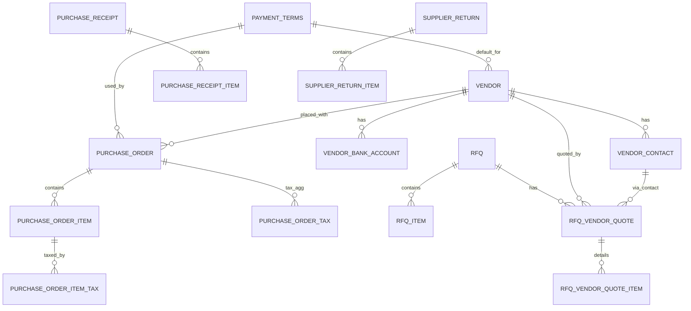

# Flexora 採購模組（Purchase / GRN / SRN / RFQ）完整規格書 v4.0
> 更新：2025-10-01（符合《Flexora ERP 開發規範 – 資料結構與版本管理（含 JaVers）》）  
> 本文件採**工程可落地**的規格，開發人員可依此直接實作，不需再行詢問。  
> - **不含 tenant_id**；唯一鍵採 `WHERE deleted=false` 之 partial unique。  
> - 稅率/折扣一律 **0–1 浮點**；金額 `DECIMAL(19,4)`；數量/單價 `DECIMAL(19,6)`；稅率 `DECIMAL(7,6)`。  
> - 時間一律 **UTC TIMESTAMP**（API 使用 ISO8601）。  
> - 通用審計欄位：`created_by VARCHAR(128)`, `created_at TIMESTAMP`, `last_modified_by VARCHAR(128)`, `last_modified_at TIMESTAMP`, `deleted BOOLEAN default false`, `deleted_at TIMESTAMP`, `deleted_by VARCHAR(128)`, `version BIGINT`。以下各表**皆具備**此欄位組（為避免冗長，表格中以「通用欄位」概括）。  
> - 流程皆為 **DB-Driven 狀態機**（*_status_def / *_event_def / *_state_transition / *_status_history）。  
> - 其他模組既有資料表：`tax_code` / `tax_rate_line`、`item`/`item_sku`、`uom`、`warehouse`/`bin`、`owner`/`user` 等，本文以 **「請參照既有模組」** 表示。

---

## 目錄
1. 設計總覽與整合
2. 資料表定義（**完整欄位表格**）
   - 2.1 PaymentTerms（共用）
   - 2.2 Vendor / VendorContact / VendorBankAccount
   - 2.3 PurchaseOrder（Header）/ PurchaseOrderItem（Line）
   - 2.4 PurchaseOrderTax / PurchaseOrderItemTax（稅明細）
   - 2.5 PurchaseReceipt（GRN Header）/ PurchaseReceiptItem（GRN Line）
   - 2.6 SupplierReturn（SRN Header）/ SupplierReturnItem（SRN Line）
   - 2.7 RFQ：Rfq / RfqItem / RfqVendorQuote / RfqVendorQuoteItem
   - 2.8 狀態／事件／轉換／歷史（PO / GRN / SRN / RFQ）
3. 稅計算規格（演算法與捨入）
4. 與其他模組整合說明（IM/庫存、AP/應付、銷售模組、價目表）
5. ER 圖（Mermaid）
6. Class 圖（Mermaid）
7. API 介面建議（對外）
8. Migration 與索引
9. 測試案例與驗收清單

---

## 1) 設計總覽與整合
- **PO（採購單）**：凍結商務條件（價量、付款條件），不直接動庫存；由 **GRN**（收貨）確認入庫與成本。  
- **GRN（收貨單）**：實體入庫與檢驗；回寫 PO 收貨量；觸發 IM（Inventory Management）`RECEIPT`。  
- **SRN（退供單）**：不良或退回；觸發 IM `ISSUE`。  
- **RFQ（向供應商詢價）**：多供應商回覆比價 → 選定 → （應用層）產生 PO 草稿。  
- **稅務**：共用 `tax_code` / `tax_rate_line` 主檔；PO 行/單存快照，與銷售一致。  
- **付款條件**：共用 `payment_terms`，Quotation / SO / PO 皆可參照。

---

## 2) 資料表定義（完整欄位）

> 表格欄位順序：**欄位代碼**｜**型態**｜**預設值**｜**欄位名稱（中文）**｜**必填**｜**說明**｜**注意事項**。  
> 未特別標註者，皆額外包含「通用欄位」。

### 2.1 `payment_terms`（共用）
| 欄位代碼 | 型態 | 預設值 | 欄位名稱 | 必填 | 說明 | 注意事項 |
|---|---|---|---|:--:|---|---|
| id | BIGINT PK |  | 主鍵 | Y | 系統識別鍵 | |
| terms_code | VARCHAR(64) |  | 付款條件代碼 | Y | 唯一代碼（如 COD, NET30, MONTH_END+30） | **partial unique**（WHERE deleted=false） |
| terms_name | VARCHAR(120) |  | 付款條件名稱 | Y | 顯示名稱 | |
| description | VARCHAR(500) | NULL | 說明 | N | 文字描述 | |
| credit_days | INT | 0 | 帳期天數 | N | NET30=30 | 0 允許 |
| cutoff_day | INT | NULL | 月結結帳日 | N | 1–31 | NULL=不適用 |
| due_day | INT | NULL | 月結應付日 | N | 1–31 | NULL=不適用 |
| grace_days | INT | 0 | 寬限天數 | N | | |
| properties | JSONB | {} | 其他參數 | N | 例如提前付款折扣 | JSON Schema 由程式定義 |

---

### 2.2 `vendor`（供應商）
| 欄位代碼 | 型態 | 預設值 | 欄位名稱 | 必填 | 說明 | 注意事項 |
|---|---|---|---|:--:|---|---|
| id | BIGINT PK |  | 主鍵 | Y | | |
| vendor_no | VARCHAR(64) |  | 供應商代碼 | Y | 唯一代碼 | **partial unique** |
| vendor_name | VARCHAR(255) |  | 供應商名稱 | Y | | |
| vendor_type | VARCHAR(32) | NULL | 類型 | N | COMPANY / INDIVIDUAL | enum |
| tax_id_number | VARCHAR(64) | NULL | 稅籍號 | N | 台灣：統一編號 | |
| registration_no | VARCHAR(64) | NULL | 登記字號 | N | | |
| payment_terms_id | BIGINT FK | NULL | 預設付款條件 | N | FK→`payment_terms` | |
| currency_code | VARCHAR(16) | NULL | 預設幣別 | N | ISO 4217 | |
| bank_account | JSONB | {} | 預設銀行帳戶 | N | 單一帳戶快照 | 多帳戶請用 `vendor_bank_account` |
| phone | VARCHAR(60) | NULL | 電話 | N | | |
| email | VARCHAR(120) | NULL | 電子郵件 | N | | |
| website | VARCHAR(200) | NULL | 網址 | N | | |
| address | JSONB | {} | 地址快照 | N | street/city/state/postal/country | |
| owner_id | BIGINT FK | NULL | 負責人員 | N | 參照 `owner`/`user` | 權限/責任歸屬 |
| properties | JSONB | {} | 自訂屬性 | N | rating/preferred 等 | |

---

### 2.3 `vendor_contact`（供應商聯絡人，不共用 CRM Contact）
| 欄位代碼 | 型態 | 預設值 | 欄位名稱 | 必填 | 說明 | 注意事項 |
|---|---|---|---|:--:|---|---|
| id | BIGINT PK |  | 主鍵 | Y | | |
| vendor_id | BIGINT FK |  | 所屬供應商 | Y | FK→`vendor` | |
| full_name | VARCHAR(255) |  | 姓名 | Y | | |
| position | VARCHAR(128) | NULL | 職稱 | N | | |
| phone | VARCHAR(64) | NULL | 電話 | N | | |
| email | VARCHAR(255) | NULL | 電子郵件 | N | | 可建立 `(vendor_id,email)` unique（WHERE deleted=false AND email IS NOT NULL） |
| is_primary | BOOLEAN | false | 主要聯絡人 | N | 僅允許一筆 true | 需 DB/應用層約束 |
| properties | JSONB | {} | 其他屬性 | N | 付款窗口、採購專員、IM 帳號 | |

---

### 2.4 `vendor_bank_account`（可選，多帳號）
| 欄位代碼 | 型態 | 預設值 | 欄位名稱 | 必填 | 說明 | 注意事項 |
|---|---|---|---|:--:|---|---|
| id | BIGINT PK |  | 主鍵 | Y | | |
| vendor_id | BIGINT FK |  | 所屬供應商 | Y | FK→`vendor` | |
| seq | INT | 1 | 序號 | Y | 排序 | |
| bank_name | VARCHAR(120) |  | 銀行名稱 | Y | | |
| account_no | VARCHAR(120) |  | 帳號 | Y | | |
| swift_code | VARCHAR(64) | NULL | SWIFT/BIC | N | | |
| is_default | BOOLEAN | false | 預設帳戶 | N | 一供應商僅允許一筆 true | 建立 unique partial 索引 |
| properties | JSONB | {} | 其他 | N | | |

---

### 2.5 `purchase_order`（PO Header）
| 欄位代碼 | 型態 | 預設值 | 欄位名稱 | 必填 | 說明 | 注意事項 |
|---|---|---|---|:--:|---|---|
| id | BIGINT PK |  | 主鍵 | Y | | |
| po_no | VARCHAR(64) |  | 採購單號 | Y | 唯一 | **partial unique** |
| vendor_id | BIGINT FK |  | 供應商 | Y | FK→`vendor` | |
| contact_id | BIGINT FK | NULL | 供應商聯絡人 | N | FK→`vendor_contact` | |
| currency_code | VARCHAR(16) |  | 幣別 | Y | ISO 4217 | |
| exchange_rate | DECIMAL(19,8) | NULL | 匯率 | N | 對系統本位幣 | 多幣別必填 |
| status_code | VARCHAR(64) | DRAFT | 狀態 | Y | 受狀態機控制 | |
| order_date | DATE | NULL | 下單日 | N | | |
| expected_arrival_date | DATE | NULL | 預計到貨日 | N | | |
| ship_to_warehouse_id | BIGINT FK | NULL | 收貨倉 | N | 參照 `warehouse` | 行可覆寫 |
| bill_to_address | JSONB | {} | 帳單地址 | N | 地址快照 | |
| ship_to_address | JSONB | {} | 收貨地址 | N | 地址快照 | |
| reference | VARCHAR(128) | NULL | 參考單號 | N | 供應商或外部單號 | |
| payment_terms_id | BIGINT FK | NULL | 付款條件 | N | FK→`payment_terms` | |
| subtotal | DECIMAL(19,4) | 0 | 未稅小計 | Y | 行彙總 | |
| discount_type | VARCHAR(16) | 'NONE' | 折扣型態 | Y | NONE/AMOUNT/RATE | |
| discount_value | DECIMAL(19,6) | 0 | 折扣值 | N | | RATE 為 0–1 |
| discount_total | DECIMAL(19,4) | 0 | 整單折扣金額 | N | 分攤後合計 | |
| shipping_fee | DECIMAL(19,4) | 0 | 運費 | N | | |
| handling_fee | DECIMAL(19,4) | 0 | 手續費 | N | | |
| tax_total | DECIMAL(19,4) | 0 | 稅總額 | Y | 由稅表彙總 | |
| grand_total | DECIMAL(19,4) | 0 | 應付總額 | Y | subtotal - discount_total + fees + tax | |
| properties | JSONB | {} | 其他屬性 | N | 擴充旗標 | |

---

### 2.6 `purchase_order_item`（PO Line）
| 欄位代碼 | 型態 | 預設值 | 欄位名稱 | 必填 | 說明 | 注意事項 |
|---|---|---|---|:--:|---|---|
| id | BIGINT PK |  | 主鍵 | Y | | |
| purchase_order_id | BIGINT FK |  | 所屬 PO | Y | FK→`purchase_order` | |
| sku_id | BIGINT FK |  | 料號 | Y | 參照 `item_sku` | 請參照既有模組 |
| sku_code | VARCHAR(64) |  | 料號快照 | Y | | |
| product_name | VARCHAR(255) |  | 品名快照 | Y | | |
| description_snapshot | TEXT | NULL | 描述快照 | N | | |
| uom_id | BIGINT FK | NULL | 單位 | N | 參照 `uom` | |
| warehouse_id | BIGINT FK | NULL | 收貨倉 | N | 參照 `warehouse` | |
| bin_id | BIGINT FK | NULL | 倉位 | N | 參照 `bin` | |
| lot_policy | VARCHAR(32) | NULL | 批號策略 | N | REQUIRED/OPTIONAL/NONE | 影響 GRN |
| serial_mode | VARCHAR(8) | 'LINE' | 序號模式 | N | LINE/LIST | LIST=需提供序號清單 |
| quantity | DECIMAL(19,6) | 0 | 採購量 | Y | | |
| unit_price | DECIMAL(19,6) | 0 | 未稅單價 | Y | | |
| discount_type | VARCHAR(16) | 'NONE' | 折扣型態 | Y | NONE/AMOUNT/RATE | |
| discount_value | DECIMAL(19,6) | 0 | 折扣值 | N | | |
| tax_code | VARCHAR(64) | NULL | 稅別代碼快照 | N | 來源 `tax_code` | 文字快照 |
| tax_rate | DECIMAL(7,6) | NULL | 稅率快照 | N | 0–1 | |
| line_tax_amount | DECIMAL(19,4) | 0 | 行稅額 | N | | |
| line_total | DECIMAL(19,4) | 0 | 行總額（含稅） | Y | | |
| received_qty | DECIMAL(19,6) | 0 | 已收貨量 | N | 由 GRN 回寫 | |
| returned_qty | DECIMAL(19,6) | 0 | 已退供量 | N | 由 SRN 回寫 | |
| properties | JSONB | {} | 其他屬性 | N | | |

---

### 2.7 `purchase_order_tax`（PO Header 稅彙總）
| 欄位代碼 | 型態 | 預設值 | 欄位名稱 | 必填 | 說明 | 注意事項 |
|---|---|---|---|:--:|---|---|
| id | BIGINT PK |  | 主鍵 | Y | | |
| purchase_order_id | BIGINT FK |  | 所屬 PO | Y | FK→`purchase_order` | |
| tax_code_id | BIGINT FK |  | 稅別 | Y | FK→`tax_code` | |
| tax_component_code | VARCHAR(64) |  | 稅組成代碼 | Y | 與 `tax_rate_line.component_code` 對應 | |
| tax_rate | DECIMAL(7,6) | 0 | 稅率 | Y | 0–1 | |
| tax_base_amount | DECIMAL(19,4) | 0 | 稅基 | Y | | |
| tax_amount | DECIMAL(19,4) | 0 | 稅額 | Y | | |
| seq | INT | 1 | 計算順序 | N | | |
| metadata | JSONB | {} | 其他 | N | 捨入/最小額等 | |

---

### 2.8 `purchase_order_item_tax`（PO Line 稅快照）
| 欄位代碼 | 型態 | 預設值 | 欄位名稱 | 必填 | 說明 | 注意事項 |
|---|---|---|---|:--:|---|---|
| id | BIGINT PK |  | 主鍵 | Y | | |
| purchase_order_item_id | BIGINT FK |  | 所屬 PO 行 | Y | FK→`purchase_order_item` | |
| tax_code_id | BIGINT FK |  | 稅別 | Y | FK→`tax_code` | |
| component_code | VARCHAR(64) |  | 稅組成代碼 | Y | | |
| tax_rate | DECIMAL(7,6) | 0 | 稅率 | Y | 0–1 | |
| tax_base_amount | DECIMAL(19,4) | 0 | 稅基 | Y | | |
| tax_amount | DECIMAL(19,4) | 0 | 稅額 | Y | | |
| seq | INT | 1 | 計算順序 | N | | |
| metadata | JSONB | {} | 其他 | N | | |

---

### 2.9 `purchase_receipt`（GRN Header）
| 欄位代碼 | 型態 | 預設值 | 欄位名稱 | 必填 | 說明 | 注意事項 |
|---|---|---|---|:--:|---|---|
| id | BIGINT PK |  | 主鍵 | Y | | |
| pr_no | VARCHAR(64) |  | 收貨單號 | Y | 唯一 | **partial unique** |
| purchase_order_id | BIGINT FK | NULL | 來源 PO | N | 建議必填 | |
| status_code | VARCHAR(64) | DRAFT | 狀態 | Y | 受狀態機控制 | |
| receipt_date | TIMESTAMP | now | 收貨時間 | Y | UTC | |
| receiver_id | BIGINT FK | NULL | 收貨人 | N | 參照 `user` | |
| remarks | TEXT | NULL | 備註 | N | | |
| properties | JSONB | {} | 其他 | N | | |

---

### 2.10 `purchase_receipt_item`（GRN Line）
| 欄位代碼 | 型態 | 預設值 | 欄位名稱 | 必填 | 說明 | 注意事項 |
|---|---|---|---|:--:|---|---|
| id | BIGINT PK |  | 主鍵 | Y | | |
| purchase_receipt_id | BIGINT FK |  | 所屬 GRN | Y | FK→`purchase_receipt` | |
| purchase_order_item_id | BIGINT FK | NULL | 對應 PO 行 | N | 若非 PO 轉入可為 NULL | |
| sku_id | BIGINT FK |  | 料號 | Y | 請參照既有 `item_sku` | |
| sku_code | VARCHAR(64) |  | 料號快照 | Y | | |
| product_name | VARCHAR(255) |  | 品名快照 | Y | | |
| uom_id | BIGINT FK | NULL | 單位 | N | 請參照 `uom` | |
| warehouse_id | BIGINT FK |  | 入庫倉 | Y | 請參照 `warehouse` | |
| bin_id | BIGINT FK | NULL | 倉位 | N | 請參照 `bin` | |
| lot_no | VARCHAR(64) | NULL | 批號 | N | `lot_policy`=REQUIRED 則必填 | |
| serial_list | JSONB | NULL | 序號清單 | N | `serial_mode`=LIST 時必填，數量=received_qty | |
| received_qty | DECIMAL(19,6) | 0 | 本次收貨量 | Y | | |
| inspection_result | VARCHAR(16) | NULL | 檢驗結果 | N | PASS/FAIL/REPAIR | |
| disposition | VARCHAR(16) | NULL | 處置 | N | PUTAWAY/QUARANTINE/REFURBISH/SCRAP | 影響 IM 流程 |
| tax_snapshot | JSONB | NULL | 稅快照 | N | 若現場稅計算 | |
| properties | JSONB | {} | 其他 | N | | |

---

### 2.11 `supplier_return`（SRN Header）
| 欄位代碼 | 型態 | 預設值 | 欄位名稱 | 必填 | 說明 | 注意事項 |
|---|---|---|---|:--:|---|---|
| id | BIGINT PK |  | 主鍵 | Y | | |
| srn_no | VARCHAR(64) |  | 退供單號 | Y | 唯一 | **partial unique** |
| status_code | VARCHAR(64) | DRAFT | 狀態 | Y | 受狀態機控制 | |
| vendor_id | BIGINT FK |  | 供應商 | Y | FK→`vendor` | |
| issue_date | TIMESTAMP | now | 出庫時間 | Y | UTC | |
| reason | VARCHAR(255) | NULL | 原因 | N | | |
| remarks | TEXT | NULL | 備註 | N | | |
| properties | JSONB | {} | 其他 | N | | |

---

### 2.12 `supplier_return_item`（SRN Line）
| 欄位代碼 | 型態 | 預設值 | 欄位名稱 | 必填 | 說明 | 注意事項 |
|---|---|---|---|:--:|---|---|
| id | BIGINT PK |  | 主鍵 | Y | | |
| supplier_return_id | BIGINT FK |  | 所屬 SRN | Y | FK→`supplier_return` | |
| sku_id | BIGINT FK |  | 料號 | Y | 參照 `item_sku` | |
| sku_code | VARCHAR(64) |  | 料號快照 | Y | | |
| product_name | VARCHAR(255) |  | 品名快照 | Y | | |
| uom_id | BIGINT FK | NULL | 單位 | N | | |
| warehouse_id | BIGINT FK |  | 出庫倉 | Y | | |
| bin_id | BIGINT FK | NULL | 倉位 | N | | |
| lot_no | VARCHAR(64) | NULL | 批號 | N | | |
| serial_list | JSONB | NULL | 序號清單 | N | | |
| return_qty | DECIMAL(19,6) | 0 | 退回數量 | Y | | |
| properties | JSONB | {} | 其他 | N | | |

---

### 2.13 RFQ（詢價）

#### 2.13.1 `rfq`（Header）
| 欄位代碼 | 型態 | 預設值 | 欄位名稱 | 必填 | 說明 | 注意事項 |
|---|---|---|---|:--:|---|---|
| id | BIGINT PK |  | 主鍵 | Y | | |
| rfq_no | VARCHAR(64) |  | RFQ 單號 | Y | 唯一 | **partial unique** |
| subject | VARCHAR(255) | NULL | 主旨 | N | | |
| status_code | VARCHAR(64) | DRAFT | 狀態 | Y | 受狀態機控制 | |
| request_date | TIMESTAMP | now | 詢價時間 | Y | UTC | |
| expected_response_date | DATE | NULL | 期望回覆日 | N | | |
| remarks | TEXT | NULL | 備註 | N | | |
| properties | JSONB | {} | 其他 | N | | |

#### 2.13.2 `rfq_item`
| 欄位代碼 | 型態 | 預設值 | 欄位名稱 | 必填 | 說明 | 注意事項 |
|---|---|---|---|:--:|---|---|
| id | BIGINT PK |  | 主鍵 | Y | | |
| rfq_id | BIGINT FK |  | 所屬 RFQ | Y | FK→`rfq` | |
| sku_id | BIGINT FK |  | 料號 | Y | 參照 `item_sku` | |
| sku_code | VARCHAR(64) |  | 料號快照 | Y | | |
| product_name | VARCHAR(255) |  | 品名快照 | Y | | |
| uom_id | BIGINT FK | NULL | 單位 | N | 參照 `uom` | |
| quantity | DECIMAL(19,6) | 0 | 詢價量 | Y | | |
| spec_note | VARCHAR(1000) | NULL | 規格備註 | N | | |
| properties | JSONB | {} | 其他 | N | | |

#### 2.13.3 `rfq_vendor_quote`（供應商回覆 Header）
| 欄位代碼 | 型態 | 預設值 | 欄位名稱 | 必填 | 說明 | 注意事項 |
|---|---|---|---|:--:|---|---|
| id | BIGINT PK |  | 主鍵 | Y | | |
| rfq_id | BIGINT FK |  | 所屬 RFQ | Y | | |
| vendor_id | BIGINT FK |  | 供應商 | Y | | |
| vendor_contact_id | BIGINT FK | NULL | 聯絡人 | N | | |
| currency_code | VARCHAR(16) | NULL | 幣別 | N | ISO 4217 | |
| payment_terms_id | BIGINT FK | NULL | 付款條件 | N | | |
| valid_until | TIMESTAMP | NULL | 報價有效期 | N | | |
| remarks | TEXT | NULL | 備註 | N | | |
| subtotal | DECIMAL(19,4) | 0 | 未稅小計 | Y | | |
| discount_total | DECIMAL(19,4) | 0 | 整單折扣 | N | | |
| tax_total | DECIMAL(19,4) | 0 | 稅總額 | N | | |
| grand_total | DECIMAL(19,4) | 0 | 總額（含稅） | Y | | |
| status_code | VARCHAR(64) | DRAFT | 狀態 | Y | DRAFT/RECEIVED/SELECTED/REJECTED | |
| properties | JSONB | {} | 其他 | N | | |

#### 2.13.4 `rfq_vendor_quote_item`（供應商回覆 Line）
| 欄位代碼 | 型態 | 預設值 | 欄位名稱 | 必填 | 說明 | 注意事項 |
|---|---|---|---|:--:|---|---|
| id | BIGINT PK |  | 主鍵 | Y | | |
| rfq_vendor_quote_id | BIGINT FK |  | 所屬供應商回覆 | Y | FK→`rfq_vendor_quote` | |
| rfq_item_id | BIGINT FK |  | 對應 RFQ 項目 | Y | | |
| unit_price | DECIMAL(19,6) | 0 | 未稅單價 | Y | | |
| discount_type | VARCHAR(16) | 'NONE' | 折扣型態 | Y | NONE/AMOUNT/RATE | |
| discount_value | DECIMAL(19,6) | 0 | 折扣值 | N | | |
| tax_code | VARCHAR(64) | NULL | 稅別代碼快照 | N | | |
| tax_rate | DECIMAL(7,6) | NULL | 稅率快照 | N | 0–1 | |
| line_tax_amount | DECIMAL(19,4) | 0 | 行稅額 | N | | |
| line_total | DECIMAL(19,4) | 0 | 行總額（含稅） | Y | | |
| lead_time_days | INT | NULL | 交期（天） | N | | |
| moq | DECIMAL(19,6) | NULL | 最低採購量 | N | | |
| properties | JSONB | {} | 其他 | N | | |

---

### 2.14 狀態／事件／轉換／歷史（各模組各自一組表）
> 結構一致，以下以 PO 為例，其餘 GRN/SRN/RFQ 僅換表名前綴。

#### 2.14.1 `purchase_order_status_def`
| 欄位代碼 | 型態 | 預設值 | 欄位名稱 | 必填 | 說明 |
|---|---|---|---|:--:|---|
| id | BIGINT PK |  | 主鍵 | Y | |
| code | VARCHAR(64) |  | 狀態代碼 | Y | 例：DRAFT/CONFIRMED/PARTIALLY_RECEIVED/RECEIVED/CANCELLED |
| name | VARCHAR(128) |  | 狀態名稱 | Y | |
| is_default | BOOLEAN | false | 預設狀態 | Y | |
| is_closed | BOOLEAN | false | 是否終結 | Y | |
| sequence | INT | 1 | 顯示順序 | N | |
| metadata | JSONB | {} | 其他 | N | 顏色/權限提示 |

#### 2.14.2 `purchase_order_event_def`
| 欄位代碼 | 型態 | 預設值 | 欄位名稱 | 必填 | 說明 |
|---|---|---|---|:--:|---|
| id | BIGINT PK |  | 主鍵 | Y | |
| code | VARCHAR(64) |  | 事件代碼 | Y | 例：confirm/receive/cancel |
| name | VARCHAR(128) |  | 事件名稱 | Y | |
| payload_schema | TEXT | NULL | 載荷 Schema | N | JSON Schema |
| is_outbound | BOOLEAN | false | 外發 | Y | |
| metadata | JSONB | {} | 其他 | N | |

#### 2.14.3 `purchase_order_state_transition`
| 欄位代碼 | 型態 | 預設值 | 欄位名稱 | 必填 | 說明 |
|---|---|---|---|:--:|---|
| id | BIGINT PK |  | 主鍵 | Y | |
| from_status_id | BIGINT FK |  | 來源狀態 | Y | FK→`*_status_def` |
| event_id | BIGINT FK |  | 事件 | Y | FK→`*_event_def` |
| to_status_id | BIGINT FK |  | 目標狀態 | Y | FK→`*_status_def` |
| guard_expression | VARCHAR(2000) | NULL | 條件 | N | SpEL |
| sequence | INT | 1 | 優先序 | N | |
| metadata | JSONB | {} | 其他 | N | |

#### 2.14.4 `purchase_order_status_history`
| 欄位代碼 | 型態 | 預設值 | 欄位名稱 | 必填 | 說明 |
|---|---|---|---|:--:|---|
| id | BIGINT PK |  | 主鍵 | Y | |
| purchase_order_id | BIGINT FK |  | 所屬單頭 | Y | |
| from_code | VARCHAR(64) |  | 前狀態 | Y | 快照 |
| to_code | VARCHAR(64) |  | 後狀態 | Y | 快照 |
| event_code | VARCHAR(64) | NULL | 事件代碼 | N | 快照 |
| changed_by | VARCHAR(128) |  | 操作者 | Y | |
| changed_at | TIMESTAMP | now | 變更時間 | Y | UTC |
| payload | JSONB | NULL | 事件載荷 | N | |
| reason | VARCHAR(255) | NULL | 變更原因 | N | |
| reference | VARCHAR(255) | NULL | 外部參考 | N | |

> **GRN/SRN/RFQ** 之四表，欄位完全相同，表名改為 `purchase_receipt_*`、`supplier_return_*`、`rfq_*`。

---

## 3) 稅計算規格（演算法與捨入）
**行級**：  
1. `raw = quantity * unit_price`（s=6）  
2. 折扣：  
   - NONE：`net = raw`  
   - AMOUNT：`net = raw - discount_value`（不得 < 0）  
   - RATE（0–1）：`net = raw * (1 - rate)`  
3. 行稅：若有 `tax_rate` → `tax = round(net * tax_rate, 4)`；複合稅依 `purchase_order_item_tax.seq` 與 `apply_on`（請參照 `tax_rate_line.apply_on`）逐一計。  
4. 行總額：`line_total = round(net + 稅合計, 4)`。  

**單頭**：  
1. 小計：`subtotal = Σ 行(net)`  
2. 整單折扣：  
   - RATE：各行 `net *= (1 - header_rate)`（分攤後重算）  
   - AMOUNT：依行 `net` 比例分攤，餘數補最後一行  
3. 稅彙總：依 `purchase_order_tax` 逐成分聚合（與行稅一致）。  
4. 總額：`grand_total = subtotal - discount_total + shipping_fee + handling_fee + tax_total`。  

**捨入**：稅與總額四捨五入至 4 位，UI 顯示可 2 位。**所有中間運算保留 s=6**。

---

## 4) 與其他模組整合
- **IM/庫存**：GRN → `RECEIPT`、SRN → `ISSUE`；遵循批號/序號策略（`lot_policy`/`serial_mode`）。  
- **AP/應付**：PO 收貨入庫後可產生應付發票（Invoice）或驗收對帳；SRN 產生折讓或退款申請。  
- **銷售**：稅規則與銷售一致，使用相同 `tax_code` / `tax_rate_line` 主檔。  
- **價目表**：若需由價目表帶出單價，請參照價目表模組（已存在），PO 行 `unit_price` 為當次快照。

---

## 5) ER 圖（Mermaid）

---

## 6) Class 圖（Mermaid）

```mermaid
classDiagram
  class PaymentTerms { +id:Long +termsCode +termsName +creditDays +cutoffDay +dueDay +graceDays +properties }
  class Vendor { +id:Long +vendorNo +vendorName +vendorType +taxIdNumber +registrationNo +currencyCode +bankAccount +address +properties }
  class VendorContact { +id:Long +vendorId +fullName +position +phone +email +isPrimary +properties }
  class VendorBankAccount { +id:Long +vendorId +seq +bankName +accountNo +swiftCode +isDefault +properties }

  class PurchaseOrder { +id:Long +poNo +vendorId +contactId +currencyCode +exchangeRate +statusCode +orderDate +expectedArrivalDate +paymentTermsId +subtotal +discountType +discountValue +discountTotal +fees +taxTotal +grandTotal +properties }
  class PurchaseOrderItem { +id:Long +poId +skuId +skuCode +productName +uomId +quantity +unitPrice +discountType +discountValue +taxCode +taxRate +lineTaxAmount +lineTotal +warehouseId +binId +lotPolicy +serialMode +properties }
  class PurchaseOrderItemTax { +id:Long +poItemId +taxCodeId +componentCode +taxRate +taxBaseAmount +taxAmount +seq +metadata }
  class PurchaseOrderTax { +id:Long +poId +taxCodeId +taxComponentCode +taxRate +taxBaseAmount +taxAmount +seq +metadata }

  class PurchaseReceipt { +id:Long +prNo +poId +statusCode +receiptDate +receiverId +remarks +properties }
  class PurchaseReceiptItem { +id:Long +prId +poItemId +skuId +uomId +warehouseId +binId +lotNo +serialList +receivedQty +inspectionResult +disposition +taxSnapshot +properties }

  class SupplierReturn { +id:Long +srnNo +statusCode +vendorId +issueDate +reason +remarks +properties }
  class SupplierReturnItem { +id:Long +srnId +skuId +uomId +warehouseId +binId +lotNo +serialList +returnQty +properties }

  class Rfq { +id:Long +rfqNo +subject +statusCode +requestDate +expectedResponseDate +remarks +properties }
  class RfqItem { +id:Long +rfqId +skuId +uomId +quantity +specNote +properties }
  class RfqVendorQuote { +id:Long +rfqId +vendorId +vendorContactId +currencyCode +paymentTermsId +validUntil +subtotal +discountTotal +taxTotal +grandTotal +statusCode +properties }
  class RfqVendorQuoteItem { +id:Long +rfqVqId +rfqItemId +unitPrice +discountType +discountValue +taxCode +taxRate +lineTaxAmount +lineTotal +leadTimeDays +moq +properties }

  PaymentTerms <|-- PurchaseOrder
  Vendor "1" o-- "many" VendorContact
  Vendor "1" o-- "many" VendorBankAccount
  Vendor "1" o-- "many" PurchaseOrder
  PurchaseOrder "1" o-- "many" PurchaseOrderItem
  PurchaseOrderItem "1" o-- "many" PurchaseOrderItemTax
  PurchaseOrder "1" o-- "many" PurchaseOrderTax

  PurchaseReceipt "1" o-- "many" PurchaseReceiptItem
  SupplierReturn "1" o-- "many" SupplierReturnItem

  Rfq "1" o-- "many" RfqItem
  Rfq "1" o-- "many" RfqVendorQuote
  RfqVendorQuote "1" o-- "many" RfqVendorQuoteItem
```

---

## 7) API 介面建議（精簡）
- Vendor：`GET/POST/PUT/DELETE /api/vendors`；`/api/vendors/{id}/contacts`；`/api/vendors/{id}/bank-accounts`
- PaymentTerms：`/api/payment-terms`
- PO：`/api/po`；事件：`/api/po/{id}/confirm`、`/api/po/{id}/cancel`
- GRN：`/api/grn`；事件：`/api/grn/{id}/receive`
- SRN：`/api/srn`；事件：`/api/srn/{id}/issue`
- RFQ：`/api/rfq`；事件：`/api/rfq/{id}/send`、`/api/rfq/{id}/vendor-quotes`、`/api/rfq/vendor-quotes/{vqId}/select`

---

## 8) Migration 與索引
- 新增表：`payment_terms`、`vendor`、`vendor_contact`、`vendor_bank_account`、`purchase_order_*`、`purchase_receipt_*`、`supplier_return_*`、`rfq_*`、以及各自的 **status/event/transition/history** 四表。  
- Partial Unique：`po_no`／`pr_no`／`srn_no`／`rfq_no`／`vendor.vendor_no`／`payment_terms.terms_code`（WHERE deleted=false）。  
- 常用索引：`(vendor_id, order_date)`、`status_code`、`created_at`、`purchase_order_item.sku_id`、`rfq_vendor_quote.vendor_id` 等。

---

## 9) 測試案例與驗收清單
- VendorContact：同一 vendor 僅允許一筆 `is_primary = true`（DB/Service 層驗證）。  
- PaymentTerms：NET30、月底結帳（cutoff+due）演算；提前付款折扣與 graceDays。  
- 稅務：複合稅順序、apply_on（請參照 `tax_rate_line.apply_on`）、四捨五入精度、行/單一致性。  
- RFQ：多供應商回覆 → SELECTED → 產生 PO 草稿（不綁 FK）。  
- GRN/SRN：批號/序號策略、IM 介面呼叫與餘額檢核；PO 進度回寫（received_qty/returned_qty）。  
- 狀態機：非法轉換阻擋、guard_expression 覆蓋、history 記錄完整。

