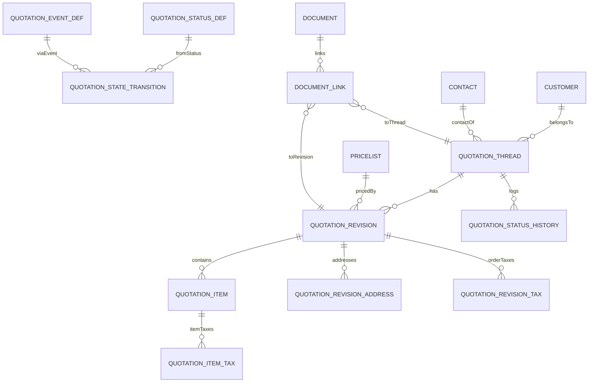
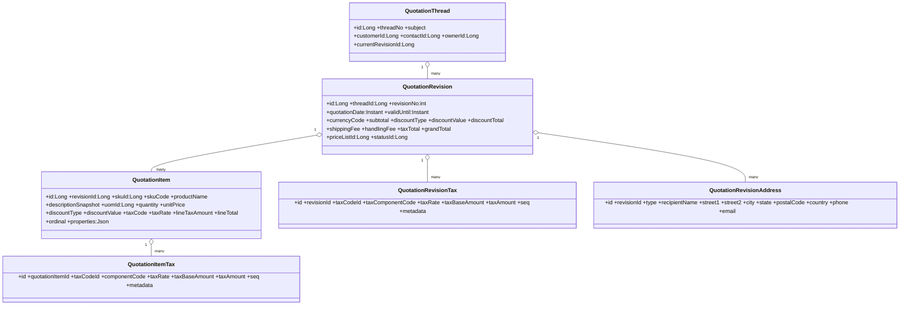

# Flexora 報價模組（Quotation）完整規格書 v2.0

> 更新：2025-10-01（Asia/Taipei）  
> 對齊《Flexora ERP 開發規範 – 資料結構與版本管理（含 JaVers）》：
>
> - **不使用 `tenant_id`**；唯一鍵採 **partial unique（WHERE deleted=false）**。
> - 時間：一律以 **UTC `TIMESTAMP`** 儲存（API 以 ISO 8601）。
> - 共通審計／軟刪／樂觀鎖欄位（以下統稱 **通用欄位**）：
>   - `created_by VARCHAR(128)`, `created_at TIMESTAMP`,  
>     `last_modified_by VARCHAR(128)`, `last_modified_at TIMESTAMP`,  
>     `deleted BOOLEAN DEFAULT false`, `deleted_at TIMESTAMP`, `deleted_by VARCHAR(128)`,  
>     `version BIGINT`。
> - 精度：金額 `DECIMAL(19,4)`；數量/單價/折扣運算 `DECIMAL(19,6)`；稅率 `DECIMAL(7,6)`（0–1）。
> - 流程：**DB-Driven 狀態機**（`*_status_def` / `*_event_def` / `*_state_transition` / `*_status_history`）。
> - 既有資料表以「**請參照既有模組**」標註：`customer`、`contact`、`item_sku`、`uom`、`price_list`、`tax_code`/`tax_rate_line`、`document`/`document_link` 等。

---

## 目錄

1. 流程總覽與名詞
2. Enum 值定義（集中）
3. 報價資料表（**完整表格**）
4. 狀態 / 事件 / 轉換 / 歷史（**完整表格**）
5. ExtAttr（定義/值）
6. 稅計算規格（演算法／順序／捨入）
7. 與其他模組整合（CRM/定價/稅/轉單/附件）
8. ER 圖（Mermaid）
9. Class 圖（Mermaid）
10. 鍵值、索引與約束建議
11. 測試案例與驗收清單

---

## 1) 流程總覽與名詞

- **Thread + Revision**：一份報價由 **報價線（QuotationThread）** 搭配 **不可變版本（QuotationRevision）** 組成；修改內容需新增新版本。
- **行項（QuotationItem）**：隸屬於某一 Revision，保存 SKU 與定價/稅務快照。
- **地址快照（QuotationRevisionAddress）**：Revision 層保存帳單/寄送地址快照。
- **稅**：與銷售相同，引用 `tax_code`/`tax_rate_line` 主檔；本模組具行稅/單頭稅表（可選）。
- **轉單**：可將已核准的 Revision 轉為 **SalesOrder**（本文件提供轉單規則與欄位對應）。

---

## 2) Enum 值定義（集中）

> 以 `VARCHAR` 儲存；如需後台維護可改 lookup 表。

### 2.1 折扣型態 `discount_type`

| 代碼     | 說明     | 規則                       |
| -------- | -------- | -------------------------- |
| `NONE`   | 無折扣   | 直接取價                   |
| `AMOUNT` | 固定金額 | 固定金額扣減（單位：金額） |
| `RATE`   | 比例折扣 | 0–1；先折扣再課稅          |

### 2.2 報價狀態 `quotation_status_def.code`（常見值）

| 代碼        | 說明     | 是否終結 |
| ----------- | -------- | -------- |
| `DRAFT`     | 草稿     | 否       |
| `SENT`      | 已寄出   | 否       |
| `APPROVED`  | 客戶同意 | 否       |
| `EXPIRED`   | 已逾期   | 是       |
| `REJECTED`  | 客戶拒絕 | 是       |
| `CANCELLED` | 作廢     | 是       |

### 2.3 事件 `quotation_event_def.code`（常見值）

| 代碼      | 說明     | 典型觸發條件           |
| --------- | -------- | ---------------------- |
| `send`    | 寄送報價 | 產出 PDF 並 email      |
| `approve` | 客戶同意 | 簽名/按鈕/外部 webhook |
| `reject`  | 客戶拒絕 | 客戶回覆               |
| `expire`  | 系統逾期 | 到期批次作業           |
| `cancel`  | 取消     | 管理員操作             |

---

## 3) 報價資料表（**完整表格**）

> 下列各表皆隱含 **通用欄位**。

### 3.1 `quotation_thread`（報價線/商機主線）

| 欄位代碼            |         型態 | 預設值 | 欄位名稱    | 必填 | 說明                  | 注意事項                                  |
| ------------------- | -----------: | -----: | ----------- | :--: | --------------------- | ----------------------------------------- |
| id                  |    BIGINT PK |        | 主鍵        |  Y   |                       |                                           |
| thread_no           |  VARCHAR(64) |        | 報價線代號  |  Y   | 對外顯示/查詢         | **partial unique**（WHERE deleted=false） |
| subject             | VARCHAR(255) |   NULL | 主旨        |  N   |                       |                                           |
| customer_id         |    BIGINT FK |        | 客戶        |  Y   | 請參照既有 `customer` |                                           |
| contact_id          |    BIGINT FK |   NULL | 聯絡人      |  N   | 請參照既有 `contact`  |                                           |
| owner_id            |    BIGINT FK |        | 負責人      |  Y   | 資料擁有者            |                                           |
| current_revision_id |    BIGINT FK |   NULL | 最新版本 id |  N   | 快取用                |                                           |

### 3.2 `quotation_revision`（報價版本，**不可變**）

| 欄位代碼       |          型態 | 預設值 | 欄位名稱       | 必填 | 說明                                  | 注意事項                                      |
| -------------- | ------------: | -----: | -------------- | :--: | ------------------------------------- | --------------------------------------------- |
| id             |     BIGINT PK |        | 主鍵           |  Y   |                                       |                                               |
| thread_id      |     BIGINT FK |        | 所屬 Thread    |  Y   |                                       |                                               |
| revision_no    |           INT |      1 | 版本號（1..n） |  Y   | 每個 thread 內唯一                    | **partial unique** `(thread_id, revision_no)` |
| quotation_date |     TIMESTAMP |    now | 報價日期       |  Y   | UTC                                   |                                               |
| valid_until    |     TIMESTAMP |   NULL | 有效期限       |  N   | UTC                                   |                                               |
| currency_code  |    VARCHAR(3) |        | 幣別           |  Y   | ISO 4217                              |                                               |
| subtotal       | DECIMAL(19,4) |      0 | 未稅小計       |  Y   | 彙總行淨額                            |                                               |
| discount_type  |   VARCHAR(16) | 'NONE' | 整單折扣型態   |  Y   | NONE/AMOUNT/RATE                      |                                               |
| discount_value | DECIMAL(19,6) |      0 | 整單折扣值     |  N   | RATE=0–1                              |                                               |
| discount_total | DECIMAL(19,4) |      0 | 整單折扣金額   |  N   | 分攤後結果                            |                                               |
| shipping_fee   | DECIMAL(19,4) |      0 | 運費           |  N   |                                       |                                               |
| handling_fee   | DECIMAL(19,4) |      0 | 手續費         |  N   |                                       |                                               |
| tax_total      | DECIMAL(19,4) |      0 | 稅總額         |  Y   | 由稅表彙總                            |                                               |
| grand_total    | DECIMAL(19,4) |      0 | 應付總額       |  Y   | subtotal - discount_total + fee + tax |                                               |
| price_list_id  |     BIGINT FK |   NULL | 參考價目表     |  N   | 請參照既有 `price_list`               |                                               |
| status_id      |     BIGINT FK |        | 狀態           |  Y   | FK→`quotation_status_def`             |                                               |

### 3.3 `quotation_revision_address`（Revision 層地址快照）

| 欄位代碼       |          型態 | 預設值 | 欄位名稱      | 必填 | 說明                   | 注意事項 |
| -------------- | ------------: | -----: | ------------- | :--: | ---------------------- | -------- |
| id             |     BIGINT PK |        | 主鍵          |  Y   |                        |          |
| revision_id    |     BIGINT FK |        | 所屬 Revision |  Y   |                        |          |
| type           |   VARCHAR(16) |        | 類型          |  Y   | BILLING/SHIPPING/OTHER |          |
| recipient_name |  VARCHAR(255) |   NULL | 收件人        |  N   |                        |          |
| contact_phone  |   VARCHAR(60) |   NULL | 聯絡電話      |  N   |                        |          |
| contact_email  |  VARCHAR(120) |   NULL | 聯絡 Email    |  N   |                        |          |
| street1        |  VARCHAR(500) |        | 地址行1       |  Y   |                        |          |
| street2        |  VARCHAR(500) |   NULL | 地址行2       |  N   |                        |          |
| city           |  VARCHAR(120) |   NULL | 城市          |  N   |                        |          |
| state          |  VARCHAR(120) |   NULL | 州/縣市       |  N   |                        |          |
| postal_code    |   VARCHAR(30) |   NULL | 郵遞區號      |  N   |                        |          |
| country        |   VARCHAR(10) |   NULL | 國家          |  N   | ISO                    |          |
| latitude       |  DECIMAL(9,6) |   NULL | 緯度          |  N   |                        |          |
| longitude      |  DECIMAL(9,6) |   NULL | 經度          |  N   |                        |          |
| instructions   | VARCHAR(1000) |   NULL | 配送指示      |  N   |                        |          |

### 3.4 `quotation_item`（報價行 — **不可變**）

| 欄位代碼             |          型態 | 預設值 | 欄位名稱       | 必填 | 說明                  | 注意事項 |
| -------------------- | ------------: | -----: | -------------- | :--: | --------------------- | -------- |
| id                   |     BIGINT PK |        | 主鍵           |  Y   |                       |          |
| revision_id          |     BIGINT FK |        | 所屬 Revision  |  Y   |                       |          |
| sku_id               |     BIGINT FK |        | SKU            |  Y   | 請參照既有 `item_sku` |          |
| sku_code             |   VARCHAR(64) |        | SKU 快照       |  Y   |                       |          |
| product_name         |  VARCHAR(255) |        | 品名快照       |  Y   |                       |          |
| description_snapshot |          TEXT |   NULL | 描述快照       |  N   |                       |          |
| uom_id               |     BIGINT FK |   NULL | 單位           |  N   | 請參照既有 `uom`      |          |
| quantity             | DECIMAL(19,6) |      0 | 數量           |  Y   |                       |          |
| unit_price           | DECIMAL(19,6) |      0 | 未稅單價       |  Y   |                       |          |
| discount_type        |   VARCHAR(16) | 'NONE' | 折扣型態       |  Y   |                       |          |
| discount_value       | DECIMAL(19,6) |      0 | 折扣值         |  N   | RATE=0–1              |          |
| tax_code             |   VARCHAR(64) |   NULL | 稅別代碼快照   |  N   |                       |          |
| tax_rate             |  DECIMAL(7,6) |   NULL | 稅率快照       |  N   | 0–1                   |          |
| line_tax_amount      | DECIMAL(19,4) |      0 | 行稅額         |  N   | s=4                   |          |
| line_total           | DECIMAL(19,4) |      0 | 行總額（含稅） |  Y   | s=4                   |          |
| ordinal              |           INT |      1 | 行序           |  Y   |                       |          |
| properties           |         JSONB |     {} | 其他屬性       |  N   | 序號/BOM/旗標         |          |

### 3.5 稅表（可選，但建議啟用，利於複合稅）

#### 3.5.1 `quotation_item_tax`

| 欄位代碼          |          型態 | 預設值 | 欄位名稱 | 必填 | 說明 |
| ----------------- | ------------: | -----: | -------- | :--: | ---- |
| id                |     BIGINT PK |        | 主鍵     |  Y   |      |
| quotation_item_id |     BIGINT FK |        | 行       |  Y   |      |
| tax_code_id       |     BIGINT FK |        | 稅別     |  Y   |      |
| component_code    |   VARCHAR(64) |        | 稅組成   |  Y   |      |
| tax_rate          |  DECIMAL(7,6) |      0 | 稅率     |  Y   | 0–1  |
| tax_base_amount   | DECIMAL(19,4) |      0 | 稅基     |  Y   |      |
| tax_amount        | DECIMAL(19,4) |      0 | 稅額     |  Y   |      |
| seq               |           INT |      1 | 順序     |  N   |      |
| metadata          |         JSONB |     {} | 其他     |  N   |      |

#### 3.5.2 `quotation_revision_tax`

| 欄位代碼           |          型態 | 預設值 | 欄位名稱 | 必填 | 說明 |
| ------------------ | ------------: | -----: | -------- | :--: | ---- |
| id                 |     BIGINT PK |        | 主鍵     |  Y   |      |
| revision_id        |     BIGINT FK |        | Revision |  Y   |      |
| tax_code_id        |     BIGINT FK |        | 稅別     |  Y   |      |
| tax_component_code |   VARCHAR(64) |        | 稅組成   |  Y   |      |
| tax_rate           |  DECIMAL(7,6) |      0 | 稅率     |  Y   |      |
| tax_base_amount    | DECIMAL(19,4) |      0 | 彙總稅基 |  Y   |      |
| tax_amount         | DECIMAL(19,4) |      0 | 彙總稅額 |  Y   |      |
| seq                |           INT |      1 | 順序     |  N   |      |
| metadata           |         JSONB |     {} | 其他     |  N   |      |

---

## 4) 狀態 / 事件 / 轉換 / 歷史（**完整表格**）

### 4.1 `quotation_status_def`

| 欄位代碼    |         型態 | 預設值 | 欄位名稱 | 必填 | 說明                     |
| ----------- | -----------: | -----: | -------- | :--: | ------------------------ |
| id          |    BIGINT PK |        | 主鍵     |  Y   |                          |
| code        |  VARCHAR(60) |        | 狀態代碼 |  Y   | 例：DRAFT/SENT/APPROVED… |
| name        | VARCHAR(120) |        | 顯示名稱 |  Y   |                          |
| description |         TEXT |   NULL | 說明     |  N   |                          |
| is_default  |      BOOLEAN |  false | 預設     |  Y   |                          |
| is_closed   |      BOOLEAN |  false | 終結     |  Y   |                          |
| sequence    |          INT |      1 | 排序     |  N   |                          |
| metadata    |        JSONB |     {} | 其他     |  N   | 顏色/權限                |

### 4.2 `quotation_event_def`

| 欄位代碼       |         型態 | 預設值 | 欄位名稱    | 必填 | 說明                              |
| -------------- | -----------: | -----: | ----------- | :--: | --------------------------------- |
| id             |    BIGINT PK |        | 主鍵        |  Y   |                                   |
| code           |  VARCHAR(60) |        | 事件代碼    |  Y   | send/approve/reject/expire/cancel |
| name           | VARCHAR(120) |        | 顯示名稱    |  Y   |                                   |
| payload_schema |         TEXT |   NULL | 載荷 Schema |  N   | JSON Schema                       |
| is_outbound    |      BOOLEAN |  false | 是否外發    |  Y   |                                   |
| metadata       |        JSONB |     {} | 其他        |  N   |                                   |

### 4.3 `quotation_state_transition`

| 欄位代碼         |          型態 | 預設值 | 欄位名稱 | 必填 | 說明    |
| ---------------- | ------------: | -----: | -------- | :--: | ------- |
| id               |     BIGINT PK |        | 主鍵     |  Y   |         |
| from_status_id   |     BIGINT FK |        | 來源狀態 |  Y   |         |
| event_id         |     BIGINT FK |        | 事件     |  Y   |         |
| to_status_id     |     BIGINT FK |        | 目標狀態 |  Y   |         |
| guard_expression | VARCHAR(2000) |   NULL | Guard    |  N   | SpEL/EL |
| sequence         |           INT |      1 | 優先序   |  N   |         |
| metadata         |         JSONB |     {} | 其他     |  N   |         |

### 4.4 `quotation_status_history`

| 欄位代碼         |         型態 | 預設值 | 欄位名稱     | 必填 | 說明 |
| ---------------- | -----------: | -----: | ------------ | :--: | ---- |
| id               |    BIGINT PK |        | 主鍵         |  Y   |      |
| thread_id        |    BIGINT FK |        | Thread       |  Y   |      |
| revision_id      |    BIGINT FK |   NULL | Revision     |  N   |      |
| event_code       |  VARCHAR(60) |   NULL | 事件代碼快照 |  N   |      |
| from_status_code |  VARCHAR(60) |        | 前狀態       |  Y   |      |
| to_status_code   |  VARCHAR(60) |        | 後狀態       |  Y   |      |
| changed_by       | VARCHAR(128) |        | 操作者       |  Y   |      |
| changed_at       |    TIMESTAMP |    now | 變更時間     |  Y   | UTC  |
| payload          |        JSONB |   NULL | 事件載荷     |  N   |      |
| reason           | VARCHAR(255) |   NULL | 原因         |  N   |      |
| reference        | VARCHAR(255) |   NULL | 外部參考     |  N   |      |

---

## 5) ExtAttr（每模組一套：Def / Value）

### 5.1 `quotation_revision_ext_attr_def`

| 欄位代碼      |         型態 | 預設值 | 欄位名稱 | 必填 | 說明                              |
| ------------- | -----------: | -----: | -------- | :--: | --------------------------------- |
| id            |    BIGINT PK |        | 主鍵     |  Y   |                                   |
| code          |  VARCHAR(80) |        | 欄位代碼 |  Y   | 唯一                              |
| data_type     |  VARCHAR(32) |        | 資料型態 |  Y   | STRING/INT/DECIMAL/DATE/BOOL/JSON |
| label         | VARCHAR(120) |   NULL | 顯示標籤 |  N   |                                   |
| required_attr |      BOOLEAN |  false | 必填     |  Y   |                                   |
| regex         | VARCHAR(255) |   NULL | 驗證規則 |  N   |                                   |
| searchable    |      BOOLEAN |  false | 可索引   |  Y   |                                   |
| metadata      |        JSONB |     {} | 其他     |  N   |                                   |

### 5.2 `quotation_revision_ext_attr_value`

| 欄位代碼              |          型態 | 預設值 | 欄位名稱 | 必填 | 說明                                                      |
| --------------------- | ------------: | -----: | -------- | :--: | --------------------------------------------------------- | --- |
| id                    |     BIGINT PK |        | 主鍵     |  Y   |                                                           |
| quotation_revision_id |     BIGINT FK |        | Revision |  Y   |                                                           |
| ext_attr_def_id       |     BIGINT FK |        | 定義     |  Y   |                                                           |
| value_string          | VARCHAR(2000) |   NULL | 值字串   |  N   |                                                           |
| value_number          |        BIGINT |   NULL | 值整數   |  N   |                                                           |
| value_decimal         | DECIMAL(19,6) |   NULL | 值小數   |  N   |                                                           |
| value_date            |          DATE |   NULL | 值日期   |  N   |                                                           |
| value_bool            |       BOOLEAN |   NULL | 值布林   |  N   |                                                           |
| value_json            |         JSONB |   NULL | 值 JSON  |  N   |                                                           |
| created_at/created_by |               |        | 稽核     |  Y   |                                                           |
| **唯一性**            |               |        |          |      | partial unique `(quotation_revision_id, ext_attr_def_id)` |     |

---

## 6) 稅計算規格（演算法／順序／捨入）

**行級**：

1. `raw = quantity * unit_price`（s=6）
2. 行折扣：
   - `NONE`：`net = raw`
   - `AMOUNT`：`net = raw - discount_value`（不得 < 0）
   - `RATE`（0–1）：`net = raw * (1 - rate)`
3. 若 Header 折扣存在：以 `RATE` 或 `AMOUNT` 方式 **按占比分攤到各行**（重算稅基）。
4. 複合稅：依 `quotation_item_tax.seq` 與 `tax_rate_line.apply_on` 逐一計算：`tax_i = round(base_i * rate_i, 4)`。
5. 行總額：`line_total = round(net + Σ tax_i, 4)`。

**單頭**：

1. `subtotal = Σ 行(net)`
2. `discount_total`（Header）：按行占比分攤（餘數補最後一行），重算稅。
3. 稅彙總：`quotation_revision_tax` 聚合行級稅基/稅額。
4. `grand_total = subtotal - discount_total + shipping_fee + handling_fee + tax_total`。

**捨入**：中間 s=6；稅與總額 s=4；顯示可 round 2（`HALF_UP`）。計算過程需保存 **calculation trace**。

---

## 7) 與其他模組整合

- **CRM**：`customer`、`contact` 作為 Thread 所屬對象；Revision 地址使用快照，不回寫主檔。
- **定價**：可由 `price_list` 帶入單價與稅別；Revision/Item 保存快照（避免後續變動影響）。
- **稅**：共用 `tax_code`/`tax_rate_line`；流程與銷售一致。
- **轉單（Quotation → SalesOrder）**：
  - 條件：`status=APPROVED`（或依 transition guard）。
  - 行為：複製 Revision header + items 至 SO；建立 `sales_order_quotation` 關聯（`quotation_id`、`revision_no`、`linked_quantity`）。
  - 權限：價金覆寫需 `ROLE_PRICE_OVERRIDE`；紀錄 trace。
- **附件**：共用 `document`/`document_link`（entity_type=`QuotationThread`/`QuotationRevision`）。

---

## 8) ER 圖（Mermaid）

---

## 9) Class 圖（Mermaid）

---

## 10) 鍵值、索引與約束建議

- **Partial Unique**：
  - `quotation_thread(thread_no)`（WHERE deleted=false）
  - `quotation_revision(thread_id, revision_no)`（WHERE deleted=false）
  - `quotation_revision_address(revision_id, type)`（WHERE deleted=false，若每類型僅一筆時）
  - `quotation_item_tax(quotation_item_id, tax_code_id, component_code)`（WHERE deleted=false）
  - `quotation_revision_tax(revision_id, tax_code_id, tax_component_code)`（WHERE deleted=false）
- **常用索引**：
  - Thread：`customer_id`、`owner_id`、`thread_no`、`created_at`
  - Revision：`thread_id`、`status_id`、`quotation_date`、`price_list_id`
  - Item：`revision_id`、`sku_id`
  - History：`thread_id`、`changed_at`
- **約束與 Guard**：
  - `revision` 不可變；修改需新增新版。
  - 轉單前需 `status in (APPROVED, ...)` 且未逾期。

---

## 11) 測試案例與驗收清單

- **計算**：行折扣/整單折扣（AMOUNT/RATE）、複合稅順序、捨入（中間 s=6、稅/總額 s=4、顯示 s=2）。
- **流程**：`send/approve/reject/expire/cancel` 的 transition + history 正確記錄。
- **轉單**：Partial/Full convert；價金覆寫權限與 trace。
- **整合**：價目表快照、稅碼快照、附件連結與存取權限。
- **資料一致性**：`revision_no` 競態測試（partial unique 防重）；`deleted=false` 約束。

---
