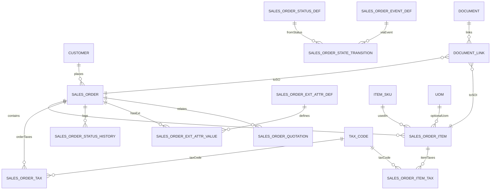

# Flexora 訂單模組（Sales Order）完整規格書 v2.0

> 更新：2025-10-01（Asia/Taipei）  
> 適用規範：**《Flexora ERP 開發規範 – 資料結構與版本管理（含 JaVers）》**（時間=UTC、金額/比率精度、DB 驅動狀態機、軟刪、樂觀鎖、ExtAttr、地址用 JSONB VO、**不使用 `tenant_id`、唯一鍵 partial unique (WHERE deleted=false)**）。

---

## 目錄

1. 流程與名詞
2. Enum 值（集中）
3. 資料表（完整表格）
   - 3.1 `sales_order`（Header）
   - 3.2 `sales_order_item`（明細）
   - 3.3 稅表：`sales_order_item_tax` / `sales_order_tax`
   - 3.4 ExtAttr：`sales_order_ext_attr_def` / `sales_order_ext_attr_value`
   - 3.5 狀態機四表：`sales_order_status_def` / `sales_order_event_def` / `sales_order_state_transition` / `sales_order_status_history`
   - 3.6 與 Quotation 關聯：`sales_order_quotation`
   - 3.7 計算稽核：`calculation_trace`（共用）
   - 3.8 附件整合：`document` / `document_link`（共用）
4. 稅的計算方式（演算法 / 順序 / 捨入）
5. 與其他模組整合（Quotation / IM / DN / Tax / AR / Document）
6. ER 圖（Mermaid）
7. Class 圖（Mermaid）
8. 鍵值、索引、約束建議
9. 測試與驗收清單

---

## 1) 流程與名詞

- **建立** → **計價/稅**（PricingEngine）→ **確認**（Confirm：向 IM 預留、回寫 `promise_date`）→ **出貨**（Delivery Note/DN）→ **請款**（AR）。
- **DB 驅動狀態機**：狀態/事件/轉換/歷史四表；按 CSV seed 管理。
- **快照**：行項保存 `sku_code/product_name/unit_price/tax_rate/discount` 等；Header 保存地址與價目表快照，不回寫主檔。
- **轉單**：支援自 **Quotation Revision** 部分/整單轉入（Join 表留來源）。

---

## 2) Enum 值（集中）

> 以 `VARCHAR` 儲存；若需後台維護可改 lookup 表。

### 2.1 折扣型態 `discount_type`

| 值       | 說明     | 規則              |
| -------- | -------- | ----------------- |
| `NONE`   | 無折扣   | 直接取價          |
| `AMOUNT` | 固定金額 | 單位：金額        |
| `RATE`   | 比例折扣 | 0–1，先折扣再課稅 |

### 2.2 訂單狀態（常見值） `sales_order_status_def.code`

| 值                  | 說明             | 是否終結 |
| ------------------- | ---------------- | -------- |
| `DRAFT`             | 草稿             | 否       |
| `CONFIRMED`         | 已確認（已預留） | 否       |
| `PARTIALLY_SHIPPED` | 部分出貨         | 否       |
| `FULFILLED`         | 全數出貨完成     | 是       |
| `CANCELLED`         | 作廢             | 是       |

### 2.3 事件 `sales_order_event_def.code`

| 值            | 說明      | 典型觸發                      |
| ------------- | --------- | ----------------------------- |
| `confirm`     | 確認/預留 | 權限＋基礎檢核通過            |
| `cancel`      | 取消      | 未進入終結態                  |
| `ship.update` | 出貨回寫  | DN 過帳回寫 shipped/fulfilled |

---

## 3) 資料表（完整表格）

> 所有表均含通用欄位：`created_by/created_at/last_modified_by/last_modified_at/deleted/deleted_at/deleted_by/version`。金額 `DECIMAL(19,4)`、中間計算 `DECIMAL(19,6)`、稅率 `DECIMAL(7,6)`。

### 3.1 `sales_order`（Header）

| 欄位                              |          型態 |   預設 | 欄位名稱        | 必填 | 說明                                       | 注意事項                                  |
| --------------------------------- | ------------: | -----: | --------------- | :--: | ------------------------------------------ | ----------------------------------------- |
| id                                |     BIGINT PK |        | 主鍵            |  Y   |                                            |                                           |
| order_no                          |   VARCHAR(64) |        | 訂單號          |  Y   | 對外唯一                                   | **partial unique**（WHERE deleted=false） |
| customer_id                       |     BIGINT FK |        | 客戶            |  Y   | 請參照既有 `customer`                      |                                           |
| currency_code                     |    VARCHAR(3) |        | 幣別            |  Y   | ISO 4217                                   |                                           |
| exchange_rate                     | DECIMAL(19,8) |   NULL | 匯率快照        |  N   | 多幣別                                     |                                           |
| billing_address                   |         JSONB |   NULL | 帳單地址快照    |  N   | 值物件                                     | 不回寫主檔                                |
| shipping_address                  |         JSONB |   NULL | 寄送地址快照    |  N   | 值物件                                     | 不回寫主檔                                |
| order_date                        |     TIMESTAMP |    now | 建單時間        |  Y   | UTC                                        |                                           |
| requested_delivery_date           |          DATE |   NULL | 要求交期        |  N   |                                            |                                           |
| status_code                       |   VARCHAR(64) |  DRAFT | 狀態            |  Y   | 對應狀態表                                 |                                           |
| origin_type                       |   VARCHAR(32) |   NULL | 來源型態        |  N   | QUOTATION/API/MANUAL                       |                                           |
| originating_quotation_id          |        BIGINT |   NULL | 來源報價 Thread |  N   | 轉單追溯                                   |                                           |
| originating_quotation_revision_no |           INT |   NULL | 來源版本號      |  N   | 轉單追溯                                   |                                           |
| subtotal                          | DECIMAL(19,4) |      0 | 未稅小計        |  Y   | 行淨額彙總                                 |                                           |
| discount_type                     |   VARCHAR(16) | 'NONE' | 整單折扣型態    |  Y   | NONE/AMOUNT/RATE                           |                                           |
| discount_value                    | DECIMAL(19,6) |      0 | 整單折扣值      |  N   | RATE=0–1                                   |                                           |
| discount_total                    | DECIMAL(19,4) |      0 | 整單折扣金額    |  N   | 分攤合計                                   |                                           |
| shipping_fee                      | DECIMAL(19,4) |      0 | 運費            |  N   |                                            |                                           |
| handling_fee                      | DECIMAL(19,4) |      0 | 手續費          |  N   |                                            |                                           |
| tax_total                         | DECIMAL(19,4) |      0 | 稅總額          |  Y   | 稅表彙總                                   |                                           |
| grand_total                       | DECIMAL(19,4) |      0 | 應付總額        |  Y   | subtotal - discount_total + fees + tax     |                                           |
| paid_amount                       | DECIMAL(19,4) |      0 | 已收款          |  N   | 由 AR 更新                                 |                                           |
| balance_due                       | DECIMAL(19,4) |      0 | 未收款          |  N   | 計算欄位                                   |                                           |
| payment_terms_id                  |     BIGINT FK |   NULL | 付款條件        |  N   | **請參照 AR/Finance 模組 `payment_terms`** |                                           |
| incoterm                          |   VARCHAR(16) |   NULL | 國貿條件        |  N   |                                            |                                           |
| sales_person_id                   |     BIGINT FK |   NULL | 業務            |  N   |                                            |                                           |
| price_list_id                     |     BIGINT FK |   NULL | 價目表          |  N   | 請參照既有 `price_list`                    |                                           |
| promise_date                      |          DATE |   NULL | 承諾交期        |  N   | Confirm 由 IM 回寫                         |                                           |
| reservation_strategy              |   VARCHAR(16) | 'AUTO' | 預留策略        |  N   | AUTO/MANUAL/NONE                           |                                           |
| ship_complete                     |       BOOLEAN |  false | 全備齊才出      |  N   | 影響 backorder                             |                                           |
| fulfillment_status                |   VARCHAR(32) | 'OPEN' | 履約狀態        |  N   | OPEN/PARTIAL/FULFILLED/CANCELLED           |                                           |
| reserved_total_qty                | DECIMAL(19,6) |      0 | 預留量快取      |  N   | 來源 IM 彙總                               |                                           |
| backorder_flag                    |       BOOLEAN |  false | 有缺貨          |  N   | 來源 IM 彙總                               |                                           |
| ext_attr_ref                      |         JSONB |   NULL | ExtAttr 快取    |  N   | 查詢優化                                   |                                           |
| properties                        |         JSONB |   NULL | 自訂屬性        |  N   | 標籤/旗標                                  |                                           |

**注意事項**

- Confirm 時呼叫 IM 建立 Reservation；缺料時建立補料建議並回寫 `promise_date` 與快取欄位。
- 出貨（DN）回寫 shipped / fulfillment 狀態。

---

### 3.2 `sales_order_item`（明細）

| 欄位                         |          型態 |   預設 | 欄位名稱       | 必填 | 說明                  | 注意事項 |
| ---------------------------- | ------------: | -----: | -------------- | :--: | --------------------- | -------- |
| id                           |     BIGINT PK |        | 主鍵           |  Y   |                       |          |
| sales_order_id               |     BIGINT FK |        | 所屬訂單       |  Y   |                       |          |
| sku_id                       |     BIGINT FK |        | SKU            |  Y   | 請參照既有 `item_sku` |          |
| sku_code                     |   VARCHAR(64) |        | SKU 快照       |  Y   |                       |          |
| product_name                 |  VARCHAR(255) |        | 品名快照       |  Y   |                       |          |
| description_snapshot         |          TEXT |   NULL | 描述快照       |  N   |                       |          |
| uom_id                       |     BIGINT FK |   NULL | 單位           |  N   | 請參照既有 `uom`      |          |
| quantity                     | DECIMAL(19,6) |      0 | 訂購量         |  Y   |                       |          |
| unit_price                   | DECIMAL(19,6) |      0 | 未稅單價       |  Y   |                       |          |
| discount_type                |   VARCHAR(16) | 'NONE' | 行折扣型態     |  Y   |                       |          |
| discount_value               | DECIMAL(19,6) |      0 | 行折扣值       |  N   | RATE=0–1              |          |
| tax_code                     |   VARCHAR(64) |   NULL | 稅別代碼快照   |  N   |                       |          |
| tax_rate                     |  DECIMAL(7,6) |   NULL | 稅率快照       |  N   | 0–1                   |          |
| line_tax_amount              | DECIMAL(19,4) |      0 | 行稅額         |  N   | s=4                   |          |
| line_total                   | DECIMAL(19,4) |      0 | 行總額（含稅） |  Y   | s=4                   |          |
| origin_quotation_id          |        BIGINT |   NULL | 來源 Q Thread  |  N   | 轉單追溯              |          |
| origin_quotation_revision_no |           INT |   NULL | 來源版本號     |  N   | 轉單追溯              |          |
| origin_quotation_item_id     |        BIGINT |   NULL | 來源 Q 行      |  N   | 轉單追溯              |          |
| warehouse_id                 |     BIGINT FK |   NULL | 指定出貨倉     |  N   |                       |          |
| reserved_quantity            | DECIMAL(19,6) |      0 | 已預留量快取   |  N   | 來源 IM               |          |
| allocatable_quantity         | DECIMAL(19,6) |      0 | 可配貨量快取   |  N   | 非權威                |          |
| backordered_quantity         | DECIMAL(19,6) |      0 | 缺貨量快取     |  N   |                       |          |
| need_by_date                 |          DATE |   NULL | 行級期望交期   |  N   |                       |          |
| shipped_quantity             | DECIMAL(19,6) |      0 | 已出貨量       |  N   | DN 回寫               |          |
| properties                   |         JSONB |   NULL | 其他屬性       |  N   |                       |          |

**注意事項**

- Confirm 成功後，不得任意修改 `sku/qty/price/warehouse` 等關鍵字段；需走取消/重建流程或 DN/CRN 調整。

---

### 3.3 稅表（複合稅支援）

#### 3.3.1 `sales_order_item_tax`

| 欄位                |          型態 | 預設 | 欄位名稱 | 必填 | 說明 |
| ------------------- | ------------: | ---: | -------- | :--: | ---- |
| id                  |     BIGINT PK |      | 主鍵     |  Y   |      |
| sales_order_item_id |     BIGINT FK |      | 所屬明細 |  Y   |      |
| tax_code_id         |     BIGINT FK |      | 稅別     |  Y   |      |
| component_code      |   VARCHAR(64) |      | 稅組成   |  Y   |      |
| tax_rate            |  DECIMAL(7,6) |    0 | 稅率     |  Y   | 0–1  |
| tax_base_amount     | DECIMAL(19,4) |    0 | 稅基     |  Y   |      |
| tax_amount          | DECIMAL(19,4) |    0 | 稅額     |  Y   |      |
| seq                 |           INT |    1 | 順序     |  N   |      |
| metadata            |         JSONB |   {} | 其他     |  N   |      |

#### 3.3.2 `sales_order_tax`

| 欄位               |          型態 | 預設 | 欄位名稱 | 必填 | 說明 |
| ------------------ | ------------: | ---: | -------- | :--: | ---- |
| id                 |     BIGINT PK |      | 主鍵     |  Y   |      |
| sales_order_id     |     BIGINT FK |      | 所屬訂單 |  Y   |      |
| tax_code_id        |     BIGINT FK |      | 稅別     |  Y   |      |
| tax_component_code |   VARCHAR(64) |      | 組成     |  Y   |      |
| tax_rate           |  DECIMAL(7,6) |    0 | 稅率     |  Y   |      |
| tax_base_amount    | DECIMAL(19,4) |    0 | 彙總稅基 |  Y   |      |
| tax_amount         | DECIMAL(19,4) |    0 | 彙總稅額 |  Y   |      |
| seq                |           INT |    1 | 順序     |  N   |      |
| metadata           |         JSONB |   {} | 其他     |  N   |      |

---

### 3.4 ExtAttr（客製欄位）

#### 3.4.1 `sales_order_ext_attr_def`

| 欄位       |         型態 |  預設 | 欄位名稱 | 必填 | 說明                              |
| ---------- | -----------: | ----: | -------- | :--: | --------------------------------- |
| id         |    BIGINT PK |       | 主鍵     |  Y   |                                   |
| key        | VARCHAR(128) |       | 欄位代碼 |  Y   | 唯一                              |
| label      | VARCHAR(128) |  NULL | 顯示名稱 |  N   |                                   |
| data_type  |  VARCHAR(32) |       | 資料型態 |  Y   | STRING/INT/DECIMAL/DATE/BOOL/JSON |
| required   |      BOOLEAN | false | 必填     |  Y   |                                   |
| searchable |      BOOLEAN | false | 可索引   |  Y   |                                   |
| ui_widget  |  VARCHAR(64) |  NULL | UI 控件  |  N   |                                   |
| metadata   |        JSONB |    {} | 其他     |  N   |                                   |

#### 3.4.2 `sales_order_ext_attr_value`

| 欄位            |          型態 | 預設 | 欄位名稱   | 必填 | 說明 |
| --------------- | ------------: | ---: | ---------- | :--: | ---- |
| id              |     BIGINT PK |      | 主鍵       |  Y   |      |
| sales_order_id  |     BIGINT FK |      | 訂單       |  Y   |      |
| ext_attr_def_id |     BIGINT FK |      | 定義       |  Y   |      |
| value_string    | VARCHAR(2000) | NULL | 值（字串） |  N   |      |
| value_number    |        BIGINT | NULL | 值（整數） |  N   |      |
| value_decimal   | DECIMAL(19,6) | NULL | 值（小數） |  N   |      |
| value_date      |          DATE | NULL | 值（日期） |  N   |      |
| value_bool      |       BOOLEAN | NULL | 值（布林） |  N   |      |
| value_json      |         JSONB | NULL | 值（JSON） |  N   |      |

> 唯一性：partial unique `(sales_order_id, ext_attr_def_id)`（WHERE deleted=false）。

---

### 3.5 狀態機四表（DB 驅動）

#### 3.5.1 `sales_order_status_def`

| 欄位       |         型態 |  預設 | 欄位名稱 | 必填 | 說明                |
| ---------- | -----------: | ----: | -------- | :--: | ------------------- |
| id         |    BIGINT PK |       | 主鍵     |  Y   |                     |
| code       |  VARCHAR(64) |       | 狀態代碼 |  Y   | DRAFT/CONFIRMED/... |
| name       | VARCHAR(128) |       | 顯示名   |  Y   |                     |
| is_default |      BOOLEAN | false | 預設     |  Y   |                     |
| is_closed  |      BOOLEAN | false | 終結     |  Y   |                     |
| sequence   |          INT |     1 | 排序     |  N   |                     |
| metadata   |        JSONB |    {} | 其他     |  N   |                     |

#### 3.5.2 `sales_order_event_def`

| 欄位           |         型態 |  預設 | 欄位名稱    | 必填 | 說明                       |
| -------------- | -----------: | ----: | ----------- | :--: | -------------------------- |
| id             |    BIGINT PK |       | 主鍵        |  Y   |                            |
| code           |  VARCHAR(64) |       | 事件代碼    |  Y   | confirm/cancel/ship.update |
| name           | VARCHAR(128) |       | 顯示名      |  Y   |                            |
| payload_schema |         TEXT |  NULL | 載荷 Schema |  N   | JSON Schema                |
| is_outbound    |      BOOLEAN | false | 是否外發    |  Y   |                            |
| metadata       |        JSONB |    {} | 其他        |  N   |                            |

#### 3.5.3 `sales_order_state_transition`

| 欄位             |          型態 | 預設 | 欄位名稱 | 必填 | 說明    |
| ---------------- | ------------: | ---: | -------- | :--: | ------- |
| id               |     BIGINT PK |      | 主鍵     |  Y   |         |
| from_status_id   |     BIGINT FK |      | 來源狀態 |  Y   |         |
| event_id         |     BIGINT FK |      | 事件     |  Y   |         |
| to_status_id     |     BIGINT FK |      | 目標狀態 |  Y   |         |
| guard_expression | VARCHAR(2000) | NULL | Guard    |  N   | SpEL/EL |
| sequence         |           INT |    1 | 優先序   |  N   |         |
| metadata         |         JSONB |   {} | 其他     |  N   |         |

#### 3.5.4 `sales_order_status_history`

| 欄位             |         型態 | 預設 | 欄位名稱     | 必填 | 說明 |
| ---------------- | -----------: | ---: | ------------ | :--: | ---- |
| id               |    BIGINT PK |      | 主鍵         |  Y   |      |
| sales_order_id   |    BIGINT FK |      | 訂單         |  Y   |      |
| event_code       |  VARCHAR(64) | NULL | 事件代碼快照 |  N   |      |
| from_status_code |  VARCHAR(64) |      | 前狀態       |  Y   |      |
| to_status_code   |  VARCHAR(64) |      | 後狀態       |  Y   |      |
| changed_by       | VARCHAR(128) |      | 操作者       |  Y   |      |
| changed_at       |    TIMESTAMP |  now | 變更時間     |  Y   | UTC  |
| payload          |        JSONB | NULL | 事件載荷     |  N   |      |
| reason           | VARCHAR(255) | NULL | 原因         |  N   |      |
| reference        | VARCHAR(255) | NULL | 外部參考     |  N   |      |

---

### 3.6 `sales_order_quotation`（SO ↔ Quotation 關聯）

| 欄位                  |          型態 | 預設 | 欄位名稱    | 必填 | 說明                           |
| --------------------- | ------------: | ---: | ----------- | :--: | ------------------------------ |
| id                    |     BIGINT PK |      | 主鍵        |  Y   |                                |
| sales_order_id        |     BIGINT FK |      | 訂單        |  Y   |                                |
| quotation_thread_id   |     BIGINT FK |      | 報價 Thread |  Y   |                                |
| quotation_revision_no |           INT |      | 版本號      |  Y   |                                |
| linked_quantity       | DECIMAL(19,6) |    0 | 連結量      |  N   |                                |
| link_type             |   VARCHAR(32) | NULL | 連結型態    |  N   | ORIGINATED_FROM/PARTIAL/MERGED |
| notes                 |  VARCHAR(500) | NULL | 備註        |  N   |                                |

---

### 3.7 `calculation_trace`（共用，簡述）

| 欄位            |              型態 | 說明                           |
| --------------- | ----------------: | ------------------------------ |
| id              |         BIGINT PK | PK                             |
| reference_type  |       VARCHAR(64) | `SalesOrder`                   |
| reference_id    |            BIGINT | 指向 SO                        |
| stage           |       VARCHAR(64) | line-pricing/tax-calc/finalize |
| input_snapshot  |             JSONB | 前置輸入                       |
| output_delta    |             JSONB | 調整差異                       |
| result_snapshot |             JSONB | 結果快照                       |
| executed_at/by  | TIMESTAMP/VARCHAR | 稽核                           |
| error_message   |              TEXT | 錯誤訊息                       |

---

### 3.8 附件整合（共用）

- 使用 `document` / `document_link`，`entity_type='SalesOrder'|'SalesOrderItem'`。
- 刪除策略：刪最後一個 link 時才移除檔案（遵守保留政策）。

---

## 4) 稅的計算方式

**行級**：

1. `raw = qty * unit_price`（s=6）
2. 行折扣：`NONE` → `net=raw`；`AMOUNT` → `net=raw-amount`（>=0）；`RATE` → `net=raw*(1-rate)`
3. Header 折扣（若有）按占比分攤至各行，重算 `net`。
4. 依 `tax_rate_line.seq` 與 `apply_on` 計複合稅：`tax_i = round(base_i * rate_i, 4)`；固定額外費用則直接加總。
5. 行總額：`line_total = round(net + Σ tax_i, 4)`。

**單頭**：`subtotal = Σ net`；`tax_total = Σ 行稅額`（或按 order-level 重算）；`grand_total = subtotal - discount_total + shipping_fee + handling_fee + tax_total`。  
**捨入**：中間 s=6、稅與總額 s=4，顯示可 round 2（`HALF_UP`）。每次計算需保存 **calculation_trace**。

---

## 5) 與其他模組整合

- **Quotation**：轉單複製 Revision 快照（header + items），建立 `sales_order_quotation`；行級 `origin_*` 追溯。
- **IM（庫存）**：`confirm` 建 Reservation；不足 → 建 Replenishment 建議並回寫 `promise_date`；DN 過帳回寫 shipped/fulfilled。
- **Delivery Note（出貨）**：DN 行對應 SO 行，回寫 `shipped_quantity` 與 `fulfillment_status`。
- **Tax**：共用主檔 `tax_code`/`tax_rate_line`；SO 稅表僅紀錄快照與結果。
- **AR**：SO 作為應收來源之一；`paid_amount/balance_due` 由 AR 回寫。
- **Document**：共用 `document/document_link`。

---

## 6) ER 圖（Mermaid，語法校驗）

---

## 7) Class 圖（Mermaid）

```mermaid
classDiagram
  class SalesOrder {
    +id:Long +orderNo
    +customerId:Long +currencyCode +exchangeRate
    +statusCode +orderDate +requestedDeliveryDate
    +subtotal +discountType +discountValue +discountTotal
    +shippingFee +handlingFee +taxTotal +grandTotal
    +paidAmount +balanceDue
    +paymentTermsId:Long +incoterm +salesPersonId:Long +priceListId:Long
    +promiseDate +reservationStrategy +shipComplete +fulfillmentStatus
    +reservedTotalQty +backorderFlag
    +billingAddress:Json +shippingAddress:Json +extAttrRef:Json +properties:Json
  }
  class SalesOrderItem {
    +id:Long +salesOrderId:Long +skuId:Long +skuCode +productName
    +descriptionSnapshot +uomId:Long +quantity +unitPrice
    +discountType +discountValue +taxCode +taxRate +lineTaxAmount +lineTotal
    +warehouseId:Long +reservedQuantity +allocatableQuantity +backorderedQuantity
    +needByDate +shippedQuantity +properties:Json
    +originQuotationId:Long +originQuotationRevisionNo:int +originQuotationItemId:Long
  }
  class SalesOrderItemTax { +id +salesOrderItemId +taxCodeId +componentCode +taxRate +taxBaseAmount +taxAmount +seq +metadata }
  class SalesOrderTax { +id +salesOrderId +taxCodeId +taxComponentCode +taxRate +taxBaseAmount +taxAmount +seq +metadata }
  class SalesOrderQuotation { +id +salesOrderId +quotationThreadId +quotationRevisionNo +linkedQuantity +linkType +notes }
  class SalesOrderStatusHistory { +id +salesOrderId +eventCode +fromStatusCode +toStatusCode +changedBy +changedAt +payload +reason +reference }
  class SalesOrderStateTransition { +id +fromStatusId +eventId +toStatusId +guardExpression +sequence +metadata }
  class SalesOrderStatusDef { +id +code +name +isDefault +isClosed +sequence +metadata }
  class SalesOrderEventDef { +id +code +name +payloadSchema +isOutbound +metadata }
  class SalesOrderExtAttrDef { +id +key +label +dataType +required +searchable +uiWidget +metadata }
  class SalesOrderExtAttrValue { +id +salesOrderId +extAttrDefId +valueString +valueNumber +valueDecimal +valueDate +valueBool +valueJson }

  SalesOrder "1" o-- "many" SalesOrderItem
  SalesOrderItem "1" o-- "many" SalesOrderItemTax
  SalesOrder "1" o-- "many" SalesOrderTax
  SalesOrder "1" o-- "many" SalesOrderStatusHistory
  SalesOrderStatusDef "1" o-- "many" SalesOrderStateTransition
  SalesOrderEventDef "1" o-- "many" SalesOrderStateTransition
  SalesOrder "1" o-- "many" SalesOrderExtAttrValue
  SalesOrderExtAttrDef "1" o-- "many" SalesOrderExtAttrValue
  SalesOrder "1" o-- "many" SalesOrderQuotation
```

---

## 8) 鍵值、索引、約束建議

- **Unique**：`sales_order(order_no)` partial unique（WHERE deleted=false）。
- **索引**：`customer_id`、`status_code`、`order_date`、`sales_person_id`、`price_list_id`、`promise_date`、`originating_quotation_id`。
- **稅表**：`(sales_order_id, tax_code_id, tax_component_code)`、`(sales_order_item_id, tax_code_id, component_code)`。
- **ExtAttr**：partial unique `(sales_order_id, ext_attr_def_id)`。
- **一致性**：Confirm 後禁止直接改動關鍵欄位；走取消/調整流程或 DN/CRN。

---

## 9) 測試與驗收清單

- 計價：行折扣/整單折扣（AMOUNT/RATE）、複合稅順序、捨入（中間 s=6、稅/總額 s=4、顯示 s=2）。
- 流程：`confirm/cancel/ship.update` 轉換與 history。
- 轉單：Quotation → SO（partial/merge）；來源追溯欄位正確。
- IM：預留與釋放冪等；promise 回寫；缺料自動建立補料建議。
- DN：出貨回寫 shipped/fulfilled 正確。
- AR：收款回寫 `paid_amount`、`balance_due`。
- 並發：order_no 唯一、@Version；預留不超賣。

---
