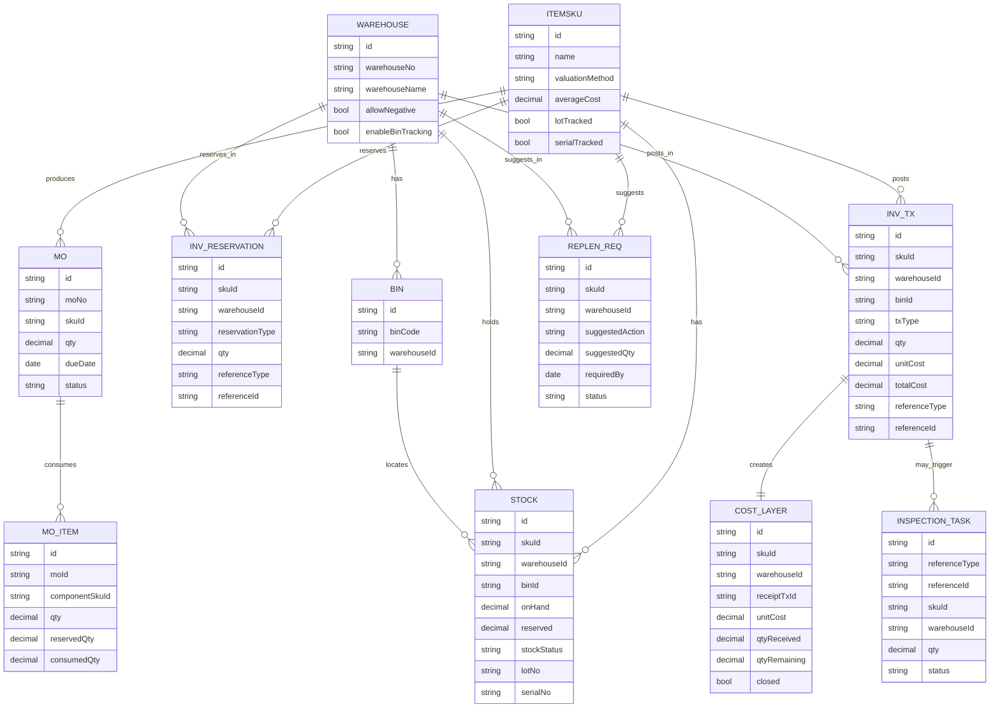
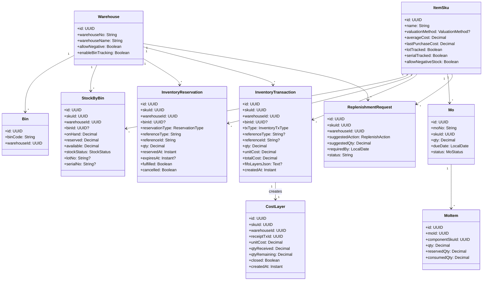

# 庫存管理（IM）完整規格書 — 含成本估值設計

**Tenant 預設：加權平均（Moving Average）＋ SKU 可覆寫：FIFO ＋ 永久成本分層（Cost Layer）**

> 適用情境：**接單生產（MTO）**＋**五金/木材零售（MTS）**
> 成本策略：公司層（Tenant）預設用 **加權平均**進行**會計過帳（COGS）**；**SKU 層可覆寫 FIFO**。**所有入庫永遠建立 Cost Layer**，因此能同時產生 **FIFO / AVG** 管理報表。
> 庫存政策：**Global default + Per-SKU + Per-Warehouse** 覆寫；**高風險操作（負庫、估值切換、手動成本調整）需審批與完整稽核**。

---

## 1. 執行摘要（Executive Summary）

* 先上 **IM**（庫存/採購/製造/會計聯動），之後視需求擴成 **WMS**（倉位/波次/高密度倉管）。
* **允許原料不足仍可接單**，自動計算**承諾交期**、建立**補料建議（PO/MO）**，同時支援零售**Partial/Backorder**。
* **成本過帳**：**預設 AVG**；SKU 可選 **FIFO**。一律寫 **Cost Layer**，報表可切換 **FIFO/AVG**，並可做差異分析。
* **多倉成本隔離**：**AVG** 與 **Cost Layers** 以 **SKU×Warehouse** 維度管理，避免跨倉污染。

---

## 2. 範圍與假設（Scope & Assumptions）

1. 產品模型（Item/ItemSku/UoM）既有，本文在其上擴充。
2. 多倉為必備；倉位（Bin）可選。
3. **Sales Order Confirm** 觸發：預留、BOM 展開（MTO）、補料建議、承諾交期。
4. IQC 未通過不進 **AVAILABLE**（維持 **QUARANTINE**）。
5. 成本與庫存數量一致性以**交易分錄（InventoryTransaction）**為準；任何更動均留稽核。

---

## 3. 高階流程（High-level Flows）

* 報價→下單：MTO 顯示預估交期（lead time / routing）。
* 訂單確認：預留可用量；若不足→計算 Promise Date → 建 **ReplenishmentRequest**（PO/MO）。
* 出貨：支援 **Partial**；不足量自動建立 **Backorder**。
* 製造：建立 **MO 草稿**、預留原料、完工入庫觸發 backorder 出貨。
* 收貨 & IQC：檢驗通過才轉入 **AVAILABLE**。
* 盤點 & 調整：形成交易分錄，成本與數量同步過帳。

---

## 4. 關鍵決策（One-page）

1. **負庫**：預設禁止（尤其 Raw），允許 per-SKU/WH 覆寫，但需審批與稽核。
2. **Partial/Backorder**：啟用。
3. **追蹤粒度**：Warehouse 必備；Bin 可選；lot/serial 依 SKU 設定。
4. **超賣補貨**：自動建立建議（PO/MO），可關閉。
5. **成本估值**：Tenant=AVG，SKU 可覆寫 FIFO；**統一建立 Cost Layer**。
6. **多倉成本隔離**：**AVG 與 Layers 以 SKU×WH 維度**。
7. **BOM 展開/預留時機**：MTO 在 **ORDER_CONFIRM** 建 MO 草稿並預留（SKU 可覆寫至 MO_RELEASE）。

---

## 5. 資料模型（表格規格）

> 型別為邏輯型別（實作建議：數量 `numeric(19,6)`、金額 `numeric(19,4)`；時間皆 UTC）。
> 欄位表皆含：**型別／是否必填／預設值／說明／驗證與注意事項**。
> **下方另提供 ER 圖與 UML Class 圖**（Mermaid）。

### 5.1 枚舉（Enums）

| Enum            | 值                                                                                                    | 說明                       |
| --------------- | ---------------------------------------------------------------------------------------------------- | ------------------------ |
| StockStatus     | AVAILABLE, RESERVED, QUARANTINE, HOLD                                                                | 可用、預留、檢驗隔離、暫存            |
| ReservationType | SALES, PRODUCTION, TRANSFER                                                                          | 預留用途                     |
| ReplenishAction | PO, MO, SUGGESTION_ONLY                                                                              | 建議動作                     |
| MoStatus        | DRAFT, PLANNED, RELEASED, IN_PROGRESS, COMPLETED, CANCELLED                                          | 工單狀態                     |
| InventoryTxType | RECEIPT, ISSUE, ADJUSTMENT, TRANSFER_IN, TRANSFER_OUT, RESERVATION, RELEASE_RESERVATION, COST_ADJUST | 分錄類別                     |
| ValuationMethod | MOVING_AVERAGE, FIFO, STANDARD                                                                       | 估值法（MVP 不實作 STANDARD 過帳） |

---

### 5.2 InventorySetting（Tenant 層設定）

| 欄位               | 型別          | 必填 | 預設 | 說明   | 驗證/注意事項                          |
| ---------------- | ----------- | -: | -- | ---- | -------------------------------- |
| key              | String(100) |  是 |    | 設定鍵  | 建議 `IM.DEFAULT_VALUATION_METHOD` |
| value            | Text        |  否 |    | 設定值  | `MOVING_AVERAGE` / `FIFO`        |
| description      | String(500) |  否 |    | 說明   |                                  |
| effectiveFrom/To | Instant     |  否 |    | 生效期間 | 同 key 多筆時依期間計算                   |

> **預設**：`IM.DEFAULT_VALUATION_METHOD="MOVING_AVERAGE"`。

---

### 5.3 Warehouse / Bin

**Warehouse**

| 欄位                                        | 型別          | 必填 | 預設    | 說明    | 驗證/注意事項      |
| ----------------------------------------- | ----------- | -: | ----- | ----- | ------------ |
| warehouseNo                               | String(50)  |  是 |       | 倉庫代號  | 唯一（未刪）       |
| warehouseName                             | String(150) |  是 |       | 倉庫名稱  |              |
| enabled                                   | Boolean     |  是 | true  | 啟用    |              |
| allowNegative                             | Boolean     |  是 | false | 允許負庫  | Raw 建議 false |
| enableBinTracking                         | Boolean     |  是 | false | 啟用倉位  | 開啟需資料檢查      |
| location                                  | String(255) |  否 |       | 地點    |              |
| deleted / deletedAt / deletedBy / version |             |    |       | 軟刪/稽核 |              |

**Bin（選配）**

| 欄位                 | 型別         | 必填 | 預設 | 說明   | 驗證/注意事項                    |
| ------------------ | ---------- | -: | -- | ---- | -------------------------- |
| binCode            | String(50) |  是 |    | 倉位代號 | (warehouseId, binCode) 唯一  |
| warehouseId        | FK         |  是 |    | 所屬倉庫 | 外鍵                         |
| capacity           | Decimal    |  否 |    | 容量   | 僅參考                        |
| binType            | String(60) |  否 |    | 類型   | Picking/Reserve/Quarantine |
| enabled / deleted… |            |    |    |      |                            |

---

### 5.4 StockByBin（或 StockByWarehouse）

| 欄位               | 型別            | 必填 | 預設        | 說明                   | 驗證/注意事項                        |
| ---------------- | ------------- | -: | --------- | -------------------- | ------------------------------ |
| skuId            | FK            |  是 |           | SKU                  | 索引 (skuId, warehouseId, binId) |
| warehouseId      | FK            |  是 |           | 倉庫                   |                                |
| binId            | FK            |  否 | null      | 倉位                   | 未啟倉位可為 null                    |
| onHand           | Decimal(19,6) |  是 | 0         | 帳面數量                 | 含 QUARANTINE/HOLD              |
| reserved         | Decimal(19,6) |  是 | 0         | 已預留                  |                                |
| available        | Decimal(19,6) |  是 | 0         | 快取：onHand - reserved | 服務層或觸發器維護                      |
| stockStatus      | StockStatus   |  是 | AVAILABLE | 狀態                   | QUARANTINE 不入 available        |
| lotNo / serialNo | String        |  否 |           | 追溯                   | 依 SKU                          |
| lastCost         | Decimal(19,4) |  否 |           | 最近入庫價（參考）            | 不作過帳                           |
| version          | Long          |  否 |           | 樂觀鎖                  |                                |

---

### 5.5 InventoryReservation（預留）

| 欄位                          | 型別              |       必填 | 預設    | 說明     | 驗證/注意事項                   |
| --------------------------- | --------------- | -------: | ----- | ------ | ------------------------- |
| skuId / warehouseId / binId | FK              | sku/wh 是 |       | 預留標的   | `(skuId,warehouseId)` 索引  |
| reservationType             | ReservationType |        是 |       | 用途     | SALES/PRODUCTION/TRANSFER |
| referenceType               | String(60)      |        否 |       | 來源模組   | SALES_ORDER / MO          |
| referenceId                 | Long            |        是 |       | 來源單 id | 與 referenceType 成對        |
| qty                         | Decimal         |        是 |       | 預留量    | 不可負                       |
| reservedBy / reservedAt     |                 |        是 | now   | 操作者/時間 |                           |
| expiresAt                   | Instant         |        否 |       | 到期釋放   | 定時 job                    |
| fulfilled / fulfilledAt     |                 |        是 | false | 是否兌現   | 出貨/領料後 true               |
| cancelled / cancelledAt     |                 |        是 | false | 是否取消   |                           |
| reason                      | String(500)     |        否 |       | 說明     |                           |
| version                     | Long            |        否 |       | 樂觀鎖    |                           |

---

### 5.6 InventoryTransaction（庫存分錄/帳）

| 欄位                          | 型別              |       必填 | 預設  | 說明         | 驗證/注意事項                              |
| --------------------------- | --------------- | -------: | --- | ---------- | ------------------------------------ |
| skuId / warehouseId / binId | FK              | sku/wh 是 |     | 交易標的       | 索引 `(skuId, warehouseId, createdAt)` |
| txType                      | InventoryTxType |        是 |     | 類型         | ISSUE/RECEIPT/ADJUSTMENT…            |
| referenceType / referenceId |                 |        否 |     | 關聯單據       | PO/GRN/MO/Shipment…                  |
| qty                         | Decimal         |        是 |     | 方向規範：入＋、出－ |                                      |
| unitCost                    | Decimal(19,4)   |        否 |     | 過帳單價       | 依生效估值法（AVG/FIFO）                     |
| totalCost                   | Decimal(19,4)   |        否 |     | 金額         | qty × unitCost                       |
| stockBefore / stockAfter    | Decimal         |        否 |     | 交易前後量      |                                      |
| fifoLayersJson              | Text            |        否 |     | FIFO 耗用明細  | 或改關聯明細表                              |
| createdBy / createdAt       |                 |        是 | now | 稽核         |                                      |
| note                        | String(1000)    |        否 |     | 備註         |                                      |
| version                     | Long            |        否 |     | 樂觀鎖        |                                      |

---

### 5.7 CostLayer（成本分層）

| 欄位                  | 型別                      | 必填 | 預設           | 說明   | 驗證/注意事項                      |
| ------------------- | ----------------------- | -: | ------------ | ---- | ---------------------------- |
| skuId / warehouseId | FK                      |  是 |              | 分層維度 | 與分錄一致                        |
| receiptTxId         | FK→InventoryTransaction |  是 |              | 建層來源 | 必為入庫類（RECEIPT/正向 ADJUSTMENT） |
| lotNo               | String(100)             |  否 |              | 批號   | lot 模式用                      |
| unitCost            | Decimal(19,4)           |  是 |              | 層單價  | 來自入庫                         |
| qtyReceived         | Decimal(19,6)           |  是 |              | 建層數  | ≥0                           |
| qtyRemaining        | Decimal(19,6)           |  是 | =qtyReceived | 未耗用量 | 不得 <0（預設禁臨時負層）               |
| createdAt           | Instant                 |  是 | now          | 建立時間 |                              |
| closed              | Boolean                 |  是 | false        | 是否耗盡 | qtyRemaining=0 時 true        |
| version             | Long                    |  否 |              | 樂觀鎖  |                              |

---

### 5.8 ReplenishmentRequest

| 欄位                  | 型別              | 必填 | 預設     | 說明                            | 驗證/注意事項             |
| ------------------- | --------------- | -: | ------ | ----------------------------- | ------------------- |
| skuId / warehouseId | FK              |  是 |        | 需求標的                          |                     |
| suggestedAction     | ReplenishAction |  是 |        | PO / MO                       |                     |
| suggestedQty        | Decimal         |  是 |        | 建議量                           | 考量 safety/inTransit |
| requiredBy          | LocalDate       |  是 |        | 到料日                           | 由 Promise 算出        |
| generatedBy         | String(60)      |  否 | SYSTEM | 來源                            | SYSTEM/USER         |
| generatedAt         | Instant         |  是 | now    | 建立時間                          |                     |
| linkedSalesOrderId  | Long            |  否 |        | 來源 SO                         |                     |
| status              | String(60)      |  否 | NEW    | NEW/ACK/CREATED_PO/CREATED_MO |                     |
| note                | String(1000)    |  否 |        | 備註                            |                     |
| version             | Long            |  否 |        |                               |                     |

---

### 5.9 Mo / MoItem

**Mo**

| 欄位                                         | 型別         | 必填 | 預設    | 說明     | 注意事項  |
| ------------------------------------------ | ---------- | -: | ----- | ------ | ----- |
| moNo                                       | String(64) |  是 |       | 工單號    | 唯一    |
| skuId                                      | FK         |  是 |       | 成品 SKU |       |
| qty                                        | Decimal    |  是 |       | 工單數量   |       |
| dueDate                                    | LocalDate  |  是 |       | 預計完工日  |       |
| status                                     | MoStatus   |  是 | DRAFT | 狀態     |       |
| linkedSalesOrderId                         | Long       |  否 |       | 對應訂單   |       |
| createdBy/createdAt/releasedAt/completedAt |            |    |       | 生命週期   |       |
| scrapQty                                   | Decimal    |  否 | 0     | 報廢     | 完工時計入 |

**MoItem**

| 欄位             | 型別         | 必填 | 說明   | 注意事項       |
| -------------- | ---------- | -: | ---- | ---------- |
| moId           | FK         |  是 | 所屬工單 |            |
| componentSkuId | FK         |  是 | 元件   |            |
| qty            | Decimal    |  是 | 應投量  | 由 BOM 展開   |
| reservedQty    | Decimal    |  是 | 已預留  | 預留引擎維護     |
| consumedQty    | Decimal    |  是 | 已耗用  | ISSUE 交易累計 |
| uom            | String(16) |  否 | 單位   | 與 BOM 一致   |

---

### 5.10 ItemSku（含成本欄位）

| 欄位                         | 型別              | 必填 | 預設            | 說明        | 注意事項                         |
| -------------------------- | --------------- | -: | ------------- | --------- | ---------------------------- |
| safetyStock / reorderPoint | Decimal         |  否 | 0             | 安全量/再訂點   |                              |
| lotTracked / serialTracked | Boolean         |  是 | false         | 批號/序號     | 啟用後不可任意關閉                    |
| defaultWarehouseId         | FK              |  否 |               | 預設補貨倉     |                              |
| explodeBOMOn               | String(30)      |  否 | ORDER_CONFIRM | BOM 展開時機  | 亦可 MO_RELEASE                |
| valuationMethod            | ValuationMethod |  否 | null          | SKU 覆寫估值法 | null=沿用 Tenant 預設            |
| averageCost                | Decimal(19,4)   |  否 | 0             | 當前平均成本    | 如要嚴格到倉別，可移至 StockByWarehouse |
| lastPurchaseCost           | Decimal(19,4)   |  否 |               | 最近進價      | 參考用                          |
| allowNegativeStock         | Boolean         |  否 | false         | 允許負庫      | Raw 預設 false                 |

---

## 6. 成本估值與過帳（Costing & Posting）

### 6.1 生效規則

* **Tenant 預設**（`IM.DEFAULT_VALUATION_METHOD`）= `MOVING_AVERAGE`。
* **SKU 覆寫**（ItemSku.valuationMethod）優先於 Tenant。
* **一律建 Cost Layer**（入庫時）：即使過帳口徑為 AVG，層檔仍保存，確保 FIFO 報表與差異分析。

### 6.2 平均法（AVG）

* **入庫**：`newAvg = (oldOnHand*oldAvg + qty*unitCost) / (oldOnHand + qty)`；寫回 `averageCost`。
* **出庫**：`unitCost = current averageCost`；交易金額 = qty×unitCost。
* **負庫**（若覆寫允許）：出庫採當時 avg；回補不追溯，必要時 `COST_ADJUST` 當期調整。

### 6.3 FIFO

* **入庫**：建立 `CostLayer`（unitCost、qtyRemaining=qty）。
* **出庫**：自最舊層扣減；交易保存 `fifoLayersJson` 或明細表。
* **建議禁負庫**：不足阻擋或建立臨時負層並於下次入庫沖回（預設停用臨時負層）。

### 6.4 報表與差異

* **Inventory Valuation**（期末）：可切 **AVG / FIFO**。
* **COGS by Method**：同期間輸出 AVG 與 FIFO 的 COGS，提供差異。
* **Layer Rollforward**：期初層＋當期入庫層－當期耗用＝期末層（可盤點調整校正）。

---

## 7. 承諾交期（Promise Date）計算（要點）

* 以 **BOM 短缺的最晚可備妥日** 與成品 `leadTimeInDays` 的 **最大值**為準；含 IQC/採購緩衝。
* UI 顯示：**Estimated Promise Date**、**短缺清單（component/shortageQty/suggestedAction/ETA）**。
* 詳算法見前述（維持不變）。

---

## 8. API 介面（草案＋一致性）

> 要求 **REST + Idempotency-Key**，重試不產生重複副作用；所有寫入 API 需在單一交易邊界中保證**數量與成本**一致。

1. `POST /api/orders/{id}/confirm`

* **入**：allowOverride?、Idempotency-Key
* **出**：`promiseDate, reservations[], replenishmentRequests[], backorderCreated`
* **原子性**：Confirm/Reserve/Replenishment 同交易提交。

2. `POST /api/inventory/reservations`

* **入**：`skuId, warehouseId, qty, reservationType, referenceType, referenceId, expiresAt`
* **約束**：不可超額；並發以 SKU×WH 範圍鎖或樂觀鎖＋重試。

3. `GET /api/inventory/sku/{skuId}/availability?warehouseId=`

* **出**：`onHand, reserved, available, inTransit, allocated`

4. `POST /api/replenishment/{id}/create-po|create-mo`

* 成功回傳新建單據 id；具冪等標頭。

5. `POST /api/mo` / `PATCH /api/mo/{id}/release|complete`

* **complete**：自動產生 **ISSUE（元件）** 與 **RECEIPT（成品）** 分錄（帶成本）。

6. `POST /api/inventory/receipts`

* **入**：`skuId, warehouseId, qty, unitCost, lotNo?, iqcRequired?`
* **出**：入庫分錄；建 **CostLayer**。AVG 更新 `averageCost`。
* **IQC**：若 iqcRequired=true → 進 QUARANTINE，Pass 後轉 AVAILABLE。

7. `POST /api/shipments` / `PATCH /api/shipments/{id}/dispatch`

* 建立 **ISSUE** 分錄，若 FIFO 過帳→計算耗用層。

8. `POST /api/inventory/adjustments`

* 方向：入/出；需要審批；生成分錄與（必要時）層檔變更或 avg 變更；產生 `COST_ADJUST` 交易（如需）。

9. 成本設定

* `GET/PATCH /api/costing/settings`（Tenant 預設）
* `PATCH /api/sku/{id}/valuation-method`（SKU 覆寫；僅**向前生效**）
* `GET /api/reports/costing/valuation?method=AVG|FIFO&period=`（含 COGS 差異）

10. Webhooks

* `inventory.replenishment.created`, `mo.created`, `inventory.qty.below-reorder`, `order.backorder.created`, `inventory.cost.adjusted`

---

## 9. UI/UX（重點）

* **訂單確認**：顯示 available、缺料清單、Promise Date；提供三鍵：Confirm&Create MO、Confirm&Create PO、Confirm Only。
* **GRN**：顯示本次單價、AVG 新值；FIFO 顯示新增層摘要。
* **出貨**：分區顯示本次出貨/Backorder；連到 MO/PO 進度。
* **SKU 詳情**：`valuationMethod`（空=Tenant 預設）、`averageCost`、`lastPurchaseCost`、變更歷史。
* **報表中心**：可切 **AVG/FIFO**、顯示 **差異卡**、**Layer Rollforward**。

---

## 10. 驗收準則（QA）

**A. 可用量/預留**

* 建立預留後，`available = onHand - reserved` 立即一致；並發不超額（除非覆寫）。

**B. Partial/Backorder**

* 可出即出，餘量建 backorder；補料後自動/提示出貨。

**C. IQC**

* IQC=YES → QUARANTINE，不進 available；Pass 後轉 AVAILABLE。

**D. 成本過帳**

* AVG：收貨更新平均、出貨用當前平均。
* FIFO：收貨建層、出貨層耗用與分錄一致；交易保存耗用層明細。

**E. 邊界條件**

* 退貨以**原出貨成本**回補（避免扭曲 COGS）。
* 負庫：AVG 不追溯；FIFO 預設阻擋（或臨時負層策略關閉）。
* 多倉：AVG/層檔**不跨倉共享**。

---

## 11. 非功能需求（NFR）

* **一致性**：同一筆「確定→預留→補貨」需同交易；庫存數量與成本不可脫鉤。
* **併發**：SKU×WH 粒度鎖或樂觀鎖＋重試；避免全表鎖。
* **效能**：建立必要索引；報表採事件溯源＋離線彙總；長表拆分/分區。
* **稽核**：所有覆寫與成本法切換皆記 old/new/by/time/reason。
* **可觀測性**：核心流程發事件（webhook/Bus），便於整合與監控。

---

## 12. 遷移與導入（Migration Playbook）

1. 寫入 Tenant 預設：`IM.DEFAULT_VALUATION_METHOD="MOVING_AVERAGE"`。
2. 擴充 ItemSku 欄位（valuationMethod/averageCost/lastPurchaseCost…）。
3. 建立 `InventoryTransaction`、`CostLayer`、`InventoryReservation` 等表。
4. 期初：以期初 onHand 與參考單價建一筆**期初 CostLayer**（每個 SKU×WH）。
5. 索引：`(skuId,warehouseId)`、`InventoryTransaction(createdAt)`、`CostLayer(closed,createdAt)`。
6. 切換估值法：**僅對切換後新交易生效**；若要歷史重算，走受控 **Revalue**（批次＋審批＋稽核）。

---

## 13. 角色與權限

* 角色：Sales / Purchaser / Production Planner / Warehouse Op / Approver / Admin。
* 高風險：負庫覆寫、成本法切換、成本調整 → 需 Approver。
* Row-level 安全：Owner/Team 維度控管。

---

## 14. 報表定義

* **Inventory Valuation（期末）**：方法=AVG 或 FIFO；可輸出按 SKU×WH 的明細與彙總。
* **COGS by Method**：同期間 AVG vs FIFO 差異，按 SKU/客戶/訂單維度鑽取。
* **Layer Rollforward**：期初層＋入庫層－耗用層＝期末層；支持按倉/批號。
* **Ageing/Turnover**、**Shortage List**、**Replenishment Queue**、**OTD**、**Negative Offset 分析**。

---

## 15. 測試情境矩陣（擴充）

| 類別          | 測試                                  | 期望                       |
| ----------- | ----------------------------------- | ------------------------ |
| Confirm（不足） | 產生 PromiseDate、ReplenishmentRequest | 正確 ETA、建議動作正確（PO/MO）     |
| 併發 Confirm  | 兩並發訂單預留同 SKU                        | 無超額；一方重試或回退              |
| GRN（AVG）    | 多批不同單價                              | 平均成本計算正確                 |
| GRN（FIFO）   | 建層                                  | 層單價/數量正確、closed 條件正確     |
| ISSUE（FIFO） | 跨多層耗用                               | fifoLayersJson 正確、金額合計正確 |
| 負庫覆寫        | 允許負庫的 SKU                           | 有稽核記錄；AVG/層策略按規則行為       |
| 退貨          | 客退/採退                               | 以原出貨/原入庫成本回沖             |
| IQC         | QUARANTINE→PASS                     | 轉 AVAILABLE、可用量即時更新      |
| 報表          | 期末估值/COGS                           | AVG/FIFO 可切換且一致可稽核       |

---

## 16. 開發優先順序（Roadmap）

* **Sprint 1–3（MVP）**：資料模型、可用量 API、Confirm+Promise+Replenishment、Partial/Backorder、GRN（AVG 過帳）＋CostLayer 建層。
* **Sprint 4–6**：MO 流程、IQC、完整成本過帳（AVG）、報表中心（含 FIFO 報表）、審批/稽核。
* **後續**：WMS 功能、MRP/排程、FIFO 過帳切換、與 GL 深度整合。

---

## 17. ER 圖（Mermaid ERD）

> 可直接貼入支援 Mermaid 的文件/平台生成圖。

---

## 18. UML Class 圖（Mermaid UML）

---

## 19. 風險與對策（彙總）

| 風險         | 說明             | 對策                                |
| ---------- | -------------- | --------------------------------- |
| 估值法切換      | 歷史不追溯與會計需對齊    | 明示向前生效；如需重算用 Revalue（批次＋審批＋稽核）    |
| FIFO×負庫    | 層檔負數難管理        | 預設禁止；必要時臨時負層＋強制回補（功能預設關閉）         |
| 多倉成本污染     | 跨倉平均扭曲成本       | 堅持 SKU×Warehouse 維度；跨倉移轉以實際成本交易處理 |
| 併發預留       | 高併發 Confirm 超額 | SKU×WH 鎖或樂觀鎖＋重試；Idempotency-Key   |
| IQC 導致交期偏差 | 承諾日未含檢驗        | Promise 演算法納入 IQC buffer；UI 明示    |

---
