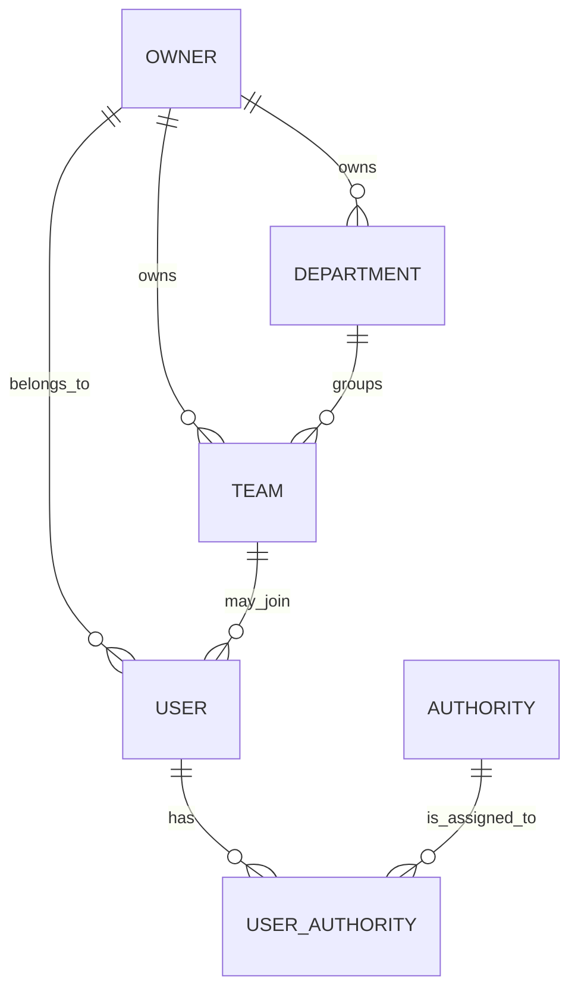

# Phase 0 — Domain Overview（系統基礎領域模型總覽）

本文件說明 Flexora ERP 在 Phase 0（System Foundation）中，  
**與「系統基礎」相關的主要 Domain / Entity / 關聯概觀**，  
作為後續模組（Product、Inventory、Quotation、Sales、Purchase…）的共同基礎。

> ⚠ 本文件為「概念層級 + 命名原則」說明，  
>   實際欄位與型別以後端專案（`flexora-react`）中的 Entity 實作為準，  
>   若有出入，應優先更新本文件。

---

## 1. Phase 0 核心領域模型一覽

Phase 0 主要關注以下幾類 Domain：

1. **使用者與權限（User & Authority）**
   - User（使用者帳號）
   - Authority / Role（角色 / 權限）
2. **組織與資料擁有者（Owner / Department / Team）**
   - Owner（公司 / 營運實體）
   - Department（部門）＊預留
   - Team（團隊）＊預留
3. **共用基底（Base Entities）**
   - 審計基底類別（AbstractAuditingEntity）
   - 軟刪除欄位（deleted / deletedAt / deletedBy）
4. **系統設定 / 參數（預留）**
   - SystemSetting / Config（未必在 Phase 0 完整實作，但需有概念）

---

## 2. 高層級 ER 概觀（High-level ER Diagram）

以下為 Phase 0 相關實體的簡化 ER 示意圖（僅示意關聯，非完整欄位）：

> 註：實作上 JHipster 會使用 `jhi_user`、`jhi_authority`、`jhi_user_authority` 等資料表，
> 若後續自訂 Entity（例如 `Owner`、`Team`）名稱不同，請在本文中標註。

---

## 3. 使用者與權限（User & Authority）

### 3.1 User（使用者）

**概念角色：**

* 系統登入帳號
* 代表實際使用系統的人員（例：業務、採購、倉管、管理者…）

**主要欄位（概念層級）：**

| 欄位                                | 說明                   |
| --------------------------------- | -------------------- |
| id                                | 主鍵                   |
| login                             | 登入帳號（唯一、不分大小寫）       |
| email                             | 電子郵件                 |
| firstName / lastName              | 姓名（可視需求調整為 fullName） |
| activated                         | 帳號是否啟用               |
| langKey                           | 語系（例如 `zh-tw`）       |
| imageUrl                          | 頭像 URL（選用）           |
| createdBy / createdDate           | 建立人 / 時間             |
| lastModifiedBy / lastModifiedDate | 異動人 / 時間             |

**規則：**

* `login` 必須唯一，且不分大小寫。
* `activated = false` 的帳號不得登入系統。
* 所有業務資料修改記錄都應能追溯到 `User`（透過審計欄位）。

---

### 3.2 Authority（角色 / 權限）

**概念角色：**

* 定義一組「權限」或「角色」，例如：

  * `ROLE_ADMIN`
  * `ROLE_USER`
  * `ROLE_SALES_MANAGER`
  * `ROLE_INVENTORY_MANAGER`

**主要欄位（概念層級）：**

| 欄位   | 說明                      |
| ---- | ----------------------- |
| name | 權限名稱（主鍵），建議以 `ROLE_` 前綴 |

**規則：**

* 權限粒度由專案需求決定（Phase 0 可先維持 JHipster 預設）。
* 具體頁面權限控制可在後續 Phase 的 spec 中釐清，不在 Phase 0 細化。

---

### 3.3 User ⟷ Authority 關聯

* 關聯型態：多對多（User 可擁有多個 Authority、一個 Authority 可被多個 User 使用）。
* 實作上由 JHipster 使用中介表 `jhi_user_authority` 維護。

**建議規則：**

* 角色分配由 Admin 或特定系統管理員進行。
* 角色變更應記錄操作人與時間（可在後續擴充 Log）。

---

## 4. 組織與資料擁有者（Owner / Department / Team）

> Phase 0 主要先規劃 **Owner & Team** 基本概念，
> 資料權限（DataScope）細節可留待未來 Phase 擴充。

### 4.1 Owner（資料擁有者 / 公司 / 實體）

**概念角色：**

* 代表一個「營運實體」，例如：

  * 集團底下的個別公司
  * 分公司
  * 法人實體

**主要欄位（概念層級）：**

| 欄位                                | 說明                |
| --------------------------------- | ----------------- |
| id                                | 主鍵                |
| code                              | Owner 代碼（唯一、人類可讀） |
| name                              | 顯示名稱              |
| active                            | 是否啟用              |
| createdBy / createdDate           | 建立人 / 時間          |
| lastModifiedBy / lastModifiedDate | 異動人 / 時間          |

**用途：**

* 未來大部分核心業務 Entity（Item、Quotation、SalesOrder、Warehouse…）都應關聯到某一個 `Owner`。
* 用來區分不同公司的資料範圍。

---

### 4.2 Team（團隊）（預留 / 規劃）

**概念角色：**

* 代表某 Owner 底下的一個「業務團隊 / 部門團隊」，例如：

  * 北區業務一組
  * 南區技術服務組
  * 國際業務部

**主要欄位（概念層級，範例）：**

| 欄位                                | 說明       |
| --------------------------------- | -------- |
| id                                | 主鍵       |
| ownerId                           | 所屬 Owner |
| code                              | 團隊代碼     |
| name                              | 團隊名稱     |
| active                            | 是否啟用     |
| createdBy / createdDate           | 建立人 / 時間 |
| lastModifiedBy / lastModifiedDate | 異動人 / 時間 |

**關聯：**

* Owner ⟷ Team：一對多（Owner 擁有多個 Team）
* Team ⟷ User：一對多或多對多，視最終設計（Phase 0 可僅規劃，不一定實作）

---

### 4.3 User 與 Owner / Team 的關聯

Phase 0 建議：

* 最低限度：User 至少要有一個「預設 Owner」概念（可直接或間接關聯）。
* 未來若導入 DataScope（資料權限），可沿用這些關聯來決定：

  * 使用者能看到哪些 Owner 的資料
  * 使用者能操作哪些 Team 的資料

**注意：**

* Phase 0 不強制實作完整資料權限（DataScope），
  但在資料模型上，請保留可擴充的空間。

---

## 5. 共用基底：審計與軟刪除

### 5.1 審計基底 AbstractAuditingEntity

**概念角色：**

* 所有需要追蹤建立/異動人的 Entity 應繼承此基底類別。

**欄位：**

| 欄位               | 說明                   |
| ---------------- | -------------------- |
| createdBy        | 建立人（User login 或 id） |
| createdDate      | 建立時間                 |
| lastModifiedBy   | 最後異動人                |
| lastModifiedDate | 最後異動時間               |

**規則：**

* 預設由 Spring Security + JPA Auditing 自動填入。
* 不得手動在業務程式內任意覆寫，除非有特別需求（應記錄在 spec）。

---

### 5.2 軟刪除欄位（Soft Delete）

對於可被刪除但仍需要保留歷史紀錄的實體（例如：Customer、Item、Contact…），
應遵守以下欄位規則：

| 欄位        | 說明              |
| --------- | --------------- |
| deleted   | 是否已軟刪除（Boolean） |
| deletedAt | 軟刪除時間           |
| deletedBy | 軟刪除操作人          |

**規則：**

* 軟刪除時：

  * 設 `deleted = true`
  * 填入 `deletedAt` 與 `deletedBy`
* 還原（如有支援）：

  * 設 `deleted = false`
  * 可保留 `deletedAt` / `deletedBy` 供稽核使用，或視需求清空
* Repository 查詢時，若無特別需求，應只查 `deleted = false` 的資料。

> ⚠ 若這些行為已透過 Hibernate Filter 或 QueryDSL 統一實作，
> 請在本文件或 Phase 0 的其他 spec 再補充具體機制。

---

## 6. 系統設定（System Settings）— 概念預留

Phase 0 不一定需要完整實作系統設定模組，但建議預留概念：

**可能的 Entity：**

* `SystemSetting`

  * key / value 型態設定（例如布林值、字串、數值）
* `SystemParameter`

  * 特定領域的參數群組

**用途：**

* 控制某些共用邏輯行為，例如：

  * 預設語系
  * 預設時區
  * 是否啟用某特定模組（Feature Toggle）
  * 編號規則（也可分開到 Numbering spec）

若未來實作，請在 Phase 0 spec 中補充詳細欄位與行為。

---

## 7. Phase 0 Domain 與其他 Phase 的關聯

Phase 0 的 Domain（User / Owner / Team / 審計 / 軟刪除…）
會被後續所有模組大量依賴，具體而言：

* Product / Pricing：

  * Item / PriceList 必須歸屬某 Owner（不一定是 Phase 0 就強制，但設計上應考慮）
* Inventory：

  * Warehouse / Bin 通常屬於某 Owner
* Quotation / Sales：

  * QuotationThread、SalesOrder 均應關聯到：

    * Owner
    * 建立人（User）
    * 可能還有 Team（業務團隊）

---

## 8. 待補與 TODO

以下項目為目前僅規劃、尚未完整定義或實作的部分，
建議在實作前先補齊規格：

* Owner / Team 的實際 Entity 名稱與完整欄位清單
* User 與 Owner / Team 的關聯方式：

  * 一個 User 是否允許多 Owner？
  * 一個 User 是否允許多 Teams？
* 軟刪除在 Repository / Service 層的統一處理策略
* System Settings 是否採用獨立 Entity、Key-Value 儲存、或 YAML + Cache

---

## 9. 版本與歷程（History）

| 版本   | 日期         | 編輯者   | 說明                      |
| ---- | ---------- | ----- | ----------------------- |
| v0.1 | 2025-11-19 | Jimmy | 建立 Phase 0 Domain 概觀初稿。 |

