# 📄 Wireframe — Quotes List Page（Ecme）

```markdown
# ✅ 版本 1：Quotes List Page — Wireframe

--------------------------------------------------------
| Sidebar (Left)                                       |
|------------------------------------------------------|
|  [Logo: Ecme]                                        |
|                                                      |
|  Dashboard                                           |
|                                                      |
|  MARKETING ▼                                         |
|    - Campaigns                                       |
|    - Leads                                           |
|    - Contacts                                        |
|    - Organizations                                   |
|                                                      |
|  SALES ▼                                             |
|    - Opportunities                                   |
|    ● Quotes (Current)                                |
|                                                      |
|  INVENTORY ▼                                         |
|    - Products                                        |
|    - Services                                        |
|    - Price Books                                     |
|                                                      |
--------------------------------------------------------

========================================================
= Top Bar                                              =
=------------------------------------------------------=
= Icons: [+] [Calendar] [Tasks] [Notifications] [User] =
========================================================

########################################################
# Main Content                                          #
########################################################

# Lists Panel (Left Column)
--------------------------------------------------------
|  Search Input: [ Search for List                ]    |
|                                                      |
|  MY LIST                                             |
|   - Open Quotes (selected)                           |
|   - Rejected Quotes                                  |
|                                                      |
|  SHARED LIST                                         |
|   - All                                              |
|                                                      |
|  TAGS                                                |
|   - VIP                                              |
|   - 重要                                             |
--------------------------------------------------------

# Quotes Panel (Right Column)
--------------------------------------------------------
|  Header: "Quotes"                                    |
|                                                      |
|  Action Button: [+ Add] (top-right)                  |
|------------------------------------------------------|

[ Filter Toolbar ]
--------------------------------------------------------
|  [Subject           | Search input ]                 |
|  [Quote Stage       | Search input ]                 |
|  [Opportunity Name  | Search input ]                 |
|  [Organization Name | Search input ]                 |
|  [Total             | Search input ]                 |
|  [Assigned To       | Search input ]                 |
|                                         [Submit]     |
--------------------------------------------------------

[ Quotes Table ]
--------------------------------------------------------
| Columns:                                             |
|   - Subject                                          |
|   - Quote Stage                                      |
|   - Opportunity Name                                 |
|   - Organization Name                                |
|   - Total                                            |
|   - Assigned To                                      |
--------------------------------------------------------

| Row 1                                                |
|   2025年AI專案授權 | Created   | AI 軟體授權合作  | ACME Corp       | 1,500,000 | 章賢 Admin |
--------------------------------------------------------
| Row 2                                                |
|   2025 CRM 系統建置  | Delivered | CRM 導入專案      | Fubon Bank      | 2,850,000 | Team Seller|
--------------------------------------------------------
| Row 3                                                |
|   雲端運算平台租賃   | Accepted  | Cloud 租賃合約    | Unicorn Startups |   680,000 | Marketing  |
--------------------------------------------------------
| Row 4                                                |
|   電子發票平台採購   | Reviewed  | E-Invoice Solution | 台灣大電信        |   950,000 | Support CS |
--------------------------------------------------------

[ Pagination ]
--------------------------------------------------------
| Rows per page: [10 ▼]   Jump to page [  1 ] Go   1–4 of 4   [<] [>]   |
--------------------------------------------------------
```

---

## ★ 新增：Pipeline 觀景模式（參考 JHipster UI）

> 在列表畫面加上「看板 / Pipeline」切換開關，讓使用者可視覺化拖拉報價狀態（DRAFT/SUBMITTED/APPROVED/...）。這是保留 JHipster UI 的優點：快速掌握每個報價的進度，並可在列上直接 trigger Workflow action。

```markdown
[View Toggle]   List ▢   |   ◉ Pipeline

# Pipeline Columns
 ------------------------------------------------------------
 | DRAFT            | SUBMITTED           | APPROVED         |
 |----------------------------------------------------------|
 | [Card #QTN-001]  | [Card #QTN-004]     | [Card #QTN-010]  |
 | Customer: ACME   | Customer: Fubon     | Customer: Unicorn|
 | Owner: Admin     | Owner: Sales Team 1 | Owner: Sales VP  |
 | Amount: 1.5M     | Amount: 2.9M        | Amount: 3.2M     |
 | Actions: Submit, | Actions: Approve,   | Actions: SetActive|
 | Clone, Cancel    | Reject, Clone       | Convert, Cancel  |
 ------------------------------------------------------------

- 每個 Card 顯示 `ThreadNo / Customer / Owner / Amount / validUntil` 以及現有 workflow actions（SUBMIT/APPROVE/CANCEL/CLONE/SET_ACTIVE → 依 `availableActions` 決定）。  
- 支援拖曳（DRAFT → SUBMITTED → APPROVED）；拖拉時呼叫對應 workflow API。  
- Pipeline 下方仍可保留簡化 filter（僅 owner/status/customer）。  
- 點擊卡片右上 icon，可跳出 `Workflow Drawer` 或 `Detail Panel`（下一頁會有 Summary + Associations 設計）。
```

> ✅ 如此保留了 JHipster pipeline 的優點（視覺化狀態 + 滑鼠點擊執行 Workflow），同時也不影響目前的 List view（透過 toggle 在同一頁切換）。
---

# ✅ 版本 2：精簡 Wireframe（適用 PRD / 規格書）

```markdown
# Quotes List — Wireframe (Compact Version)

----------------------------------------------------------------
Sidebar
----------------------------------------------------------------
- Logo: Ecme
- Dashboard
- Marketing
  - Campaigns
  - Leads
  - Contacts
  - Organizations
- Sales
  - Opportunities
  - *Quotes (current)*
- Inventory
  - Products
  - Services
  - Price Books

----------------------------------------------------------------
Top Bar
----------------------------------------------------------------
- Icons: Add | Calendar | Tasks | Notifications | User

----------------------------------------------------------------
Main Content
----------------------------------------------------------------

[Lists Panel – Left]
- Search box
- My List
  - Open Quotes
  - Rejected Quotes
- Shared List
  - All
- Tags
  - VIP
  - 重要

[Quotes Panel – Right]
Title: Quotes
Action: [+ Add]

Filters:
- Subject
- Quote Stage
- Opportunity
- Organization
- Total
- Assigned To
[Submit]

Quotes Table:
- Subject
- Quote Stage
- Opportunity Name
- Organization Name
- Total Amount
- Assigned To

Rows:
1. 2025年AI專案授權 | Created   | AI 軟體授權合作      | ACME Corp        | 1,500,000 | Admin
2. 2025 CRM 系統建置  | Delivered | CRM 導入專案          | Fubon Bank       | 2,850,000 | Team Seller
3. 雲端運算平台租賃   | Accepted  | Cloud 租賃合約        | Unicorn Startups | 680,000   | Marketing
4. 電子發票平台採購   | Reviewed  | E-Invoice Solution   | 台灣大電信         | 950,000   | Support CS

Pagination:
- Rows per page selector
- Range indicator (1–4 of 4)
- Navigation arrows
```

---

## ⭐ 版本 4：Detail View（Summary + Associations Wireframe）

> 當使用者在 List/Pipeline 點擊某筆 Quote 時，右側 Detail Pane 顯示該 Thread/Revision 的 summary、Workflow guard 以及關聯資料。

```markdown
--------------------------------------------------------
| Detail Pane（右側 / 可視為 Drawer 或固定面板）        |
--------------------------------------------------------

[Tabs]
 - Summary (default)
 - Lines
 - Workflow
 - Attachments

### Summary Tab
--------------------------------------------------------
| Quote Summary Card                                  |
|----------------------------------------------|-------|
| Thread No: QTN-2025-0001                     | Edit |
| Customer: ACME Corp                          |      |
| Owner: Sales Team                            |      |
| Status Badge: SUBMITTED (blue)               |      |
| Valid Until: 2025-12-31                      |      |
| Total Amount: NT$ 1,500,000                  |      |
| Margin: 22% (optional)                       |      |
--------------------------------------------------------

| Workflow Guard Card                           |
|-----------------------------------------------|
| ⚠ Requires Valid Until                       |
| ⚠ Requires at least one line                 |
| ✅ Customer specified                        |
| [SUBMIT] [CANCEL] [CLONE] (button group)      |
--------------------------------------------------------

### Associations

| Contacts Card (Related Contacts)              |
|-----------------------------------------------|
| 1. Jane Chen — Account Manager — Email        |
| 2. Alex Wu  — Technical Lead — Phone          |
| [View all contacts]                           |

| Related Sales Orders                          |
|-----------------------------------------------|
| SO-2025-1001 | Confirmed | 1,200,000          |
| SO-2025-1002 | Draft     |   300,000          |
| [Create SO from this Quote]                   |

| Delivery Notes                                |
|-----------------------------------------------|
| DN-2025-2001 | Shipped | 2025-05-10          |
| [View Delivery Timeline]                      |

| Documents                                     |
|-----------------------------------------------|
| Contract Draft.pdf                            |
| Spec_v3.docx                                  |
| [Upload new document]                         |
```

> 以上 Detail Pane 只是 wireframe 文字描述，可用 Drawer 或在 List 頁右側固定顯示。Summary/Workflow/Associations 的欄位應直接參照 `api-spec`/`workflow-info`/`documents` API，UI 只需對照對應 DTO 即可。

# ✅ 版本 3：Mermaid Wireframe（Figma-style Hierarchy）

> 💡 **此 Mermaid 不畫 UI，而是呈現線框結構層級（UX tree）**
> 你可以直接貼到 Markdown，GitHub / Mermaid Live Editor 可預覽。

```mermaid
flowchart TD

%% Page Root
A[Quotes List Page]

%% Sidebar
A --> B[Sidebar]
    B --> B1[Dashboard]
    B --> B2[Marketing]
        B2 --> B2a[Campaigns]
        B2 --> B2b[Leads]
        B2 --> B2c[Contacts]
        B2 --> B2d[Organizations]
    B --> B3[Sales]
        B3 --> B3a[Opportunities]
        B3 --> B3b[*Quotes*]
    B --> B4[Inventory]
        B4 --> B4a[Products]
        B4 --> B4b[Services]
        B4 --> B4c[Price Books]

%% Top Bar
A --> C[Top Bar]
    C --> C1[+ Add Icon]
    C --> C2[Calendar Icon]
    C --> C3[Tasks Icon]
    C --> C4[Notification Icon]
    C --> C5[User Menu]

%% Main Content
A --> D[Main Content]

%% Lists Panel (Left)
D --> D1[Lists Panel]
    D1 --> D1a[Search List Input]
    D1 --> D1b[My List]
        D1b --> D1b1[Open Quotes]
        D1b --> D1b2[Rejected Quotes]
    D1 --> D1c[Shared List]
        D1c --> D1c1[All]
    D1 --> D1d[Tags]
        D1d --> D1d1[VIP]
        D1d --> D1d2[重要]

%% Quotes Panel (Right)
D --> D2[Quotes Panel]
    D2 --> D2a[Header: Quotes]
    D2 --> D2b[Button: + Add]

    %% Filters
    D2 --> D2c[Filters]
        D2c --> F1[Subject]
        D2c --> F2[Quote Stage]
        D2c --> F3[Opportunity]
        D2c --> F4[Organization]
        D2c --> F5[Total]
        D2c --> F6[Assigned To]
        D2c --> F7[Submit Button]

    %% Table
    D2 --> D2d[Quotes Table]
        D2d --> T1[Subject Column]
        D2d --> T2[Quote Stage Column]
        D2d --> T3[Opportunity Column]
        D2d --> T4[Organization Column]
        D2d --> T5[Total Column]
        D2d --> T6[Assigned To Column]

    %% Pagination
    D2 --> D2e[Pagination]
        D2e --> P1[Rows per page]
        D2e --> P2[Range Indicator]
        D2e --> P3[Prev/Next Arrows]
```



---
